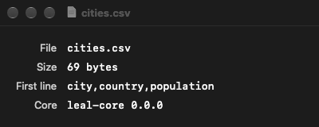

# 0.3 Walking skeleton

## What was built

The whole pipeline from the Rust core to a running AppKit app, built from
the command line.

- **`leal-core`**: `inspect_file(path) -> io::Result<FileSummary>`
  (`crates/leal-core/src/inspect.rs`). It returns the byte count and the
  first line: at most 200 bytes, line ending removed, decoded as UTF-8 with
  invalid bytes replaced by U+FFFD. A multi-byte character cut in half by the
  200-byte limit is dropped rather than shown as U+FFFD. It reads only the
  first 200 bytes, whatever the file size. There are 12 unit tests and a
  doctest. This is skeleton code; the real reader is `source` (1.1).
- **`leal-ffi`** (`crates/leal-ffi/src/lib.rs`): UniFFI 0.32.2 with proc
  macros (`uniffi::setup_scaffolding!()`, `#[uniffi::export]`), no UDL.
  - `core_version() -> String`
  - `inspect_file(path: &str) -> Result<FileSummary, LealError>`
  - `FileSummary` is a `uniffi::Record` (`byte_count: u64`,
    `first_line: String`). `LealError` is a `uniffi::Error` enum:
    `NotFound { path }` and `Io { path, message }`.
  - The crate only converts types. The `io::Error` to `LealError` mapping is
    one `match` on the error kind.
- **`crates/uniffi-bindgen`**: the standard UniFFI generator binary
  (`uniffi::uniffi_bindgen_main()`), built from the workspace so it always
  matches the library's UniFFI version.
- **`justfile`**: `ffi [profile]`, `xcodeproj`, `app [profile]`,
  `run [profile]`, `app-test` and `check-all`. The profile is `debug` (the
  default) or `release`. `just check` is unchanged and still Rust-only.
- **`app/`**:
  - `project.yml` (XcodeGen).
  - `Resources/Info.plist`, which declares the CSV and TSV document types.
  - `Sources/`: `main.swift`, `AppDelegate.swift`, `MainMenu.swift` and
    `SummaryWindow.swift`.
  - `Tests/LealFFITests.swift`.
  - `Leal.xcodeproj` and `Generated/` are git-ignored and always
    regenerated.
- **CI**: a `check-all` job on `macos-latest` (currently macOS 26 on arm64).
  It selects the newest stable Xcode, fails early if that Xcode is older than
  16, installs XcodeGen with Homebrew, and runs `just check-all`. It then
  runs `just app release` and checks with `lipo -verify_arch` that the
  Release app contains both arm64 and x86_64. On failure it uploads the
  xcodebuild logs and `.xcresult`. `actionlint` passes.
- **README**: setup steps for a fresh clone.

### The app

- **Lifecycle.** AppKit only: there is no storyboard and no SwiftUI `App`.
  `main.swift` creates `NSApplication`, sets the delegate and calls `run()`.
  The menu bar is built in code (`MainMenu.swift`).
- **Opening a file.** File > Open… (⌘O) shows an `NSOpenPanel` limited to CSV
  and TSV. Files opened from Finder, the Dock or `open -a` go through
  `application(_:open:)`. Both paths call the same `open(_:)`.
- **The window.** A plain window shows the file name, the byte count, the
  first line and the `leal-core` version. Every value comes from Rust.
- **Errors.** A Rust error opens an `NSAlert`. Swift chooses the wording for
  each `LealError` case, because DESIGN §4.4 puts user-facing strings in
  Swift (a String Catalog, later). Any other error, including a Rust panic,
  shows its `localizedDescription`.
- **`NSDocument`.** Not used, because a panel was simpler. Task 1.6 brings
  the real document architecture.
- **Signing and settings.** Ad hoc signing (`CODE_SIGN_IDENTITY = "-"`, no
  team), Swift 6 language mode, macOS 14.0 deployment target, bundle id
  `io.github.robhaswell.leal`.



*The image is an offscreen render of `SummaryWindow.make` with real data from
Rust, not a screen capture. See "Verification".*

## How the pipeline fits together

```
crates/leal-core ──(Rust dependency)──▶ crates/leal-ffi  (#[uniffi::export])
                                             │
             just ffi: cargo build --target aarch64-apple-darwin
                       cargo build --target x86_64-apple-darwin
                                             │
               target/<triple>/<profile>/libleal_ffi.a   (one per arch)
                     │                                   │
          lipo -create                    uniffi-bindgen generate --library
                     ▼                    (reads metadata embedded in the .a)
target/universal/<profile>/libleal_ffi.a         ▼
                     │                   app/Generated/leal_ffi.swift
                     │                   app/Generated/leal_ffiFFI.h
                     │                   app/Generated/leal_ffiFFI.modulemap
                     │                           │
                     └────── linked ──┐   ┌── compiled + imported
                                      ▼   ▼
          just xcodeproj: xcodegen ─▶ app/Leal.xcodeproj
          just app:       xcodebuild ─▶ build/DerivedData/Build/Products/<Config>/Leal.app
          just app-test:  xcodebuild test ─▶ LealTests.xctest (bindings + .a, no app)
          Xcode IDE:      RustFFI target runs `just ffi`, then builds as above
```

**How Swift sees Rust.** The generated `leal_ffi.swift` contains `import
leal_ffiFFI`. That is a Clang module described by the generated
`leal_ffiFFI.modulemap`, which wraps the C header `leal_ffiFFI.h`. The
project passes `-Xcc -fmodule-map-file=$(PROJECT_DIR)/Generated/leal_ffiFFI.modulemap`
in `OTHER_SWIFT_FLAGS`, so Clang finds the module with no renaming, no
bridging header and no wrapper framework. This is the wiring the UniFFI
manual describes for Xcode. The `.swift` file is compiled straight into the
`Leal` target, so Swift code calls `inspectFile(path:)` like any other
function in the module.

**Linking.** `LIBRARY_SEARCH_PATHS` points at
`target/universal/$(LEAL_RUST_PROFILE)` (Debug → `debug`, Release →
`release`) and `OTHER_LDFLAGS` has `-lleal_ffi`. That directory holds only
the `.a`, so `-l` can't pick up a dylib by mistake. Rust's static library
needs only `-lSystem -lc -lm` (from `--print native-static-libs`), and the
linker already adds those.

**Tests.** `LealTests` is an unhosted unit-test bundle. It compiles the same
generated `.swift` file and links the same `.a`, so it tests the bindings
directly and doesn't launch the app. That keeps CI simple. It means the
bindings file is compiled twice, which costs about a second. When 1.6 adds
app logic worth testing, it can add a hosted test target or move the
bindings into a framework.

**Building from Xcode.** Builds from the IDE (⌘B, ⌘R, ⌘U, Instruments) don't
go through `just`. So `project.yml` has an aggregate target, `RustFFI`, whose
only build phase runs `just ffi <profile>`, with `LEAL_RUST_PROFILE`
mapping Debug to `debug` and Release to `release`. `Leal` and `LealTests`
both depend on it, so it runs once per build, before either compiles.
- **Why not a pre-build script.** A pre-build script on each target would
  run `just ffi` twice, in parallel, on the same files, because Xcode builds
  the two targets concurrently.
- **`PATH`.** The script adds `/opt/homebrew/bin`, `/usr/local/bin` and
  `~/.cargo/bin`, because Xcode's script environment doesn't include
  Homebrew or rustup.
- **It runs every build** (`basedOnDependencyAnalysis: false`). Cargo already
  tracks every Rust input precisely, including sources, `Cargo.lock`, the
  toolchain and dependencies. An Xcode input list would be incomplete and
  go stale. A no-op run takes about a second and touches nothing. The phase
  still declares its outputs (the three generated files and the universal
  `.a`), so Xcode knows where they come from.
- **Script sandboxing.** It is off for this one target
  (`ENABLE_USER_SCRIPT_SANDBOXING: NO`), because Cargo reads the whole
  workspace and writes to `target/` and `~/.cargo`, which can't be declared.
  Every other target keeps the project-wide `YES`.
- **Building from `just`.** The `just` recipes have already run `just ffi`.
  They call xcodebuild with `LEAL_FFI_PREBUILT=1` in the environment, and the
  script skips when it sees that, so `just app` doesn't build the library
  twice. It is an environment variable rather than a build-setting override
  on the xcodebuild command line, because an override changes the build
  settings and made `just` and IDE builds relink each other's output.
- **Fresh clone.** The generated Swift file is an `optional` source, so
  `just xcodeproj` works in a fresh clone before `Generated/` exists. The
  first IDE build creates it. I checked this with `Generated/` deleted:
  `just xcodeproj`, then plain `xcodebuild` (Debug test and Release build)
  with a minimal `PATH=/usr/bin:/bin:/usr/sbin:/sbin`. Both succeeded with no
  warnings.

**Zero warnings.** `SWIFT_TREAT_WARNINGS_AS_ERRORS` and
`GCC_TREAT_WARNINGS_AS_ERRORS` are on. The `app` and `app-test` recipes also
run xcodebuild with `-quiet`, which prints only warnings and errors, and fail
if the output contains `warning:`. That second check catches linker and
build-system warnings, which the compiler settings don't cover.

## Adding a new FFI function end to end

1. **Core.** Write the logic and its tests in `leal-core`, as a public
   function that takes and returns ordinary Rust types.
2. **FFI.** In `crates/leal-ffi/src/lib.rs`, add a wrapper marked
   `#[uniffi::export]` that calls the core function and converts the types.
   - Return `Result<_, LealError>` if the function can fail or could
     plausibly panic, so a panic reaches Swift as an error (see Rust notes).
     Only infallible, trivially safe functions, like `core_version`, return a
     plain value.
   - New structs get `#[derive(uniffi::Record)]` (plain data) or
     `#[derive(uniffi::Object)]` (a handle to shared state, such as the
     document in 1.6). New error cases are new `LealError` variants.
   - Add a Rust unit test for the wrapper.
3. **Bindings.** Run `just ffi`. `app/Generated/leal_ffi.swift` now has the
   function, named in `lowerCamelCase` (`inspect_file` becomes
   `inspectFile(path:)`).
4. **Swift.** Call it from the app. Add an XCTest in `app/Tests/` that calls
   it through the bindings.
5. **Check.** `just check-all`.

Nothing else needs changing: there is no UDL file, header or Xcode setting
to update.

## Build cache: what reruns

| Change | What reruns |
|---|---|
| Nothing | `just app` takes about 2 s. Cargo finds both slices up to date. `lipo` is skipped because neither slice is newer than the universal `.a`. The bindings are regenerated into `target/uniffi-swift/`, but identical files aren't copied, so Xcode sees no change. xcodegen regenerates the project and xcodebuild finds nothing to do. |
| Rust code in `leal-core` or `leal-ffi`, API unchanged | Cargo rebuilds the changed crates for both architectures, `lipo` runs, and the bindings are unchanged. Xcode relinks the app, because the linker records every file it reads (`-dependency_info`) and the `.a` changed. No Swift is recompiled. About 6 s. |
| The FFI API (new or changed export) | As above. `leal_ffi.swift` and the header change, so Xcode recompiles the Swift that depends on them. |
| Swift code only | Cargo, `lipo` and the bindings are no-ops. Xcode recompiles the changed Swift files and relinks. |
| `app/project.yml` | xcodegen writes a new project and Xcode rebuilds whatever the changed settings affect. |
| Building from the Xcode IDE | The `RustFFI` phase runs `just ffi` first, with the same effect as the rows above. Under `just`, it skips. |
| `just app` and an IDE build, one after the other | They share Cargo's cache and the `.a`, so Rust never rebuilds. With the same environment, neither relinks the other's output. The real IDE runs with a different environment from a terminal, and Xcode tracks the environment of its tasks. So switching between the two may relink the app, which takes about a second. |
| `just check` after `just ffi`, or the other way round | Neither invalidates the other. The per-target builds live in `target/<triple>/`, and `just check` builds for the host in `target/debug/`. |

A build from nothing takes about 45 s on an M-series Mac. That covers two
Rust targets, the bindings generator, xcodegen and xcodebuild (measured with
`cargo clean && rm -rf app/Generated build app/Leal.xcodeproj && just run`,
with crates already downloaded). Release (`just app release`) builds the Rust
slices with the release profile (thin LTO) and Xcode builds a universal app.

## Verification

- `just check` passes: 18 Rust tests (nextest) and 2 doctests.
- `just app-test` passes: 5 XCTest tests.
  - A success case (size and first line of a CRLF file).
  - Non-ASCII path and contents.
  - A missing file throws `LealError.NotFound(path:)`: a Rust `Err`
    arriving as a Swift `throw`.
  - A directory throws `LealError.Io`.
  - `coreVersion()`.
  - Separately, I confirmed that a failing XCTest fails the recipe and
    prints the failure text.
- **From clean:** `cargo clean && rm -rf app/Generated build
  app/Leal.xcodeproj`, then `just run`, built and launched the app with no
  warnings.
  - At the time, I also tried to drive File > Open through System Events.
    That sent synthetic keystrokes to whatever app was frontmost, and
    CLAUDE.md now forbids it. It doesn't count as verification. Later checks
    only build, test and launch.
  - Opening a small CSV with `open -a Leal.app cities.csv` (the same
    `open(_:)` code path) showed a window with the file name, "69 bytes",
    `city,country,population` and `leal-core 0.0.0`.
  - An unreadable file (mode 000) showed the alert "Leal couldn't open
    “locked.csv”. Permission denied (os error 13)".
  - The app was then quit.
- **Screenshot.** `screencapture` failed ("could not create image"): this
  session has no Screen Recording permission. `docs/tasks/0.3-skeleton.png`
  is therefore an offscreen render of the window made by
  `SummaryWindow.make`, with real data from `inspectFile`, drawn with
  `cacheDisplay`. It has the same size (400×160) as the real window reported
  by the window server. Replace it with a real capture when convenient.
- **Panics.** I checked by hand that a panic in a `Result` export becomes a
  Swift error. A temporary `assert!` in `inspect_file` made Swift catch
  `rustPanic("deliberate panic")` instead of crashing. That code was
  reverted; see the open questions.

## Decisions and deviations

- **No `#![allow(unsafe_code)]` in `leal-ffi`.** UniFFI's macros generate
  `#[unsafe(no_mangle)] extern "C"` functions. The `unsafe_code` lint doesn't
  fire on code generated by an external proc macro, so the workspace-wide
  `deny` stays on for `leal-ffi` too. Our own code there has no `unsafe`.
- **`inspect_file` takes `&str`, not `String`.** UniFFI accepts `&str`
  arguments, and clippy's `needless_pass_by_value` (enabled in 0.1) rejects
  an owned `String` that is only borrowed.
- **UniFFI default features off** for `leal-ffi` (`default-features = false`
  in the workspace dependency). The default `cargo-metadata` feature is only
  used by the generator, so `crates/uniffi-bindgen` turns it back on. This
  keeps `cargo_metadata` and `serde_json` out of the library's build.
- **Bindings come from the aarch64 slice, not the universal `.a`.** Both
  slices embed the same metadata, and a thin archive is the simplest input
  for the generator.
- **`MACOSX_DEPLOYMENT_TARGET=14.0` for the Rust builds**, matching the app.
  This prevents "built for newer macOS" linker warnings, now and if Rust's
  default ever changes.
- **Rust errors are structured, and Swift words them.** Swift shows its own
  text for `NotFound` and the OS message for `Io`. UniFFI already makes
  `LealError` conform to `LocalizedError` (with a debug-style description),
  so Swift can't override that conformance. It formats the alert text in
  `AppDelegate.describe` instead.
- **Document types use role `Viewer` and rank `Alternate`**, so Leal never
  takes over as the default CSV app and doesn't claim it can save yet. Task
  1.6 or 2.5 should switch to `Editor` (and add `NSDocumentClass`).
- **Hardened runtime and the App Sandbox are off for now.** Neither is
  needed to run with ad hoc signing, and both belong with the real document
  and signing work (1.6 and 4.5). DESIGN §4.3 still asks for sandbox
  compatibility.
- **CI** keeps the fast `check` job and adds `check-all` beside it, so Rust
  runs twice per push. That trades macOS minutes (free for a public repo) for
  a quick Rust signal.
- **Extra recipe**: `just xcodeproj` (xcodegen only). `app` and `app-test`
  both need it.
- **Dependencies.** `uniffi` 0.32.2 (MPL-2.0; the dependency CLAUDE.md
  names).
  - The library uses it at runtime through `uniffi_core`, `anyhow`, `bytes`,
    `static_assertions` and `once_cell`. The rest are build-time proc-macro
    dependencies.
  - The host-only generator adds `clap`, `askama`, `goblin`,
    `cargo_metadata` and others. They never reach the app.
- **Toolchain.** Built with Xcode 27.0 (Swift 6.4) and XcodeGen 2.46.0.

## Pitfalls hit

- **Swift 6 and AppKit isolation.** `AppDelegate` conforms to
  `NSApplicationDelegate`, but it still needed an explicit `@MainActor`, and
  so did the `MainMenu` and `SummaryWindow` enums. Without it, Swift 6.4
  reported every AppKit call as a main-actor isolation warning, which
  warnings-as-errors turned into a failed build.
- **xcodebuild destinations.** With no `-destination`, xcodebuild warns
  "Using the first of multiple matching destinations" (arm64, x86_64, Any
  Mac). The recipes pass `platform=macOS,arch=$(uname -m)`.
- **`-quiet` hides test results**, including failure messages. `app-test`
  writes a result bundle (`build/LealTests.xcresult`), prints the pass and
  fail counts from `xcresulttool`, and prints the full summary on failure.
- **Noise outside `-quiet`.** Without `-quiet`, xcodebuild prints
  `appintentsmetadataprocessor ... warning: Metadata extraction skipped`,
  which would trip the warning check. With `-quiet` it is hidden. xcodebuild
  also prints `DVTAssertions: Warning in ... IDELaunchSession.m` and
  `IDETestOperationsObserverDebug` lines during tests, even with `-quiet`.
  They are Xcode-internal and don't match `warning:`.
- **`open` reuses a running app.** If Leal is already running, `open` just
  brings it to the front, showing the old build. `just run` quits a running
  Leal first (`pkill -x Leal`) and waits for it to exit.
- **Same-second mtimes.** `lipo` often finishes in the same second as the
  last slice. So "skip unless the universal `.a` is newer than every slice"
  re-ran `lipo`, and relinked the app, on the next build. The test is now
  "run `lipo` if the `.a` is missing or a slice is newer".
- **Xcode's script environment** has no Homebrew or rustup on `PATH`, and
  script sandboxing forbids undeclared file access. See "Building from
  Xcode".
- **Rewriting the bindings every time** would force Swift to recompile on
  every build. The recipe generates them into a scratch directory and copies
  only files that changed. `lipo` is likewise skipped when no slice is newer
  than the universal library.
- **`NSApplication.delegate` is weak.** The delegate is kept as a global in
  `main.swift` so it lives as long as the app.

## Open questions

- **A permanent panic test?** Proving in CI that a panic becomes a Swift
  error would need a panicking export in the shipped library, perhaps behind
  a Cargo feature that only the test build enables. It was verified by hand
  instead. Worth adding when 1.x adds exports that do real work?
- **CI's Xcode.** CI will build with Xcode 26 (Swift 6.2), but this was only
  built locally with Xcode 27 (Swift 6.4). The first CI run is the real
  test.

## Rust notes

- **FFI (foreign function interface).** This is how code in one language
  calls code in another. Swift and Rust can't call each other's functions
  directly, but both can call C functions. So the Rust library exports plain
  C functions, with simple arguments (integers, pointers, byte buffers) and
  the C calling convention (`extern "C"`), and Swift calls them.
  - Anything richer, such as a `String`, a struct or an error, has to be
    turned into bytes on one side and rebuilt on the other.
  - Getting this wrong by hand is easy and unsafe: a wrong pointer or a
    buffer freed twice crashes the app.
- **UniFFI** is Mozilla's tool that writes both sides of that bridge for us.
  - On the Rust side, its macros generate the `extern "C"` functions and the
    conversion code.
  - On the Swift side, `uniffi-bindgen` generates `leal_ffi.swift`, which
    wraps each C function in a normal Swift function with Swift types, plus
    the C header and module map that let Swift see the C functions.
  - We write ordinary Rust (`fn inspect_file(path: &str) -> Result<...>`) and
    Swift sees `func inspectFile(path: String) throws -> FileSummary`.
- **Proc macros.** A procedural macro is a Rust function that runs at
  compile time, reads the code it is attached to, and writes extra code.
  `#[derive(Debug)]` is one you have already seen.
  - `#[uniffi::export]` reads the function's signature and generates the C
    function (`uniffi_leal_ffi_fn_func_inspect_file`), the argument and
    result conversion, and a blob of metadata describing the function.
  - `#[derive(uniffi::Record)]` and `#[derive(uniffi::Error)]` do the same
    for types. `uniffi::setup_scaffolding!()` generates the per-crate setup
    once.
  - `uniffi-bindgen` later reads the metadata back out of the compiled `.a`
    ("library mode"). That's why there's no separate interface file to keep
    in sync.
- **`staticlib`.** `crate-type = ["staticlib", "lib"]` in
  `crates/leal-ffi/Cargo.toml` makes Cargo produce `libleal_ffi.a`. That's
  an archive of compiled machine code containing our code, `leal-core`, the
  parts of the standard library we use, and every dependency. Xcode's linker
  copies what the app needs from it into the `Leal` binary, so there is no
  separate Rust library to ship.
  - A `.a` is built for one CPU architecture. We build one for Apple silicon
    (`aarch64-apple-darwin`) and one for Intel (`x86_64-apple-darwin`), and
    `lipo` glues them into one universal file.
- **`Result` and error enums across the boundary.** A Rust function that can
  fail returns `Result<T, E>`: either `Ok(value)` or `Err(error)`. Rust has
  no exceptions.
  - `LealError` is an `enum`, a type whose value is exactly one of several
    variants, each with its own fields (`NotFound { path }`,
    `Io { path, message }`).
  - `#[derive(uniffi::Error)]` teaches UniFFI to send it to Swift. There it
    becomes a Swift `enum LealError: Error`, and a function returning
    `Result<FileSummary, LealError>` becomes a Swift function that `throws`.
  - So `Err(LealError::NotFound { .. })` in Rust arrives as a thrown
    `LealError.NotFound(path:)` that Swift can `catch` and `switch` on. See
    `testMissingFileThrowsNotFound` in `app/Tests/LealFFITests.swift`.
  - `.map(FileSummary::from).map_err(...)` in `inspect_file` converts the
    `Ok` value and the `Err` value respectively, without unwrapping.
- **Why panics matter at an FFI boundary.** A *panic* is Rust's reaction to a
  bug it can't recover from locally: an index out of bounds, an `unwrap()`
  on an error, a failed `assert!`. Normally the panic *unwinds*, walking back
  up the call stack and cleaning up until something catches it or the
  thread dies.
  - A panic can't unwind into Swift. Since Rust 1.81, a panic that reaches
    an `extern "C"` function's boundary aborts the whole process instead
    (before that, it was undefined behaviour). An abort is still a crash, so
    UniFFI's generated C functions wrap every call in
    `std::panic::catch_unwind`. They turn a caught panic into an error code
    and return normally, so the panic never reaches the boundary.
  - For an export that returns `Result`, the Swift side turns that code into
    a thrown error (`rustPanic("...")`). The app can show an alert and keep
    running, which matters once there are unsaved edits.
  - For an export that returns a plain value, the Swift wrapper uses `try!`,
    so a panic there still crashes the app. That's why anything that can
    fail, or does enough work to possibly panic, returns `Result`
    (0.1 notes).
  - It is also why `panic = "abort"` is not set in `Cargo.toml`: with
    abort, there is nothing left to catch.
- **`impl From<A> for B`** (in `leal-ffi`) is Rust's standard trait for
  "convert an A into a B". Here it converts the core's `FileSummary` into
  the FFI's `FileSummary`. They are separate types because `leal-core` must
  not depend on UniFFI.
