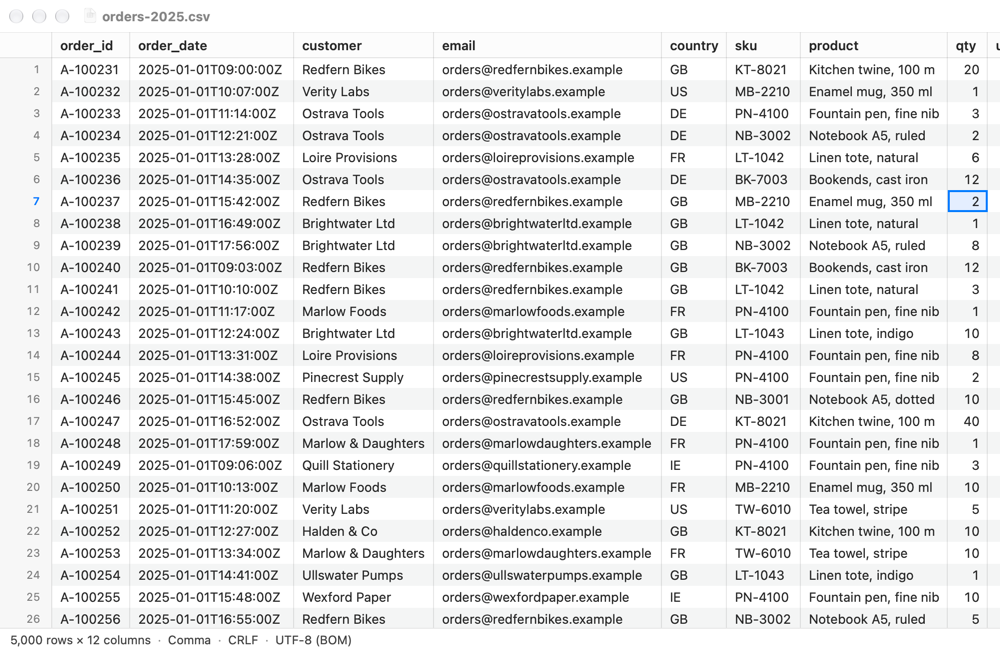
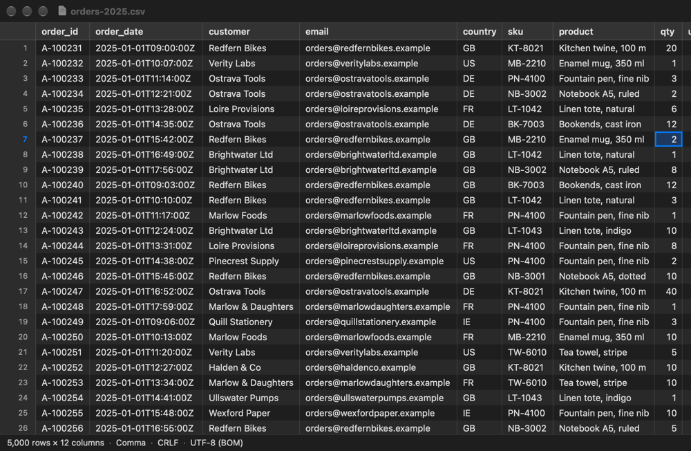
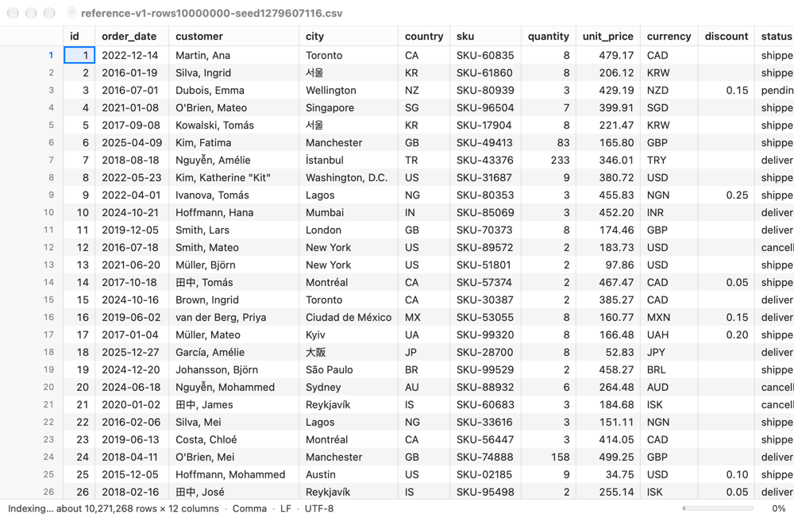
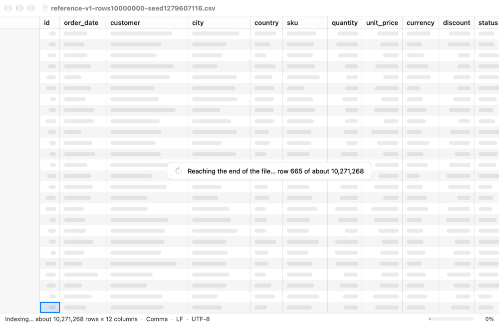
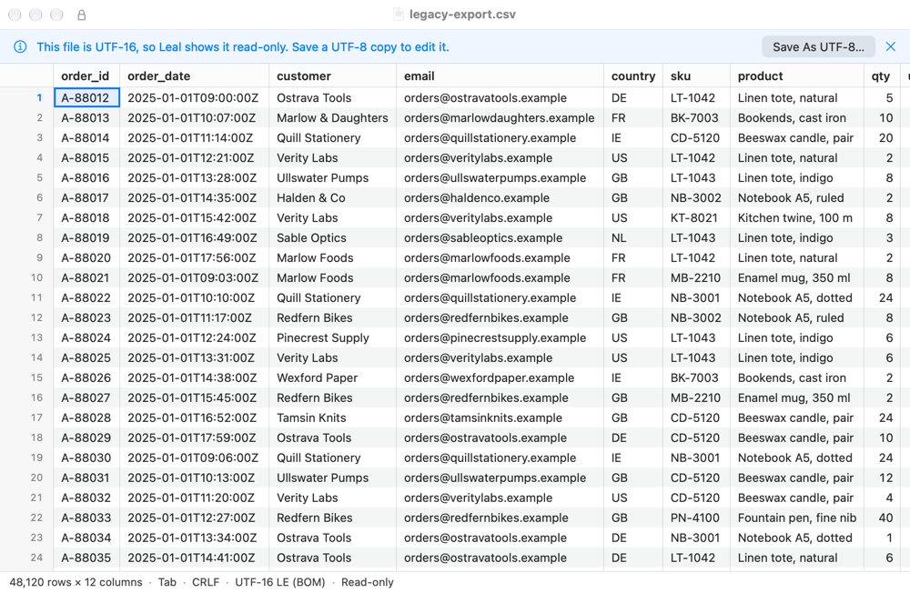
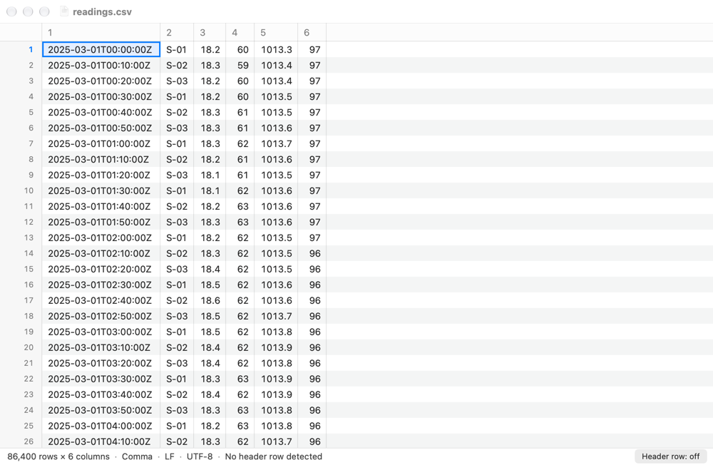

# 1.6 App: document and grid

Leal now opens CSV and TSV files as `NSDocument`s read by the core, and
shows them in the custom-drawn grid of ADR-0001 option B. The grid appears
from the P0 first screen while the index is built. The status bar says how
the file is read, and the window follows the approved mockups (ADR-0002).
The 0.3 skeleton's summary window and `inspect_file` are gone, and so is
`spikes/grid-spike/`.

## What was built

| Where | What |
|---|---|
| `leal-core/src/rows/numeric.rs` | **New.** `looks_numeric` and `NumericColumns`: which columns hold numbers, so they are right-aligned (DESIGN §4.1; §3.10 lists number detection as P2 work). |
| `leal-core/src/document/` | `Document::cells(rows, columns, max_chars)` gives a window of columns with each row's whole field count (`RowCells`). `Document::column_count()` is the most common field count so far. `Document::numeric_columns(sample)` and `FirstScreen.column_count` are new. `rows()` and `cells()` share one `read_rows`. |
| `leal-core/src/inspect.rs` | **Removed**, with `OpenError::read`. PLAN 1.1 asked 1.6 to switch the app over, and it now opens everything through `source` and `document`. |
| `leal-ffi/src/document.rs` | `Document.cells`, `columnCount`, `numericColumns`; `RowCells`; `LineEnding`; `Interpretation.lineEnding`, `ReviewResult.lineEnding`, `FirstScreen.columnCount`. Every new export returns `Result`. `inspect_file` and `FileSummary` are removed. |
| `app/Sources/App/` | `AppDelegate` no longer opens files: `NSDocumentController` does. It opens no untitled document. `MainMenu` has Open Recent, the standard Edit items, and View > Use First Row as Header. |
| `app/Sources/Document/` | `CSVDocument` (the `NSDocumentClass`); `DocumentModel` (the core document as a `GridDataSource`, the job tasks, sizing and failure); `ProgressRelay` (coalesces progress onto the main thread); `Job.finish()` (the `withTaskCancellationHandler` wrapper). |
| `app/Sources/Grid/` | The grid. `GridLayout`: column geometry as running totals and the visible-range arithmetic. `ColumnSizer` and `TextMeasurer`. `CellTileCache`. `CellPainter`, the one place that draws cells, with `TextLineCache`. `GridView`, `GridHeaderView`, `GridGutterView` and `GridCornerView`. `GridScrollView`. `GridContainerView`, which wires them up and owns the selection, the keys and the indexing pill. |
| `app/Sources/Window/` | `DocumentViewController` (banners, grid, status bar), `DocumentWindowController`, `StatusBarView`, `BannerView`, `StatusText` (the status bar's words). |
| `app/Sources/Bench/` | `ScriptedRun` and `ScrollBench`: the in-app scroll benchmark and offscreen snapshots, driven by launch arguments. |
| `app/AppTests/` | **New hosted target** `LealAppTests` (see Tests). |
| `app/project.yml`, `Info.plist`, `Leal.entitlements` | Sandbox entitlements, `NSDocumentClass`, the hosted test target, and `-ApplePersistenceIgnoreState YES` for tests. |
| `justfile` | `bench-scroll`, `snapshot`, `wide-file`, `strings`. |
| `spikes/grid-spike/` | **Deleted.** It stays at the `phase-0` tag, and its results are in `docs/tasks/0.4-results.md`. DESIGN §7 no longer lists `spikes/`. |

### Opening a file

1. `NSDocumentController` (File > Open, Open Recent, Finder, the Dock,
   `open -a`) makes a `CSVDocument` and calls `read(from:ofType:)`. That
   method is `nonisolated` in the SDK, but `canConcurrentlyReadDocuments`
   is false, so AppKit calls it on the main thread. It enters the main
   actor with `MainActor.assumeIsolated`.
2. `DocumentModel.open` calls `openDocument`. That is the core's P0: clone,
   map, detect and parse the first 100 rows. It returns without waiting
   for the index, in a few milliseconds whatever the file's size.
3. The model sizes the columns from the first screen and asks the core
   which columns are numeric, from the same rows. The window is built, and
   the grid's first draw reads its rows from the core. Those rows come from
   the 64 KB the core kept.
4. `model.start()` begins two Swift tasks, one waiting for the index job
   and one for the review job. Both go through `Job.finish()`. Progress
   arrives through `ProgressRelay`.
5. Once the index has 1,000 rows (or is complete), a detached utility task
   reads the first 1,000 rows and the numeric columns and measures them,
   then hands the widths to the main actor. Columns the user has resized
   are left alone.

The header row isn't one of the grid's rows: if the file has one, grid row
`r` is file row `r + 1`. The gutter and the status bar count data rows.

### The grid

- **Virtualised drawing.** `GridView` is the scroll view's document view,
  as tall as all the rows (estimated while indexing). It draws only the
  cells in the rectangle AppKit asks for. A 40M-row document is 880M
  points tall; `CGFloat` is a `Double`, so row positions are exact (tested).
- **Cells in tiles.** `CellTileCache` reads 64 rows × 32 columns per FFI
  call (`Document.cells`) and keeps the 24 most recently used tiles. A wide
  file only reads the columns on screen, which answers the 1.4 notes'
  question about very long rows: the core still splits the whole row, but
  only the window's cells are decoded and copied. A tile read while
  indexing may stop at the last indexed row; it is read again when more
  rows arrive. A failed read isn't retried until the cache is cleared.
- **Laid-out text is cached** (ADR-0001's main cost). `TextLineCache` is
  keyed by what a line shows (text, cut or not, font), not by cell, so
  repeated values such as dates, cities and currencies share one
  `CTLine`. It has two generations: lookups promote a line, and when the
  current generation is full the older one is dropped whole. Trimming
  costs nothing per frame. Values are cut to what a column could show,
  about a third of its width in characters, before Core Text sees them,
  so a 128-character notes cell costs no more than a short one.
- **Header and gutter.** The header sits above the scroll view and follows
  its horizontal offset. The gutter is a tall view in its own `NSClipView`
  that follows the vertical offset, so, like the grid, it draws only the
  strip a scroll exposes. Scroll events over either are passed to the grid.
- **Column geometry** is `GridLayout`: widths and running totals, with
  binary searches for the visible columns.
  - Dragging a header edge resizes a column, from 24 pt up.
  - Double-clicking the edge fits the column to the sampled and visible
    cells, up to 1,000 pt.
  - The resize cursor comes from one tracking area, not one cursor
    rectangle per edge: those would be rebuilt on every frame of a
    horizontal scroll.
- **Sizing** follows ADR-0002 question 2. Columns are sized from the first
  screen at P0, then from the first 1,000 rows, with a 260 pt maximum and a
  40 pt minimum. Header titles count too. `TextMeasurer` adds advances from
  a table built with Core Text, so the tabular digits are right, and falls
  back to a `CTLine` for non-ASCII text.
- **Style** follows mockups 01a and 01b:
  - the system font at 13 pt in 22 pt rows, and tabular digits for
    numeric columns, which are right-aligned;
  - the system's alternating row colours, and separators between columns;
  - the active cell with a light accent fill, a 2 pt accent ring and its
    row number in the accent colour;
  - no header shows 1, 2, 3… in grey; a column past the header's last
    field shows "Column N", dimmed.
  - Every colour is a system colour resolved when a view draws, so dark
    mode and Increase Contrast follow the system.
- **Control characters.** This answers the 1.4 notes' open question. Line
  breaks show as `↵` (ADR-0002 question 11), tabs as `⇥`, and NUL and the
  other C0 controls as their Unicode control pictures (`␀`), all in the
  secondary colour (`CellText.display`). This is presentation only; values
  are never changed. After the phase 1 review (fid-3), every character
  Core Text would otherwise draw at zero width or break the line at has a
  symbol, so a cell never looks like text a search doesn't find:

  | In the value | Shown as |
  |---|---|
  | CR, LF, CRLF (one symbol), U+2028, U+2029 | `↵` |
  | tab | `⇥` |
  | U+0000–U+001F | `␀`–`␟` (U+2400–U+241F) |
  | DEL (U+007F) | `␡` |
  | C1 controls, U+0080–U+009F (NEL among them) | `⍰` (U+2370), one each |

  Unicode has no control pictures for C1, so they share `⍰`. They come
  from ISO-8859-1's 0x80–0x9F bytes, Windows-1252's five unmapped bytes and
  NEL in UTF-8. Each symbol is one UTF-16 unit for one, except CRLF's, so
  find's highlights line up. The cell inspector shows the value itself,
  with its layout manager's `showsControlCharacters` on, so the same
  characters are visible there too.
- **Keys** (DESIGN §4.2), from AppKit's standard key bindings:
  - the arrows;
  - Page Up and Page Down;
  - ⌘↑ and ⌘↓ (and Home and End);
  - ⌘← and ⌘→;
  - Tab and Shift-Tab.

  The active cell stays in view. Clicks select a cell; clicking the gutter
  selects that row. Range selection and the rest are task 1.8.
- **Past the indexed region** (DESIGN §3.10 rule 5, mockup 02b). Rows from
  `loadedRowCount` to `rowCount` (the estimate) are drawn as skeleton bars,
  and the gutter leaves them unnumbered. When the visible rows are all
  past the indexed ones, a floating pill reads "Reaching the end of the
  file… row N of about M" after ⌘↓, or "Indexing… row N of about M"
  otherwise. When indexing completes after ⌘↓, the active cell moves to
  the real last row.
- **Clipping.** Since the macOS 14 SDK `NSView.clipsToBounds` is false by
  default, and `draw(_:)`'s rectangle can reach past a view's bounds. The
  gutter's and header's fills then covered the cells: the whole grid
  rendered blank in tests until every drawing view clipped. The spike
  had set it too.

### The status bar

`StatusText.segments` gives `1,000,000 rows × 12 columns · Comma · CRLF ·
UTF-8 (BOM)` (mockup 01a), and `Indexing… about 9,400,000 rows × 12
columns` with a progress bar and percentage while indexing (02a). It also
shows `· Read-only` for UTF-16 (06a), and `· No header row detected` with a
"Header row: off" button (06b).

- **Where the encoding came from** (ADR-0005 decision 8):
  - a BOM shows "(BOM)", the file's attribute "(file attribute)", and the
    user's choice "(chosen)";
  - a guess shows the name alone, as the mockups draw it, with a tooltip
    saying it was guessed.
- **Line endings.** First paint's line ending, replaced by the whole
  file's once the review finishes.
- **The Header row toggle** (ADR-0002 question 13). The status-bar button
  appears when there is no header row, as in 06b. View > Use First Row as
  Header works either way, so a wrongly detected header can be turned off
  too. It calls `reinterpret` and keeps the user's other choices.

### UTF-16 (mockup 06a)

`DocumentModel.isReadOnly` is true for UTF-16 LE and BE, which opens the
document with three things:

- the info banner, "This file is UTF-16, so Leal shows it read-only. Save a
  UTF-8 copy to edit it.";
- a lock glyph in the title bar;
- "Read-only" in the status bar.

"Save As UTF-8…" is wired up in 2.3 (`SEAM(2.3)`); until then it says the
feature is coming. `BannerView` is generic, for 1.7's banners.

### Background work, cancellation and failure

- **Progress** arrives on the index thread. 1.5 made that every 256 KiB,
  four times as often as before. `ProgressRelay` keeps the latest report
  and hops to the main actor at most once per 100 ms; the final report goes
  at once. The model then updates the counts and the column count, and
  starts the refined sizing when there are enough rows.
- **`withTaskCancellationHandler`** (ADR-0005 decision 6). `Job.finish()`
  awaits `wait()` and calls `cancel()` from the cancellation handler. A task
  that is already cancelled cancels the job at once. Every await on a core
  job in the app uses it. Closing a document cancels its tasks, and so its
  jobs, then releases the core document, which deletes the clone.
- **The user-interaction signal** (DESIGN §3.10 rule 3).
  - Every scroll event, key and click calls `scheduler.noteUserInput()`.
  - A scroll gesture calls `setInteracting(true)` from its `.began` phase
    (or its momentum's), and `false` when the gesture ends with no
    momentum, or when its momentum ends or is cancelled.
  - This answers 1.3a's open question. The benchmark's scripted scroll
    calls `noteUserInput()` each frame, as real scrolling would.
- **Failure** (DESIGN §3.9). Every core call goes through
  `DocumentModel.call`. A `DocumentFailed` error, or any error that isn't a
  `LealError` (a panic UniFFI caught), fails the document, and so does a
  job ending in `JobFailure.Panicked`. Then:
  - the model makes no more calls on its handle (a test counts them),
    cancels its tasks, and shows no rows;
  - `CSVDocument.presentFailure()` shows a sheet with "Reopen" and
    "Close". Reopening closes the document and opens the file again
    through `NSDocumentController`, which makes a new core document.
  - One gap: a background sizing read already in flight can still reach
    the core. The core refuses it with `DocumentFailed`, and its result is
    dropped.

### Skeleton changes (0.3 notes)

- No `openDocument(_:)` or `application(_:open:)` in `AppDelegate`.
- `Info.plist` names `$(PRODUCT_MODULE_NAME).CSVDocument` for both
  document types. The role stays `Viewer`.
- **App Sandbox on**, with user-selected read-write files. Clones and
  temporary folders work under it:
  - the clone goes to `itemReplacementDirectory` on the file's volume
    (inside the container for the boot volume);
  - the records live in the container's Application Support;
  - the hosted tests run sandboxed and check that closing a document
    empties the records folder.

  A removable drive under the sandbox wasn't tested here (see "What a
  reviewer should check"). **Since the phase 1 review (cons-12)** the
  hosted `RemovableDriveTests` do it, on real disk images:
  - What the sandbox blocks: `hdiutil create` and `hdiutil attach` fail
    in the test host with "Device not configured" (an attach leaves the
    device attached but unmounted), `diskutil image attach` with "Failed
    to attach disk image", and `diskutil` can't find the disk at all.
    `hdiutil info` works, and so does `hdiutil detach -force`, but with a
    file on the volume open it took about 10 s (0.3 s outside the
    sandbox).
  - So the Leal scheme's test pre-action starts
    `app/Scripts/disk-image-helper.sh`, which attaches images from
    outside the sandbox when a test asks, inside the app's container
    (hidden from Finder), pulls a drive out when asked, and detaches
    everything at the end (the post-action stops it). Each checkout has
    its own folder (keyed on the scheme's `$(PROJECT_DIR)`, which the test
    gets as `LEAL_DISK_IMAGE_CHECKOUT`), and each run its own helper, pid
    and stop file. A helper ends, detaching its images, as soon as its
    xcodebuild has gone, and after 20 minutes at most. The next start
    sweeps up what a dead helper left. Its log is
    `build/disk-image-helper/helper.log`.
  - What passes in the sandboxed host: on an APFS and an exFAT image the
    volume is ejectable, Leal may make its folder in the volume's
    `.TemporaryItems`, the file is read from the drive and copied, then
    worked from the copy ("Working from a copy"), the copy is recorded
    while open and gone once closed, and nothing is left on the drive. A
    compressed (slow) exFAT image pulled out part-way shows "Drive
    disconnected", the banner, the rows read and Save off, with no crash,
    and closes cleanly.
  - Not covered: the images are mounted inside the container, which the
    host may reach by path. A file a user opens on a real drive under
    `/Volumes` comes with a sandbox extension for that file instead, so a
    by-hand check with a USB drive at the gate is still worth doing.
- **Hardened runtime: in 4.5**, with Developer ID signing and
  notarization. Turning it on with ad hoc signing would need
  library-validation exceptions for the hosted test bundle and gains
  nothing yet.
- Edit menu: Undo, Redo, Cut, Copy, Paste, Delete, Select All.
- `LealAppTests` is hosted in Leal.app (`TEST_HOST`, `BUNDLE_LOADER`) and
  links `LealFFI`, with no bindings of its own. As the test host, the app
  opens no window and doesn't remove leftover folders. The scheme passes
  `-ApplePersistenceIgnoreState YES`, so no window is restored either.
- **A permanent panic test** (0.3 open question): kept.
  `testRustPanicThrowsInsteadOfCrashing` runs in debug and release, and
  the document-level panics are tested in both targets.

## Tests

`just check-all` passes: 498 Rust tests (1 skipped) and 48 XCTests. `just
app-test release` passes too: it builds with `ENABLE_TESTABILITY=YES`,
because the hosted tests use `@testable import Leal`, which Release
builds don't allow by default. That applies only to its own build, never
to the app `just app release` makes. `just app release` gives a universal
app (arm64 and x86_64) that passes `codesign --verify --deep --strict`,
with the sandbox entitlements and no test-only exports.

- **Rust**
  - `rows::numeric` (5): numbers and non-numbers; empty cells don't count;
    a cut cell is text; short rows.
  - `document` (5): a window of columns with field counts, past the end
    and empty; the column count from the first 64 KB, then from the index
    once it passes them; numeric columns with and without a header.
  - FFI: the new exports and fields.
- **`LealAppTests` (new, hosted)**
  - `GridLayoutTests`:
    - running totals, cell rects, visible rows and columns (including a
      binary-against-linear check over 200 columns), hit testing and
      column edges;
    - column sizing (widest cell or title, minimum, maximum, cut cells);
    - the measurer against Core Text for three fonts, and the control
      character symbols;
    - every keyboard move at the edges, and the key bindings;
    - the tile cache: re-reads as rows arrive, LRU eviction, failed reads.
  - `GridRenderingTests`: offscreen drawing with a fake source.
    - Cells draw text, skeleton rows don't, and the gutter numbers only
      loaded rows.
    - **The last screen of a 1M-row and a 40M-row grid is pixel-identical
      to the first** (ADR-0001's tall-view test).
    - The header and gutter follow the scroll, and keys keep the active
      cell in view.
    - ⌘↓ past the index shows the pill, then moves to the real last row.
    - Resize and fit.
  - `DocumentTests` against the real core.
    - **Open and close:** titles, cells, numeric columns, the status text;
      the clone recorded while open and removed after close; no core calls
      after close; an open error's wording.
    - **First screen before the index**, with a 24 MB file. Straight after
      the open, the model has the first 64 KB's rows and the estimate, and
      the grid's cells are readable. Nothing has run on the main actor yet,
      so this doesn't depend on timing. Then the loaded rows only grow, up
      to the exact count, and the last row reads.
    - **Failure:** a panic in a call. The document is failed, offers to
      reopen, makes no further calls, and reopening gives a working
      document. A panic in a watched job fails the document too.
    - **Cancellation:** cancelling the Swift task that awaits a held
      review job stops the job, which ends with `JobFailure.Cancelled`. A
      task cancelled before it waits cancels its job at once.
    - The Header row toggle (button and re-read), extra "Column N" titles,
      UTF-16 read-only, and the whole window drawing its grid.

## Performance

Measured on the M5 Pro (`Mac17,8`, 120 Hz, window 1200 × 784 pt) with
`just bench-scroll` (Release). Two caveats:

- **The screen was locked** throughout, as for the spike. The display was
  kept awake with `caffeinate -u`. WindowServer composites nothing, so
  compositor hitches aren't measured.
- **Other agents were building and testing in parallel**, with load
  averages of 3–16. Even CPU time per frame varied by up to 70% between
  identical runs. The numbers below are from the quietest runs (load about
  3.5–5).

**PLAN asks for an unlocked screen and a base M1 Air; neither was
available.**

The bench is the spike's method. A display link scrolls the grid frame by
frame: vertical flings, horizontal flings to the right edge, vertical
flings there, and back to the left. "Fast" is 60,000 pt/s over 50,000
rows, and "moderate" is 15,000 pt/s over 10,000 rows. Besides the frame
interval and busy time (wall time less run-loop sleep), it records each
frame's **main-thread CPU time**, which doesn't grow when other processes
take the cores.

| File | Speed | Late frames (missed a 120 Hz refresh) | Frame p99 | Main-thread CPU p50 / p99 | Busy p50 / p99 |
|---|---|---:|---:|---:|---:|
| Reference (1M × 12) | fast | 11 of 7,544 (0.15%) | 8.3 ms | 4.2 / 7.5 ms | 4.6 / 8.0 ms |
| Reference | moderate | 3 of 6,160 (0.05%) | 8.3 ms | 4.1 / 6.4 ms | 4.6 / 7.0 ms |
| Wide (100k × 200, `just wide-file`) | fast | 63 of 8,098 (0.8%) | 8.3 ms | 4.3 / 9.2 ms | 4.6 / 9.4 ms |
| Wide | moderate | 42 of 8,744 (0.5%) | 8.3 ms | 4.2 / 8.2 ms | 4.9 / 8.5 ms |

The wide file scrolls horizontally without trouble: 1 late frame in 2,632
(moderate) and 2 in 611 (fast). Most of the late frames are in vertical
scrolling while scrolled right.

| Budget (DESIGN §1) | Measured | |
|---|---|---|
| Open to first rows visible < 150 ms | 78–94 ms, from `read(from:)` to the grid's first draw with rows | ✓ |
| Launch to first rows | 215–375 ms, including process start | — |
| Full index < 500 ms | indexed 108–187 ms after the open, with the app running (the core's bench is 1.3's) | ✓ |
| Scrolling: no dropped frames at 120 Hz | 0.05–0.15% late on the reference file, 0.5–0.8% on 200 columns | close, not met |
| Leal's heap < 40 MB, reference file | 16.8 MB after load, 25.7 MB settled, peak 35.7 MB fast and 25.9 MB moderate | ✓ |
| Idle app < 30 MB resident | not measured (1.10) | — |

- **Footprint** (everything macOS charges, graphics surfaces included).
  For the reference file it is 181 MB after load, 218 MB peak and 104–107
  MB settled. The spike's B was 86 MB settled. The 200-column file adds
  about 10 MB.
- **Against the spike.** *Corrected by task 1.6a: the threefold gap
  below came from how the two apps were launched, not from Leal's grid.
  With the same launch, Leal's main thread does about the spike's work
  per frame. See "Scroll performance".* The spike's B ran back to back
  with Leal on the same machine, at 200 columns and moderate speed:

  | | Spike B | Leal |
  |---|---|---|
  | Vertical, late frames | 4 | 2–16 |
  | Vertical, busy p50 | 1.4 ms | 4.5 ms |
  | Horizontal, late frames | 4 of 4,394 | 1 of 2,632 |

  **Leal's main thread does about three times the spike's work per
  frame.** Of a 4.5 ms frame:
  - about 1 ms is Leal's drawing;
  - 0.8 ms is AppKit preparing the display;
  - about 2.4 ms is Core Animation replaying the recorded drawing into the
    layer's backing store.

  The replay is roughly 8× the spike's, for about 1.5× the cells.

  Ruled out by experiment:
  - the line cache, fresh lines, the tabular-digit font, the palette;
  - the gutter, the scheduler signal;
  - `drawsAsynchronously` (tried and removed: it made vertical scrolling
    worse).

  With nothing drawn the frame costs 0.6 ms, and row shading and
  separators alone bring it to 1.75 ms. The trigger isn't found. On an M1
  Air, about half as fast per core, CPU p99 would be about 15–18 ms, so
  **expect dropped frames there until this is solved**. See "Open
  questions".
- **The benchmark's conditions matter.** The first runs had horizontal
  scrolling at 200 columns 27% late. The cause was the measurement: no
  user activity, so App Nap and timer coalescing applied, and a window
  that other windows covered. The bench now does what the spike did: a
  `latencyCritical` activity and a floating window. After that, the same
  build had horizontal scrolling at 0.04% late.

### Reproducing

```sh
just reference-file && just wide-file
just bench-scroll target/bench-data/reference-v1.csv            # fast
just bench-scroll target/bench-data/wide-200.csv moderate
```

Each run takes about two minutes and prints JSON with the stats per phase
(`phases.vertical`, `.horizontal`, `.verticalWide`), memory and first-paint
times. The window must be on screen. `-LealBenchVerticalOnly YES`, passed
as an extra option, stops after the first vertical flings.

## Scroll performance (task 1.6a)

PLAN 1.6a asked why Leal's main thread did about three times the spike's
work per frame (busy p50 4.5 ms against 1.4 ms), and to fix it.

**Root cause: it doesn't. The gap came from the measurement.** The spike
was started from a shell. Leal has to be started with `open`, because
the sandbox only lets it read a file that LaunchServices hands it. macOS
then puts the two main threads on different cores. Busy and CPU time
measure the core and its clock as much as the work. Counting the main
thread's instructions shows the two do about the same work per frame.

### Evidence

The bench now records the main thread's instructions and cycles for
every frame (see "The fix"). Cycles over CPU time give the clock it ran
at. These runs used the first vertical flings at 200 columns, moderate
speed. "Loaded" means six low-priority busy loops ran alongside, as other
agents' builds did during the 1.6 measurements, which raises the clocks.

| Launched | Load | App | Busy p50 | CPU mean | Instructions per frame | Clock |
|---|---|---|---:|---:|---:|---:|
| from the shell | loaded | spike | 1.3–1.4 ms | 1.2–1.3 ms | 19.6 M | 4.0 GHz |
| from the shell | loaded | Leal | 1.5 ms | 1.5 ms | 24.1 M | 4.05 GHz |
| `open` | loaded | spike | 2.6 ms | 2.6 ms | 19.7 M | 3.4 GHz |
| `open` | loaded | Leal | 2.8–3.1 ms | 2.9–3.2 ms | 24.1 M | 2.8–3.3 GHz |
| from the shell | quiet | spike | 4.4–4.6 ms | 3.9–4.1 ms | 19.7 M | 2.0–2.1 GHz |
| `open` | quiet | spike | 4.5 ms | 3.9 ms | 19.9 M | 2.1 GHz |
| `open` | quiet | Leal | 4.4–4.7 ms | 4.2–4.5 ms | 23.7–24.0 M | 1.9–2.1 GHz |

- **Each app's instructions per frame stay the same** whatever the launch
  or the load. Only the clock changes, and the core type with it: per
  cycle, a fast core retires 1.5–1.8 times as many instructions.
- **The 1.6 comparison was the first row against the fourth.** Started
  from a shell on a loaded Mac, the spike ran at about 4 GHz on the fast
  cores. Leal, started with `open`, ran at 2.8–3.3 GHz. Started from the
  shell too, Leal takes 1.5 ms, the spike's figure. (To launch it that way,
  a test build opened the file itself from a path in its container.)
- **Instructions:** Leal does about 22% more than the spike at 200
  columns. Its columns are narrower (73 pt on average against the spike's
  118 pt), so it shows about 1.6 times as many cells. At 12 columns,
  where both show every column, Leal does less: 18 M against 20 M.
- **Instruments** (Time Profiler, 15 s of vertical flings at 200 columns)
  gives both apps the same profile. 85–90% of the main thread is Core
  Animation's commit:
  - **The views' own drawing** is 30–40%: `draw(_:)` for the strip the
    scroll exposed, recorded into a display list. Leal's grid draw is
    11%.
  - **Updating the layer's backing store** is 40–55%. AppKit backs a
    view in a scroll view with a content layer the size of the *visible*
    rect, which moves with the scroll. On every scroll step that layer is
    rebuilt from the view's retained display list: the whole visible
    grid, not just the new strip. AppKit replays the list into a fresh
    one, then Core Animation replays that into its asynchronous drawing
    queue.

  This is what the 1.6 notes called "Core Animation replaying the
  recorded drawing". It happens in the spike's B too: the layer trees
  match (GridView → `ContentLayer` the size of the visible rect, drawn
  asynchronously), and in both apps the cost per frame is flat across a
  fling, from 125 pt a frame down to 4. It isn't triggered by anything in
  Leal, and the same happens for a document view only 6,292 pt tall.
- **Ruled out by experiment**, by instructions per frame:
  - setting `clipsToBounds` through AppKit's setter instead of overriding
    it;
  - an explicit `wantsLayer`;
  - `layerContentsRedrawPolicy = .onSetNeedsDisplay`;
  - an opaque separator colour;
  - asking for overdraw with `prepareContent(in:)`: the content layer
    stays the size of the visible rect.
  - `copiesOnScroll` has had no effect since macOS 11.
  - A grid drawn in 128 pt tile subviews was worse: 32 M instructions a
    frame. Partly visible tiles redraw as the scroll changes their
    visible part.
- **Where Leal's own time goes**, from removing it in turn (CPU, quiet
  Mac, reference file): cell text about 1.6 ms of 4.1 ms, the gutter
  0.6 ms. With the grid drawing nothing, a frame still costs 1.6 ms.

### The fix

No change to the grid. It already matches the spike once both run the
same way, and nothing in its view setup makes Core Animation redraw more.
Two changes to the harness:

- **`just bench-scroll` reports work, not just time.** For each phase,
  and for the whole scroll, it adds the main thread's instructions per
  frame (`instructionsMean`, `instructionsP50`, `instructionsP99`, in
  millions) and cycles (`cyclesP50`, `cyclesP99`). It also adds
  `mainThreadGHz`, the cycles over the CPU time.
  - They come from `thread_selfcounts`, the kernel's per-thread
    performance counters. It is in libsystem_kernel but has no public
    header, so `ScrollBench.swift` declares it.
  - The public `proc_pid_rusage` only counts whole processes, which
    includes Core Animation's drawing threads.
  - Like the rest of the bench, it is only in `LEAL_BENCH` builds.
  - **Compare builds or apps by instructions per frame.** Busy and CPU
    time only compare runs made the same way at the same time.
- **The scripted runs no longer kill other agents' Leal.** On a timeout,
  `_run-scripted` used `pkill -n -x Leal`, which could hit another agent's
  test host. It now kills only the process it started: the one new
  process of its own app bundle.

### Before and after

The grid is unchanged, so these runs compare Leal with the spike's B
measured the same way. Both were launched with `open`, using the full
benchmark at moderate speed. Runs alternated, three of each. Conditions:

- the screen was locked, with the display kept on by `caffeinate -u`;
- 1,049–1,072 processes, with other agents building and testing;
- load averages of 2.9–6.3 at the start of each run.

The spike's 12 columns are its synthetic data; Leal's are the
reference file.

**Vertical flings** (the first stage):

| | Busy p50 | CPU p50 / p99 | Instructions per frame | Clock | Late frames |
|---|---:|---:|---:|---:|---:|
| Leal, 12 columns | 4.3–4.6 ms | 3.8–4.1 / 6.2–6.3 ms | 17.8–17.9 M | 1.8–2.0 GHz | 3, 1, 1 of ~3,075 |
| Spike, 12 columns | 4.8 ms | 4.2–4.3 / 6.1–6.2 ms | 19.8–20.0 M | 2.0 GHz | 6, 8, 5 of ~3,063 |
| Leal, 200 columns | 4.6–4.7 ms | 4.3–4.5 / 7.9–8.2 ms | 23.9–24.2 M | 1.75–1.96 GHz | 0, 2, 2 of ~3,076 |
| Spike, 200 columns | 4.6–4.7 ms | 4.1–4.2 / 6.1–6.2 ms | 19.6–19.7 M | 1.9–2.0 GHz | 2, 12, 14 of ~3,061 |

**The whole scroll**, all three scrolling stages:

| | Late frames |
|---|---|
| Leal, 12 columns | 17, 3, 3 of ~6,150 |
| Spike, 12 columns | 7, 13, 9 of ~6,150 |
| Leal, 200 columns | 3, 13, 5 of ~8,780 |
| Spike, 200 columns | 9, 22, 35 of ~10,500 |

Horizontal flings at 200 columns:

| | Instructions per frame | Busy p50 |
|---|---:|---:|
| Leal | 48–53 M | 5.0–5.2 ms |
| Spike | 45–48 M | 5.0 ms |

The process counts came from `ps -A` and the load averages from
`sysctl vm.loadavg`, just before each run. Leal's JSON also records
`loadAvgAtStart` and `loadAvgAtEnd`.

### What it means for the budget

- **These runs are on the slow cores.** With the screen locked, no app is
  frontmost, and an app opened with `open` ran its main thread at about
  2 GHz on a quiet Mac. When Rob scrolls, Leal is the frontmost app,
  which macOS should give the fast cores. On those (the loaded runs from
  the shell) a frame is about 1.5 ms. That is expected, not measured: the
  budget question is still the one 1.6 left open. **Measure on an unlocked
  Mac, and on a base M1 Air.**
- **The next lever is Leal's tail, not its median.** At 200 columns Leal's
  CPU p99 is 8 ms against the spike's 6 ms, and its instructions p99 is
  about 52 M against 33 M. That is most likely the frames that do more of
  Leal's own work, such as reading a new 64-row tile of cells from the
  core or laying out values not seen before. Not yet measured frame by
  frame.
- **Cutting the rebuild of the visible layer** is the bigger lever, for
  both apps: it is about half of every frame. It needs a structure in
  which scrolling moves layers instead of redrawing them, as
  `NSTableView`'s row views do. The 128 pt tiles above weren't it, and
  that is a design question for ADR-0001, not a 1.6a fix.

## Screenshots

These are offscreen renders of the window's own views (`cacheDisplay`; no
Screen Recording permission), from synthetic data made to look like the
mockups' (no real data). The big-file shots use the 1 GB variant of the
reference file. They were saved at 1× from a 1000 × 620 window, to keep
each under 400 KB. Full-size 1200 × 780 renders were compared with the
mockups and match them closely.

| Mockup | Leal |
|---|---|
| `docs/mockups/01a-clean-file-light.png` |  |
| `docs/mockups/01b-clean-file-dark.png` |  |
| `docs/mockups/02a-opening-first-paint.png` |  |
| `docs/mockups/02b-opening-jump-past-index.png` |  |
| `docs/mockups/06a-utf16-read-only.png` |  |
| `docs/mockups/06b-no-header-row.png` |  |

```sh
just snapshot file.csv out.png -LealAppearance dark -LealSelect 6,7 -LealWindowSize 1000x620
just snapshot big.csv out.png -LealSnapshotEarly YES -LealJumpEnd YES   # 02a / 02b
```

Differences from the mockups:

- **The title is left-aligned** with the document icon, as macOS 27 draws
  it. When the lock accessory is there, the title is centred.
- **The lock glyph** (06a) is at the title bar's leading edge, after the
  window buttons: a titlebar accessory, because AppKit has no API for an
  image right after the title.
- **Header titles count** when sizing columns, so headers aren't cut
  ("coun…" in the mockup is "country" here).
- **"Save As UTF-8…"** has the primary tint (`tintProminence`). It looks
  grey in an offscreen render of an inactive window.

## Decisions and deviations

- **Number detection is in the core** (`looks_numeric`, `numeric_columns`):
  "logic lives in the core". **Width measurement is in Swift**, because it
  needs the fonts.
- **The 1,000-row sizing is a Swift utility-QoS task, not a job on the
  core's P2 pool.** It is two core reads and Swift measuring, a few
  milliseconds once. It doesn't pause while the user scrolls, as rule 3
  asks of P2; it runs once, off the main thread.
- **The grid asks for 128 characters a cell**, not 256. That is more than
  fits in a 380 pt column; a wider column ends long values with an
  ellipsis. It keeps each tile's read small. The inspector (1.8) shows
  whole values.
- **Ragged rows.** A short row's missing cells are `GridCell.missing`,
  left blank. 1.7 draws them hatched (`SEAM(1.7)`) once the core says the
  row is ragged. A long row adds a dimmed "Column N" as soon as a tile
  shows it (ADR-0002 question 5).
- **The Header row toggle** is in the status bar when there is no header
  (06b), and in the View menu always (see "The status bar").
- **The cell drawing for fallback C** (ADR-0001) is `CellPainter` and
  `TextLineCache`. A row view in an `NSTableView` could call them
  unchanged.
- **`CSVDocument` reads on the main thread.** First paint is a few
  milliseconds; a slow removable drive could stretch its one 64 KB read
  (1.3a notes). Concurrent reading would run the `NSDocument` initialiser
  off the main thread, which Swift 6's isolation checks forbid.
- **Scripted runs are only in `LEAL_BENCH` builds** (see "Changes after
  review").
- **Scripted-run options are `-Name value` pairs** (`-LealSnapshot`,
  `-LealBenchScroll`, …), not `--name`. macOS opens a bare launch argument
  as a document ("light" from `--appearance light`), but reads `-Name
  value` pairs into the argument defaults domain.
- **New dependencies:** none.

## What a reviewer should check

- The open questions below, especially main-thread time against the spike.
- `DocumentModel.call` and `fail`: that no path after a failure reaches the
  handle except the in-flight background sizing read.
- `ProgressRelay`'s lock and hop, and that a late report from an old
  generation is ignored (`progressArrived` checks the generation).
- `GridContainerView.move(.lastRow)` and `reloadData()` while indexing:
  `isJumpingToEnd` and the estimate shrinking under the active cell.
- `TextLineCache`'s two generations, and `Dropped` (lines freed off the
  main thread).
- The sandbox, by hand: open a file from a removable drive or a disk image
  (the clone goes to that volume's `.TemporaryItems`), and use Open Recent
  after relaunching.
- That the String Catalog has every string: `just strings` syncs it from a
  Debug build. Two keys ("Close", "Read-only") are used twice with
  different comments.

## Open questions

- **Main-thread cost, for the phase 1 gate.** Leal does about three times
  the spike's main-thread work per frame, most of it in Core Animation's
  backing-store updates, not Leal's drawing. Late frames are 0.05–0.8%
  here, and an M1 Air would likely drop frames. The next step is an
  Instruments session on an unlocked, quiet Mac (Rob's), comparing the
  phase-0 spike and this build layer by layer. If the cause is a property
  of the custom view, ADR-0001's fallback C would share it, since its rows
  draw with the same code. Should 1.6 land as it is, with this as a known
  issue for 1.10 or 4.1, or stay open until it's solved?
- **Column drag-to-reorder** (1–2 days, ADR-0001) isn't in the mockups. Is
  it wanted in v1?
- **The lock glyph's place** (title-bar leading edge) and **header titles
  counting in column widths**: acceptable as drawn here?
- **Re-measure on an unlocked screen and a base M1 Air**, as 1.2b, 1.3,
  1.4 and ADR-0001 ask: `just bench-scroll` takes two minutes a file.

## Changes after review

The review approved the branch with seven should-fixes, all done.

1. **A gesture left on when a window closes.** A window closed mid-scroll
   (or mid-momentum) never sent the gesture's end, and the scheduler has
   no timeout, so P2 and P3 work stayed paused for every document.
   - `GridScrollView` tracks the gesture (`setGesture`) and ends it when it
     leaves its window.
   - `DocumentModel.setInteracting` owns the document's share of the
     scheduler's state, and `close()` and `fail()` end it.
   - Tests: `testAGestureEndsWhenTheGridLeavesItsWindow`, and
     `testClosingADocumentMidGestureLetsBackgroundWorkResume` (another
     document's held review runs once the first closes).
2. **A failure while opening.** A panic in one of `init`'s calls failed
   the document before there was a window to show it in.
   - `CSVDocument.open` now throws it as an open error, worded "Something
     went wrong inside Leal…", and releases the core document.
   - A failure after opening but before the window is on screen is
     offered once the window shows (`makeWindowControllers`, then
     `showWindows`).
   - Tests use a test-only hook, `DocumentModel.afterFirstPaintForTesting`,
     with `debugPanic`.
3. **Sizing very wide files.** A sizing read now takes at most 100,000
   fields (`sizingFieldLimit`), as the core's row cache caps fields: 20,000
   columns are sized from 5 rows, not 1,000 (20M cells).
   - The model keeps each column's widest text (`widestText`), not the
     sampled rows, and double-click to fit uses it.
   - The app now asks the core for a one-row first screen
     (`OpenOptions(firstScreenRows: 1)`), for the header titles; the core's
     `first_screen()` itself is unchanged. The grid has always drawn its
     first screen through `cells` from the in-memory 64 KB head, so first
     paint is unaffected. The P0 sizing rows are read the same way, with the
     same cap.
   - A header row longer than the first 64 KB is read once the index has
     it.
   - Test: `testColumnSizingOfAVeryWideFileIsCapped` (20,000 columns).
4. **A stale ⌘↓.** `isJumpingToEnd` stayed set after ⌘↓, so a later click
   jumped to the last row when indexing finished. `select()` (clicks and
   other moves) and scroll input now drop it. Test:
   `testAClickOrScrollAfterJumpingDropsTheJump`.
5. **The "cancelled before it waits" test** now uses a review job held by
   the scheduler, so the job is certainly running, and it asserts
   `JobFailure.Cancelled`.
6. **The in-memory note** (DESIGN §3.1). The status bar shows "Read into
   memory", with a tooltip, when `storage()` is `Memory`; `storage()` was
   already exported. Copy, Reading and Disconnected are 1.7's, now listed
   in PLAN 1.7.
7. **The scripted runs are out of the shipped app.**
   - `ScriptedRun` and `ScrollBench` compile only with the `LEAL_BENCH`
     compilation condition. Only `just bench-scroll` and `just snapshot`
     set it, in their own `build/DerivedData-bench`.
   - `just check-no-bench` fails if a Release app's binary has their
     symbols or option names (`nm`, `strings`). CI runs it after `just app
     release`, beside the test-export check.

`just check-all`, `just app-test release` and `just app release` pass, and
so do `codesign --verify --deep --strict` and `just check-no-bench`.

## Rust notes

- **`impl FnMut` parameters** (`Document::read_rows`). `rows()`,
  `cells()` and `numeric_columns()` share one function that reads rows and
  calls a closure on each. `FnMut` means the closure may change what it
  captured: `numeric_columns` passes one that adds to a `NumericColumns`
  it owns. `impl FnMut(…) -> T` makes the compiler generate a copy of
  `read_rows` for each closure, so there's no cost for the indirection.
  The closure only borrows the row's bytes while `read_rows` holds them,
  which is why it gets them as arguments rather than keeping them.
- **Slices of slices** (`Document::cells`). `fields.get(a..b)` returns
  `Option<&[FieldSpan]>`, a view into the row's fields, without copying.
  The range is clamped first, so a window past the row's end gives an
  empty slice rather than a panic. `unwrap_or_default()` turns `None` into
  an empty slice.
- **A small state machine as an enum** (`numeric.rs`, `Column`). Each
  column is `Empty`, `Numeric` or `Text`, and `add` moves it on with a
  `match` over (state, is this cell a number). Once `Text`, it stays
  `Text`. `#[derive(Default)]` with `#[default]` on `Empty` lets
  `resize` fill new columns.
- **Byte-level parsing without regex** (`looks_numeric`). It walks the
  string's bytes (`as_bytes()`), which is safe here because every byte it
  looks for is ASCII. In UTF-8, ASCII bytes never appear inside a
  multi-byte character, so a non-ASCII digit (`١`) just isn't a digit.
- **UniFFI records and `u32`** (`RowCells.field_count`). Swift has no
  `usize`, so counts crossing the boundary are `u32` or `u64`, converted
  with `try_from(…).unwrap_or(MAX)` (`to_u32`, `to_range`). That
  saturates instead of panicking on an impossible value.

## Swift notes (for the Swift/AppKit reviewer)

- **Swift 6 isolation.** Views, the model and the document are
  `@MainActor`.
  - `NSDocument.read(from:ofType:)` is `nonisolated` in the SDK; it enters
    the main actor with `MainActor.assumeIsolated`, which traps if AppKit
    ever calls it elsewhere.
  - `ProgressRelay` and `TextMeasurer` are `@unchecked Sendable`, with the
    reason in a comment (a lock; an immutable `CTFont`).
  - The UniFFI objects are `Sendable`, so the detached sizing task can use
    the core document directly.
- **`withTaskCancellationHandler`** needs the operation and the handler to
  be safe to run at the same time. `cancel()` only sets a flag in Rust, so
  it is.
- **`clipsToBounds`** is overridden to `true` on every drawing view (see
  "Clipping").
