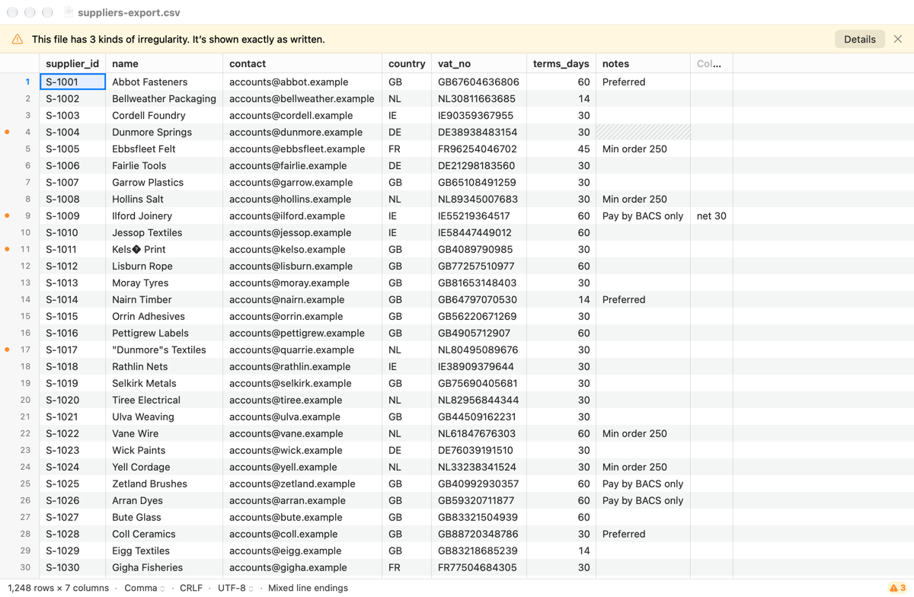
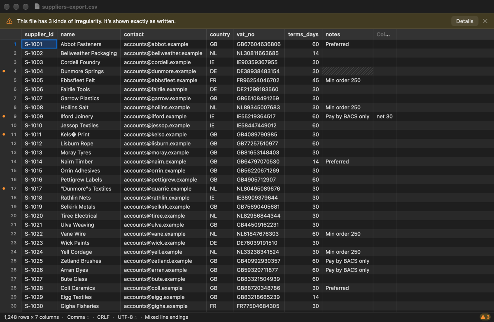
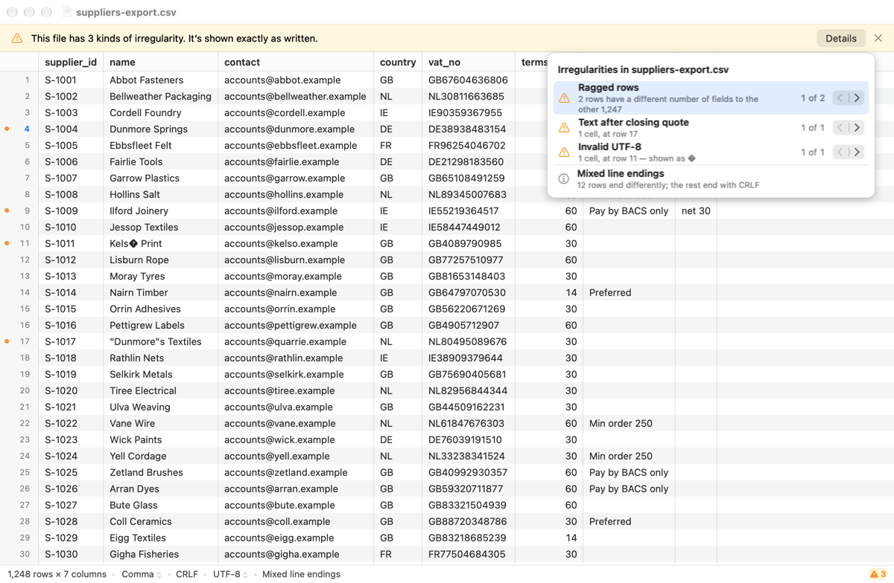
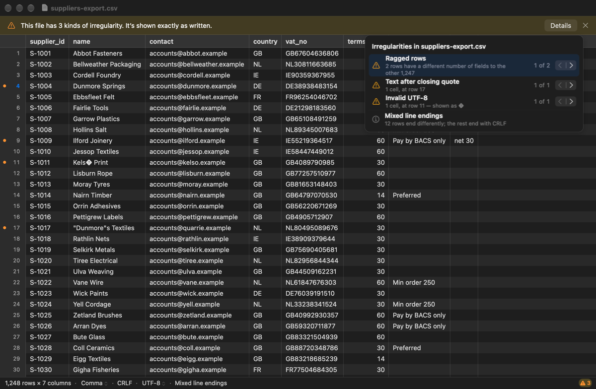

# 1.7 App: diagnostics banner

Messy files now say so. A non-modal banner reports how many kinds of
irregularity the file has, and the status bar keeps a badge after the banner
is dismissed. The details popover lists each kind with its count and
Previous/Next, and the gutter marks every affected row. Short ragged rows'
missing cells are hatched. The status bar notes info-level kinds, where the
bytes are (Reading, Copy, Disconnected, changed while reading) and ignored
attributes. Its delimiter and encoding are menus (**Treat As**, **Reopen with
Encoding**), and the review's delimiter and encoding suggestions appear as
banners. The removable-drive banners refuse Save and offer Save As. The file
is shown exactly as written throughout: nothing here changes a byte, and
every count, row and choice comes from the core.

## What was built

| Where | What |
|---|---|
| `leal-core/src/diagnostics/marks.rs` | `Mark::{Any, Ragged, Flagged}`. The row marks can be searched for ragged rows only or flagged rows only (`next_where`, `previous_where`, `is`). The 64-row vectorised skip still applies. |
| `leal-core/src/diagnostics/find.rs` | **New.** `field_with(kind, encoding, bytes, base, row)` finds the first field of a parsed row that has a field-level kind (text after a closing quote, invalid encoding, NUL, the unterminated quote). It uses the same definitions as the index pass. |
| `leal-core/src/diagnostics/mod.rs` | `RowFlags { marked, ragged }` and `Diagnostics::row_flags(rows)` (one lock per screenful), `row_is_ragged`, and `Report::rows_with_common_field_count`. |
| `leal-core/src/document/` | `Document::next_with_kind` and `previous_with_kind` (each giving a `Place { row, column }`), `row_flags`, `can_save` and `changed_on_disk`. `read_rows_of` reads rows from a given reading. |
| `leal-core/src/detect/`, `dialect.rs` | `Bom::allows(encoding)` (which `choose_encoding` now uses) and `Detection::encoding_choices()`. |
| `leal-core/src/source/` | Test hook `SimulatedFault` and `Source::open_simulating_fault`. The drive vanishes, or the file changes, when the copy reaches a chosen byte. It sets the same state a real fault does. |
| `leal-ffi` | `Interpretation.notes` (`InterpretationNote`) and `encodingChoices`. `DiagnosticsReport.rowsWithCommonFieldCount`. `DiagnosticPlace`, `RowFlags`, `Document.nextWithKind`, `previousWithKind`, `rowFlags`, `canSave` and `changedOnDisk`. Under `test-exports` only: `SimulatedFault` and `debugOpenDocumentWithFault`. `test-exports` now turns on leal-core's `test-hooks`. |
| `app/Sources/Window/DiagnosticsText.swift` | **New.** Every word of the banners, popover and status notes (String Catalog), and `KindNavigation`, the pure Previous/Next state. |
| `app/Sources/Window/DiagnosticsPopover.swift` | **New.** `DiagnosticsDetailsController` and `DiagnosticsEntryView` (mockup 03b). |
| `app/Sources/Window/DocumentViewController.swift` | Banner management (drive, UTF-16, diagnostics, delimiter and encoding suggestions, in that order), the popover and its navigation, Treat As, Reopen with Encoding, and the Save As placeholder. |
| `app/Sources/Window/StatusBarView.swift`, `StatusText.swift` | The bar as a row of segments. The delimiter and encoding are menu buttons, and there is a badge. `StatusText.items` (with roles), storage notes, attribute notes, info kinds and tooltips. `BannerView` gains a non-prominent button, a settable message and the pale yellow warning fill. |
| `app/Sources/Document/DocumentModel.swift` | Holds the diagnostics report, the review, the drive state (`storage`, `changedOnDisk`, `canSave`) and a row-flags cache. Adds `find(kind:forward:from:)` (off the main actor), `treatAs` and `reopen(encoding:)`. `openForTesting` is the hook for the fault tests. |
| `app/Sources/Document/CSVDocument.swift` | `canSave`. Save is refused (validation and `save(_:)`) while it is false. |
| `app/Sources/Grid/` | `GridDataSource.rowHasMarker` and `isHatched`, with defaults. `CellPainter.drawGutterMarker` and `drawHatch`. One call each in the gutter's and the grid's draw loops. |
| `app/Sources/App/MainMenu.swift` | View ▸ Treat As, View ▸ Show Irregularities, File ▸ Reopen with Encoding. |
| `app/Sources/Bench/ScriptedRun.swift` | `-LealDetails YES` for the 03b snapshot (see Screenshots). |
| `app/project.yml` | The diagnostics corpus is copied into `LealAppTests` as a resource folder. |
| `app/AppTests/DiagnosticsTests.swift` | **New.** The hosted tests below. |

### The banner (mockup 03a, ADR-0002 question 7)

- It appears as soon as the report has a warning or an error
  (`showsBanner`), while indexing too, and its count follows the report:
  "This file has N kinds of irregularity. It’s shown exactly as written."
  The singular reads "1 kind".
- **Details** is a plain push button, as drawn. Dismissing the banner hides
  it for the rest of the reading. The status bar's badge (⚠ N) stays and
  opens the details.
- Info-level kinds (mixed line endings, blank lines) never show the banner
  and have no gutter marker. They appear in the status bar ("Mixed line
  endings", "Blank lines") and in the popover. The BOM is already in the
  encoding segment, as "UTF-8 (BOM)".
- Reading the file again (Treat As, Reopen, the Header row toggle) is a new
  reading, so the dismissed banner and suggestions can come back.

### The details popover (mockup 03b)

- One entry per kind, with errors and warnings first in the core's order,
  then a separator and the info kinds without navigation. The entry used
  last is highlighted.
- The words come from the report. Ragged rows read "N rows have a different
  number of fields to the other M", where M is the core's
  `rows_with_common_field_count`. Cell kinds read "1 cell, at row 17", or
  "N cells, the first at row R", and invalid encoding adds "— shown as �".
  Row numbers are the gutter's, so the header row isn't counted. A location
  in the header row reads "the header row".
- **Mixed line endings** reads "12 rows end differently; the rest end with
  CRLF". The mockup's "12 rows end with LF" needs the minority line ending,
  which the report doesn't keep (see Deviations).

### Previous and Next, past the first 1,000

The report keeps only the first 1,000 locations of each kind (DESIGN §3.5),
but the row marks cover every row (1.5). Since the marks have one flag for
all field-level kinds, each kind's navigation works like this, in
`Document::step_to_kind`:

- **Ragged rows:** the marks alone (`Mark::Ragged`), against the current
  mode. The column selected is the row's first missing cell, or its first
  extra one.
- **Field-level kinds and the unterminated quote:** the marks give
  candidate rows (`Mark::Flagged`). If the report is complete and has no
  other flagged kind, every candidate is this kind, and the row is read only
  to find the column. Otherwise each candidate row is checked from its
  bytes, and rows with only other kinds are skipped. Where the report's
  locations decide the answer, and for NULs and invalid UTF-8 going
  forward, it is quicker still (see "Changes after review").
- **Info kinds:** no navigation, as drawn.

The app calls it on a detached task: in a file where most rows have some
other flagged kind it reads many rows. The answer is dropped if the file was
read again meanwhile. The position label is "k of N" from the report's
locations. Past them it is "1,000+ of N": the core can't count a field-level
kind's occurrences before a row without reading every row. A kind starts
"unvisited" at "1 of N", and its first **Next** shows that first occurrence.
Previous is off until then and at the first occurrence. Next is off at the
last one, when all are listed.

### Gutter markers and hatched cells

- `DocumentModel` reads `rowFlags` for 64 grid rows per FFI call and caches
  the blocks. It clears them when a new report arrives, because the marks
  grow and the mode can change while indexing. The gutter draws a 6 pt
  orange dot at its leading edge for marked rows.
- `.missing` cells are hatched if the row is ragged and the column is below
  the most common field count. Columns past it belong to longer rows ("Column
  8") and stay blank (ADR-0002 question 5). A blank line is never ragged, so
  it isn't hatched.
- The change to the grid is two calls and two `CellPainter` functions. The
  colours are resolved in those functions, not in `GridPalette`, so the
  per-frame palette (task 1.6a's area) is unchanged.

### Changing the interpretation (ADR-0005 decision 8)

- **Treat As:** the status bar's delimiter is a menu button (a chevron in
  the bar's secondary text style), and the same menu is in View ▸ Treat As.
  Choosing a delimiter calls `reinterpret` with it and keeps the user's other
  choices. The file is re-indexed, and its diagnostics, row flags, review and
  banners start again.
- **Reopen with Encoding:** the encoding is a menu button too, and File ▸
  Reopen with Encoding has the same list. It offers only the encodings the
  core says the BOM allows (`encodingChoices`): 14 for a file without a BOM,
  and just the BOM's own otherwise. A choice overrides the guess or the
  file's attribute (ADR-0004 decision 11), and the status bar then says
  "(chosen)".
- **Suggestions:** when the review finishes, "This file looks
  semicolon-separated." with **Switch**, and "This file looks like
  Windows-1252." with **Reopen as Windows-1252**. Both are info banners like
  06a's. The core suggests only for a guess, so once the user chooses there
  is no suggestion.
- **Ignored attributes:** "Encoding attribute ignored", or "Remembered
  settings ignored" for Leal's own attribute, with the reason in the tooltip.

### Removable drives (ADR-0006, 1.1a)

- **Status notes** (`Document.storage()`): "Reading from the drive" while
  the copy runs, "Working from a copy" once it is mapped (also for the
  large-file copy fallback), "Drive disconnected", and "Changed while
  reading". 1.6's "Read into memory" is unchanged. Each has a tooltip.
- **Banners**, which come first in the stack:
  - Disconnected: "The drive with this file was disconnected. Leal shows the
    rows it had read; Save is off until the drive is back, and Save As keeps
    a copy."
  - Changed: "This file changed on its drive while Leal was reading it, so
    what’s shown may mix two versions. Save is off; Save As keeps a copy."

  Both have **Save As…**.
- The model notices from the index job's `DriveDisconnected` or
  `ChangedOnDisk` ending, from every progress report, and from any read that
  fails that way. A read can fail inside a draw, so that last check is
  queued for afterwards.
- **Save** is refused: `CSVDocument.validateUserInterfaceItem` turns off
  `save(_:)`, and `save(_:)` itself beeps, while the core's `can_save()` is
  false. Save As is left to `NSDocument`. Phase 1 writes nothing, so the
  banner's **Save As…** shows a "not available yet" sheet (`SEAM(2.5)`), as
  1.6 did for Save As UTF-8.

## Tests

`just check-all` passes: 512 Rust tests (1 skipped) and 78 XCTests, 23 of
them new (after review). `just app-test release` (78), `just app release`,
`just check-no-bench` and `just check-no-test-exports` pass too.

- **Rust (leal-core)**
  - `each_kind_is_found_in_every_row_past_the_first_1000`: a 4 MB file with
    about 3,000 rows of each kind (invalid UTF-8; a NUL and text after a
    quote in the same row; ragged rows). Walking each kind with Next and
    with Previous gives exactly the rows and columns the file was made with,
    which agree with the report's first 1,000 locations and its count. Info
    kinds give nothing.
  - `kind_navigation_agrees_with_the_report_on_the_corpus`: every corpus
    file, UTF-16 included. Each kind's walk visits exactly the report's
    rows, and the selected field contains the location's offset.
  - The single-kind fast path, the ragged and unterminated columns, row
    flags (blank lines aren't ragged), encoding choices for no BOM, UTF-8
    and UTF-16 BOMs, `rows_with_common_field_count`, and the simulated
    disconnection and change: the job ends with the right error, storage,
    `can_save` and readable rows.
- **leal-ffi**: the new exports and fields, the note conversions, and
  `debug_open_document_with_fault` for both faults.
- **`DiagnosticsTests` (hosted, with the corpus files from
  `tests/corpus/diagnostics/` in the test bundle)**
  - The banner's wording, Details, dismissal and the badge staying. Three
    kinds counted with two info kinds left out. Info-only corpus files
    (blank lines, mixed line endings, BOM) and a clean file show no banner.
  - The popover for every corpus file: exactly the report's kinds in order,
    "1 of N" with the report's counts, and the counts in the subtitles. The
    mockup's wording on ragged-rows.csv.
  - **Previous and Next past 1,000:** 7,200 rows with 3,600 ragged, 1,200
    NUL and 1,200 text-after-quote rows. Next visits all 1,200 NUL rows in
    order, in column 1, with "1,000+ of 1,200" at the end, and stops there.
    250 Previous steps go back across the 1,000th to "950 of 1,200". Ragged
    rows are visited past the 1,000th, each at its first missing cell. The
    highlight moves. The first Next, the arrows' enabled states and wrapping
    at the ends are covered on a corpus file.
  - Gutter markers and hatching on ragged-rows.csv: the model's flags, and
    the offscreen pixels. The orange dot appears on marked rows only, hatch
    lines in the short row's missing cell, and none in the long row's extra
    column. The gutter markers are also checked on a grid with a fake source
    that marks rows 1 and 4.
  - Treat As from the status bar's menu and the View menu (columns, a new
    generation, new diagnostics). Reopen with Encoding from the menu: no
    UTF-16 without a BOM, invalid UTF-8 gone under Windows-1252, and
    "(chosen)". An attribute overridden. An unsupported attribute's note.
  - The encoding suggestion (ASCII for 64 KB, then Windows-1252) and its
    button. The delimiter suggestion (the core's own case), dismissal and
    Switch.
  - Through `debugOpenDocumentWithFault`: a disconnection at 100 KB (banner
    first in the stack, "Drive disconnected", Save refused, earlier rows
    readable), a change at 50 KB, and a fault-free removable file ending as
    "Working from a copy" with Save allowed.
  - The status bar's words for every storage state, notes and info kinds,
    and the `KindNavigation` positions (several occurrences in one row,
    beyond the listed ones).

## Performance

Nothing on the scroll path changed except, for each drawn row, one
dictionary lookup in the flags cache (an FFI call per 64 rows when a block
is new) and one more call to the data source per missing cell. The grid's
draw loops and `GridPalette` are otherwise untouched, for 1.6a. Each kind's
navigation runs off the main thread.

**Previous and Next** (after review, `crates/leal-bench/benches/navigate.rs`,
`just bench navigate/`). The file is about 175 MB: 120,000 rows of 200
fields. Every row has text after a quote, so every row is flagged, with a
NUL in every 37th row, invalid UTF-8 in every 53rd and a short row every
41st. Each search starts at row 100,000, past every kind's 1,000th
location. M5 Pro, release:

| Benchmark | Median |
|---|---:|
| `navigate/next_nul_wide` | 1.8 µs |
| `navigate/previous_nul_wide` | 2.8 µs |
| `navigate/next_invalid_wide` | 2.2 µs |
| `navigate/previous_invalid_wide` | 3.6 µs |
| `navigate/next_ragged_wide` | 14 µs |
| `navigate/previous_ragged_wide` | 14 µs |
| `navigate/next_quote_wide` | 3.2 µs |

The review measured one NUL Next at 254 ms on a 226 MB, 200-column file
with the first version. Searching for a NUL or invalid UTF-8 whose next
occurrence is far away now costs one `memchr` or SIMD validation pass over
the bytes in between, about 10 GB/s. The ragged searches cost the most
because a 200-field mode is wider than a row mark's code, so every row's
exact count comes from the side list. Not budgeted: DESIGN §1 has no
budget for this.

### The marks benchmarks

After 1.7 landed, CI's Benchmarks job flagged `marks/previous_wide` (the
gutter's **Previous** over 400,000 unmarked 130-field rows, 1.5): 443 →
579 µs, +30.6%, in a run that wasn't noisy. It was real, and it wasn't
the price of a correctness fix. It also had nothing to do with the
`Document::search_kind` changes in "Changes after review": that benchmark
calls `RowMarks::previous` directly.

**Cause.** 1.7 gave the marks searches a `Mark` filter (any, ragged or
flagged), passed down to the per-row test `marked_with`. For a narrow
mode the code alone decides, and that loop got about 10x faster (the new
`flagged | ragged` form vectorises). In a wide mode (127 fields or more)
every row is walked one at a time, alongside the side list, at about half
a nanosecond a row. There the compiler now decided `which` again on every
row, and no longer merged `marked_with`'s checks (a mode at all? blank?
wide?) with the walk's own "is this row wide?". The loop went from about
20 instructions per row to 23, with two more branches, and that was the
third.

**Fix** (`marks.rs`, behaviour unchanged). In a wide mode a search now
uses `WideTest`: the ragged test with what a wide mode already settles
taken out. There is a mode, and every narrower row is ragged unless
blank. `which` is decided once per search: there is one walk for each,
`next_wide::<FLAGGED, RAGGED>` and `previous_wide::<…>`, chosen by a
`match`. The race fix and cancellation are untouched: they are in
`Document`, above the marks. `wide_files_are_marked_and_searched_correctly`
now also checks every kind's walk, forwards and backwards from every row,
against its row-by-row test (`row_is`). Before, only `Mark::Any` was
walked there.

Same machine, back to back (M5 Pro, release, `just bench marks/` at each
commit, and the Fixed column from `just bench-compare 8030ad4~1`, which
passes; other agents kept the load at about 5):

| Benchmark | 8030ad4~1 | 8030ad4 | Fixed |
|---|---:|---:|---:|
| `marks/next_narrow` | 147 µs | 12.9 µs | 12.9 µs |
| `marks/previous_narrow` | 148 µs | 13.9 µs | 12.8 µs |
| `marks/next_wide` | 260 µs | 322 µs (noisy) | 255 µs (−3.5%) |
| `marks/previous_wide` | 206 µs | 278 µs (+33.5%) | 189 µs (−7.9%) |

`navigate/` is unchanged or faster: the ragged walks are 4–6% faster and
the rest are within ±2%.

## Screenshots

Offscreen renders (`just snapshot`, no Screen Recording permission) of a
synthetic file made to look like the mockups' (`suppliers-export.csv`,
invented names, 1,248 rows; generated by a throwaway script, not
committed). 1×, 1200 × 752 content.

| Mockup | Leal |
|---|---|
| `docs/mockups/03a-messy-file-banner.png` |  |
| 03a in dark mode |  |
| `docs/mockups/03b-messy-file-details.png` |  |
| 03b in dark mode |  |

```sh
just snapshot suppliers-export.csv out.png -LealWindowSize 1200x752 -LealAppearance light
just snapshot suppliers-export.csv out.png -LealWindowSize 1200x752 -LealDetails YES -LealAppearance dark
```

Differences from the mockups:

- **The popover in the snapshots** is its content drawn on a plain panel
  under Details. A real `NSPopover` is a window of its own, placed by the
  system, and its glass doesn't draw with `cacheDisplay`. In the app it is a
  standard transient popover anchored on Details, or on the badge once the
  banner is dismissed.
- **The active cell** after Next is the row's first missing cell, so in
  03b the hatched "notes" cell of row 4 has the selection ring, under the
  popover. The mockup shows only the row number highlighted.
- **"Mixed line endings"** wording, as above.
- **The extra "Column 8"** is narrower than drawn: 1.6's sizing doesn't
  count the dimmed title. That isn't changed here.
- The delimiter and encoding segments carry a small chevron, the only new
  control in the bar (ADR-0005 decision 8: no mockup round; Rob sees these
  at the phase 1 gate).

## Decisions and deviations

- **Navigation is per row, not per occurrence.** Next goes to the next *row*
  with the kind. A row with two NUL fields counts twice in "k of N", so the
  label can skip from 1 to 3. The report counts occurrences per field
  (ADR-0003), while the marks know rows.
- **Past the report's locations the label is "1,000+ of N"**, not an exact
  index (see above).
- **Mixed line endings wording** names the most common ending (from the
  review), not the minority one, which the report doesn't keep. Keeping
  per-ending counts in the report is a small core change if Rob wants the
  mockup's exact words.
- **Save As is a placeholder** until saving exists (2.5), as Save As UTF-8
  was in 1.6. Save is refused through `NSDocument` validation, though phase
  1 has no Save menu item yet.
- **ChangedOnDisk** shows its banner, status note and Save refusal. Reload,
  and dropping rows read before the change, are 1.9's (`SEAM(1.9)` in
  `DocumentModel.jobEnded`).
- **The fault tests use a new test hook**, `open_simulating_fault`, on top
  of 1.1a's `open_simulating_removable`, because a disk image can't be
  attached from inside the sandboxed test host (since the phase 1 review,
  `RemovableDriveTests` use real images attached from outside it; see
  docs/tasks/1.6.md). leal-ffi's `test-exports`
  (debug and `app-test release` only) now turns on `test-hooks`. `just
  check-no-bench` and the release library are unaffected.
- **The Copy note** shows for every mapped copy, including the 1.1
  large-file fallback on volumes that can't clone, where it is true too.
- **New dependencies:** none.

## What a reviewer should check

- `Document::step_to_kind`'s `alone` shortcut, and that `field_with` agrees
  with the collector for every encoding. The corpus test covers UTF-16 and
  the generated test covers mixed kinds. Single-byte unmapped bytes rely on
  `encoding_rs`'s malformed-input result, as display does.
- `DocumentModel.queueDriveCheck`: a failed read during a draw must not
  change the UI inside the draw.
- The banner stack's order and the per-reading dismissal (`dismissed`,
  `bannerGeneration`).
- The String Catalog (`just strings`). "Mixed line endings" is used twice
  with different comments (status bar and popover), like 1.6's "Close" and
  "Read-only".
- **Other agents' runs may kill the test host.** `just _run-scripted` ends
  an overdue run with `pkill -n -x Leal`, the newest process called Leal,
  which can be another worktree's test host. One `just app-test` here hung
  with its host gone while another agent was benchmarking. That is the
  likely cause, not a proven one. The suite passed when run again.

## Open questions (for the phase 1 gate)

- The interpretation controls and banners have no mockup (ADR-0005
  decision 8). The review found them consistent with ADR-0002, and Rob
  sees them at the gate.
- Answered in review: the mixed line endings wording stays, and Next doesn't
  wrap: it stops at the last occurrence with its arrow off.

## Changes after review

The review approved the branch with six should-fixes, all done, after a
rebase onto `main`.

1. **Previous and Next were slow on wide files** (254 ms for one NUL Next on
   a 226 MB, 200-column file), and every click started another search that
   couldn't be stopped. `Document::search_kind` now works in three steps:
   - the report's locations answer directly where they cover the target
     (`listed_row`, a binary search);
   - a NUL, or invalid UTF-8, going forward over a mapped file is found by
     one search of the bytes from the row on (`diagnostics::find::next_hit`,
     with `memchr` and `simdutf8::compat`, in 1 MiB windows), and
     `RowIndex::row_at_offset` (new) turns it into a row;
   - otherwise the marks give candidate rows, 256 per lock
     (`Diagnostics::rows_where`), and each is checked from its bytes
     (`row_may_have`). Only text after a quote and the unterminated quote
     need the row parsed, and only when it has a quote.

   No row goes through the grid's row cache or its mutex any more. Every
   search takes a number from `Document::searches`, and stops with
   `Cancelled` at its next check once a newer search has started. leal-ffi
   turns that into `None`, which Swift drops. Benchmarks: see Performance.
   Test: `a_newer_search_stops_an_older_one`.
2. **A race in the "only this flagged kind" shortcut.** The report and the
   marks are read under different locks, so while indexing, a flagged row
   of a kind the report didn't have yet could be taken for this kind. Both
   shortcuts (that one and the report's locations) are now used only once
   the report is complete. Test: `a_report_older_than_the_marks_is_not_trusted`
   passes an empty, incomplete report with complete marks. With the shortcut
   allowed, the NUL search returns the quote's row, and the test fails.
3. **Show Irregularities did nothing on info-only files**: it pointed at the
   hidden badge. The popover now points at the banner's Details button, or
   else the badge, or else the status bar's info note (`detailsAnchor`). The
   info notes ("Blank lines", "Mixed line endings") are now buttons that
   open the details. Test: `testInfoOnlyDetailsOpenFromTheStatusBarNote`.
4. **An occurrence in the header row selected data row 1.** It now scrolls
   to the top, with the column in view, and selects no cell. Test:
   `testAnOccurrenceInTheHeaderRowShowsTheHeader`.
5. **The release leak check.** A new `just check-no-test-exports`, which CI
   runs in place of its inline grep, fails if the release `LealFFI` or
   `Leal` binary has any test-only export (`debug_panic`, `debug_watch`,
   `debug_open_document_with_fault`) or leal-core test hook
   (`open_simulating_*`, `SimulatedFault`, `set_fault`), in `nm` or
   `strings` output and in either spelling. Checked both ways: the release
   app passes, and an `app-test` build fails on `debug_panic`, `debug_watch`
   and `SimulatedFault`.
6. **VoiceOver.** The status bar's delimiter and encoding buttons are pop-up
   buttons named "Delimiter: Comma, menu" and "Encoding: UTF-8, menu". The
   popover's arrows are "Previous: Ragged rows" and "Next: Ragged rows",
   with the same tooltips. Test:
   `testTheMenuButtonsAndArrowsAreNamedForVoiceOver`.

Also from the answers: when Next finds nothing further, its arrow goes off
(`KindNavigation.reachedEnd`), also past the listed locations. The
1,200-NUL test checks this.

## Rust notes

- **An enum as a filter** (`Mark` in `marks.rs`). Rather than three copies
  of `next` and `previous`, one search takes a `Mark` saying what counts as
  marked, and a `match` in `marked_with` decides. `#[derive(Clone, Copy,
  PartialEq)]` lets it be passed by value and compared (`which ==
  Mark::Flagged`).
- **Const generics as compile-time switches** (`next_wide::<FLAGGED,
  RAGGED>` in `marks.rs`, after the benchmark regression). `fn
  next_wide<const FLAGGED: bool, const RAGGED: bool>` takes two `bool`s
  fixed at compile time, not at run time. The compiler makes one copy of
  the function for each pair used, and in each copy `FLAGGED && …` is
  plain `true && …` or `false && …`, so the unused test disappears. A
  `match which` picks the copy once per search. The alternative, passing
  `which` in, is one line shorter but tests it on every row.
- **Returning early from a `match`** (`step_to_kind`). Each arm either gives
  a value (`Mark::Ragged`) or `return Ok(None)` for the info kinds. `match`
  is an expression, so `let which = match kind { … };` reads as "which marks
  to search, or stop".
- **`Result<Option<T>, E>`** (`next_with_kind`). Two different "no"s: `Err`
  means a row couldn't be read (a vanished drive), and `Ok(None)` means
  there is no further occurrence. The `?` operator passes an `Err` up and
  leaves the `Option` for the caller.
- **A reference to a closure** (`find.rs`, `let has: &dyn Fn(&FieldSpan) ->
  bool = match kind { … }`). Each arm makes a different closure, and
  closures have different types, so they are borrowed as `&dyn Fn`, one
  shared type. `position(has)` then calls it on each field. Most arms
  capture `raw`, a closure that borrows `bytes`.
- **`as_chunks::<2>()`** (`find.rs`). It splits a byte slice into `[u8; 2]`
  pairs plus a remainder, without copying, which suits UTF-16 code units:
  an odd remainder is a final odd byte, so invalid. `char::decode_utf16`
  then reports an unpaired surrogate as an `Err`.
- **Feature-gated fields** (`removable.rs`). `#[cfg(any(test, feature =
  "test-hooks"))]` on a struct field, an enum, a method or a statement
  compiles it only for tests and the test-hooks feature. The product build
  has no `fault` field at all. `#[cfg_attr(not(...), expect(unused_mut))]`
  on `let mut removable` tells the compiler that the `mut` is needed only
  when the hook exists.
- **`if … && let …` chains** (`search_kind`, after review). `if direction
  == Direction::Forward && let Some(bytes) = self.source.as_slice() && let
  Some(extent) = …` runs the block only if every part holds, and binds
  `bytes` and `extent` for it. It replaces three nested `if let`s (Rust 2024
  edition).
- **A counter as a cancel signal** (`Document::searches`, an `AtomicU64`).
  `fetch_add` gives each search its own number, and a search stops when the
  counter has moved on. That needs no handle and no lock: the counter is
  shared between threads safely, and `Ordering::Relaxed` is enough, since
  only the value matters, not what other memory it orders.
- **A struct for a borrowed result** (`RowBytes<'a, 'r>`). It holds the
  row's bytes, which may borrow from the file (`Cow<'a, [u8]>`), and a
  reference to the index (`&'r RowIndex`), which borrows from the reading.
  The two lifetimes say these come from different owners. Clippy flagged
  the tuple type it replaced as too complex to read.
- **Cargo features that turn on another crate's** (`leal-ffi/Cargo.toml`,
  `test-exports = ["leal-core/test-hooks"]`). Building leal-ffi with its
  test exports builds leal-core with its test hooks. Release builds use
  neither.

## Swift notes (for the Swift/AppKit reviewer)

- **Protocol requirements with defaults** (`GridDataSource.rowHasMarker`,
  `isHatched`). They are declared in the protocol and given a default in an
  extension. A method defined only in an extension would be dispatched
  statically, so the grid, which holds an `any GridDataSource`, would never
  reach `DocumentModel`'s version.
- **Off-main work with the UniFFI handle.** `DocumentModel.find` runs
  `nextWithKind` in `Task.detached`. The generated `Document`, the enums
  and the records are `Sendable`. The result returns to the main actor, and
  is dropped if the generation changed.
- **Navigation returns its `Task`**, so tests can `await
  content.navigate(...).value` instead of polling.
- **Banners are keyed** by `NSUserInterfaceItemIdentifier`, so a banner is
  replaced only when what it says changes, and a dismissal applies to that
  key for the current reading.
- **Menus built per click** (`treatAsMenu`, `reopenMenu`) from the last
  `StatusSummary`. The menu bar's items are static and validated by
  `DocumentViewController.validateMenuItem`, with the delimiter or encoding
  in `representedObject` (`DelimiterBox`, `EncodingBox`).
