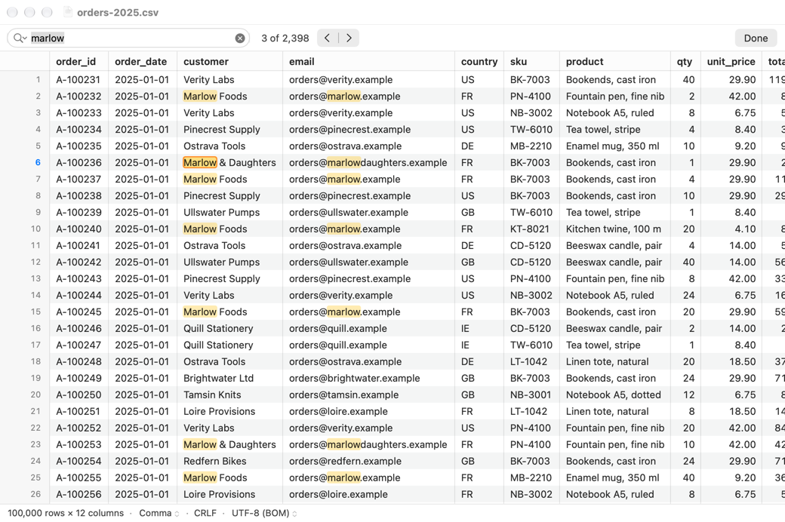
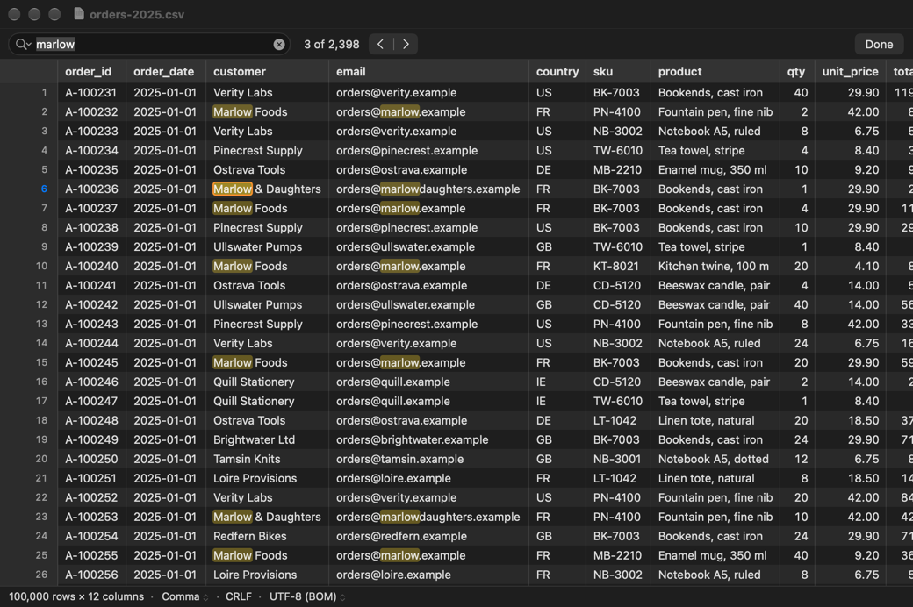
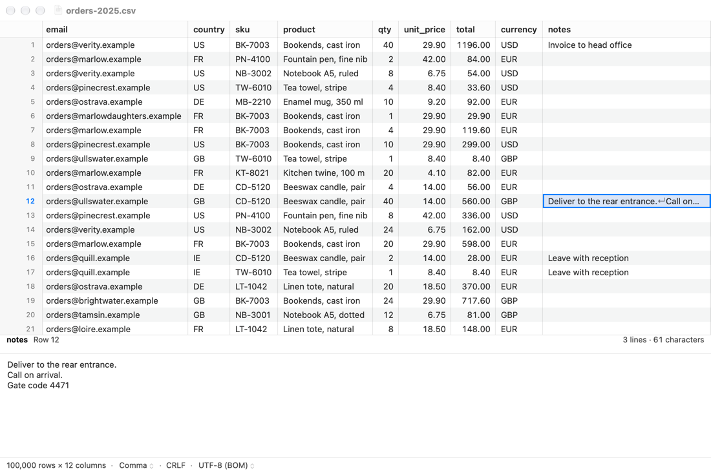
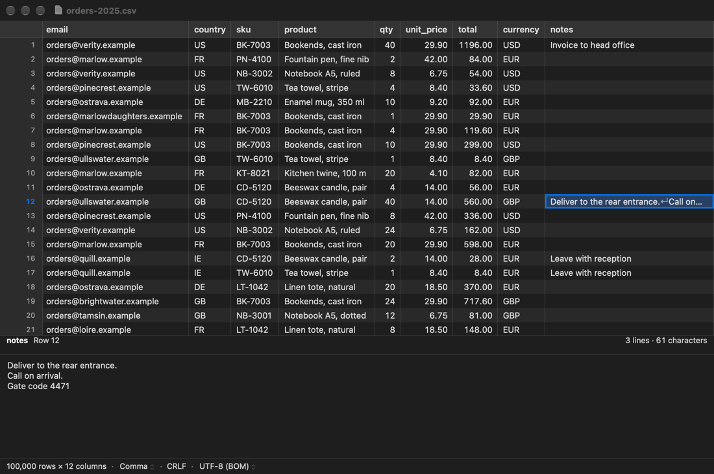
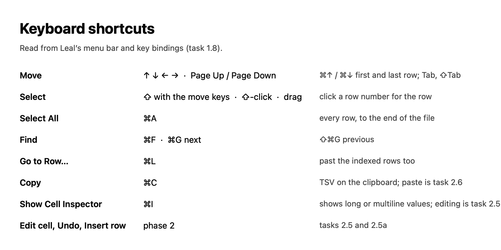

# 1.8 App: find, go to row, copy, cell inspector

Leal can now find text in a file, go to a row by number, copy cells and
show a cell's whole value. The grid has a real selection: click,
Shift-click, drag, ⌘A, row numbers, and Shift with every move key. Find
runs in the core as a background (P2) search that streams its matches,
works while the file is still being indexed, and pauses while the user
scrolls. Go to Row works past the indexed rows. Copy puts tab-separated
display values on the clipboard. The cell inspector is a bottom pane,
toggled with ⌘I. It is read-only until task 2.5.

## What was built

| Where | What |
|---|---|
| `leal-core/src/find.rs` | **New.** `Query` (literal text, case-insensitive by default) and `Matcher`: whether a display value holds the query, where it is (UTF-16 ranges for the grid), and for UTF-8 a search of the raw bytes that finds candidate rows without splitting them. |
| `leal-core/src/document/search.rs` | **New.** `Document::find` → `Search`, a P2 job: progress, `step` (Next or Previous, wrapping), `ordinal` ("k of N") and `matches_in` (a tile's highlights). |
| `leal-core/src/document/values.rs` | **New.** `Document::copy_cells` (a P2 job giving TSV), `push_tsv_cell`, `Document::cell_value` and `CellValue` (the inspector's whole value, with its character and line counts and whether it has invalid bytes). |
| `leal-core/src/schedule/` | `Interval::Find` and `Interval::Copy`, for the signposts. |
| `leal-ffi/src/document/find.rs` | **New.** `Document.find`, `Search`, `Document.copyCells`, `CopyJob`, `Document.cellValue`, with their records. Every call goes through the document's failure guard (`guarded`, factored out of `Document::call`), and a panic in their jobs fails the document. |
| `leal-bench/benches/find.rs` | **New.** Find over the reference file, and a screen of cells while a search runs (budgeted at 1 ms, DESIGN §3.9). |
| `app/Sources/Grid/GridSelection.swift` | **New.** The selection: the active cell and a rectangle from `anchor` to `extent`, with `throughLastRow` for ⌘A while indexing. |
| `app/Sources/Grid/GridHighlights.swift` | **New.** `GridHighlighter`, the protocol the grid asks for find's highlights, and `CellText.displayRanges`. |
| `app/Sources/Grid/GridView.swift` | The selection's fill, the highlights (one call before each matching cell's text), Shift-click, drag (with autoscroll), Shift with the move keys, and Copy and Select All. |
| `app/Sources/Grid/GridContainerView.swift` | Selection, `extend`, `selectAll`, row selection, and Go to Row with `PendingJump` (⌘↓'s old `isJumpingToEnd` is now `.end`). |
| `app/Sources/Grid/GridChrome.swift` | The gutter numbers selected rows in the accent colour; Shift-click on a row number. |
| `app/Sources/Grid/CellPainter.swift` | `drawFindHighlights`. |
| `app/Sources/Document/FindModel.swift` | **New.** The find bar's state: the core's search, the current match, a Next waiting for the search, and highlight tiles. |
| `app/Sources/Document/DocumentValues.swift` | **New.** Copy and the inspector's reads, and `Clipboard`. `DocumentModel.backgroundHandle()` is the one change to `DocumentModel` itself. |
| `app/Sources/Window/FindBar.swift` | **New.** The find bar, and `FindText` (its words and Go to Row's). |
| `app/Sources/Window/CellInspector.swift` | **New.** The inspector pane, its text view (which takes ⌘↩) and `InspectorText`. |
| `app/Sources/Window/DocumentViewController.swift` | The find bar above the banners, the inspector between grid and status bar, and the commands: Find, Find Next, Find Previous, Go to Row, Copy, Show/Hide Cell Inspector. |
| `app/Sources/App/MainMenu.swift` | Edit ▸ Find ▸ Find… ⌘F, Find Next ⌘G, Find Previous ⇧⌘G; Edit ▸ Go to Row… ⌘L; View ▸ Show Cell Inspector ⌘I. |
| `app/Sources/Bench/` | `-LealFind`, `-LealInspector` and `-LealShortcuts` for the snapshots; `ShortcutSheet`. |
| `app/AppTests/FindTests.swift`, `SelectionTests.swift` | **New.** See Tests. |

### Find (mockup 04a, ADR-0002 question 9)

- **What matches.** A cell whose display value contains the query. That
  is the value the grid shows: unquoted, `""` read as `"`, decoded, and
  with invalid bytes as U+FFFD. The query is literal text.
  Case-insensitive matching is on by default (DESIGN §4.2). It uses
  Unicode simple case folding, as the `regex` crate defines it, so
  `ÉCOLE` matches `école`. The field's magnifying-glass menu has
  **Ignore Case**. The header row isn't searched, since it isn't one of
  the grid's rows.
- **A match is a cell.** The count ("6 of 2,318") counts cells in file
  order, row by row and left to right. Every occurrence in a matching
  cell is highlighted. The current match gets a stronger mark with an
  orange outline, in place of the active cell's fill and ring, as 04a
  draws it. Its row number is in the accent colour.
- **In the core, on the scheduler.** `Document::find` spawns a P2 job
  that works in chunks of about 64 KiB of rows (`SEARCH_CHUNK_BYTES`).
  It calls `checkpoint` between chunks, so it pauses while the user
  scrolls or types (DESIGN §3.10 rule 3) and stops within one chunk when
  cancelled. It shares no lock with the grid's reads except the index's,
  which both only read. It never uses the row cache.
- **While indexing.** The search reads the rows indexed so far. When it
  catches up it waits 1 ms and looks again, until the index is complete.
  If the index job stops first (the document closed, or a drive
  vanished), the search ends with the index's error. That keeps rule 6's
  promise for filters for find too.
- **Streaming.** The matches so far are kept as each matching row's
  number and a running count, 12 bytes a matching row. That is 12 MB if
  every row of the 1M-row reference file matches. Which cells of a row
  match is worked out again when needed, from one parse of that row: for
  the rows on screen, Next and "k of N". The app reads the progress every
  100 ms while the search runs, and the highlights a tile (64 × 32 cells)
  at a time. A tile is read again once the search has passed it.
- **Raw bytes first.** For UTF-8, the matcher first searches the raw
  bytes with a byte regex, with each quote in the query as `"` or `""`.
  Only rows with a candidate are split into fields, and only fields where
  a candidate starts are decoded and checked. This is exact, not a
  heuristic. A display value is its raw bytes less the enclosing quotes
  and one quote of each `""`. Any stretch of it without U+FFFD is valid
  UTF-8, which the byte regex matches with the same case folding. The
  argument is in `Matcher::new`'s docs. Other encodings, and queries
  containing U+FFFD, check every value.
- **Next and Previous** (⌘G, ⇧⌘G, Return and Shift-Return in the field,
  the arrows) go from the active cell, which needn't be a match. Past the
  last match they wrap to the first, and before the first to the last.
  That is how macOS find bars behave; 1.7's diagnostics Next stops
  instead. Until the search is complete, a step it can't answer yet is
  `Pending`, and the app asks again as results arrive. Typing selects
  the first match at or after the active cell once it is found. A click,
  key, scroll or Go to Row cancels that, so a late result never moves the
  selection away from where the user went.
- **The count** reads "6 of 2,318" when the active cell is a match, and
  "2,318 matches" otherwise. While the search runs it reads "6 of
  2,318+", the same "+" as 1.7's counts. It can also read "Searching…" or
  "No matches".
- **Done** or Esc closes the bar and stops the search, and its highlights
  go. The query stays: ⌘F selects it, and ⌘G reopens the bar and goes on.
  Reading the file again (Treat As, Reopen with Encoding, the Header row
  toggle) starts the search again for the new reading.

### Go to Row (⌘L)

A standard sheet asks for a row number, as the gutter numbers rows. It
accepts grouping separators ("1,000,000"). A row the index already has is
selected at once. A row past the indexed ones follows DESIGN §3.10 rule 5:

- the grid scrolls to where the estimate puts the row, with skeleton
  rows;
- the pill reads "Reaching row N… row X of about M";
- when the index reaches the row, it is selected in the column the active
  cell was in.

If the file turns out shorter, the last row is selected. A scroll or a
click drops the wait, as it already did for ⌘↓.

The indexer is already at the front of the queue: it runs on its own
thread from first paint on, with nothing ahead of it. 1.3a noted this
too. So Go to Row needs no change in the core, and needs nothing like
`reprioritize`.

### Copy (⌘C)

- The selected rectangle goes on the clipboard as tab-separated **display
  values** (`Document::copy_cells`), one row per line, with no line ending
  after the last.
- Nothing is fixed: invalid bytes copy as the U+FFFD the grid shows, and
  text after a closing quote copies as it reads.
- A cell holding a tab, a line break or a quote is quoted, with each quote
  doubled. This is how Excel and Numbers put cells on the clipboard, so a
  multiline cell pastes back as one cell.
- A short row's missing cells are empty, so the columns still line up.
- The text goes on the pasteboard as both `public.utf8-tab-separated-values-text`
  and plain text, from one copy of its bytes.
- **At once when small.** A selection the index has, of at most about
  4 MB (`Document::estimated_copy_bytes`, which reads no rows), is copied
  on the spot (`Document::copy_cells_now`) and is on the pasteboard when
  ⌘C returns.
- **Promised when large.** Anything else is a P2 job, and its text is
  *promised* to the pasteboard straight away (`CopyPromise`, an
  `NSPasteboardItemDataProvider`), so a paste never gets the old
  clipboard. The text is built off the main thread and stays in the core
  until something pastes it. A paste before the job is done waits for it
  there (`CopyJob.takeWaiting`), as a promise must be answered at once.
- **A promised copy outlives its window.** Closing the document, reading
  the file again or reloading it doesn't stop it. The job keeps its own
  reading and the file's clone, so it still gives exactly the cells that
  were copied. If closing stopped the document's index before the job
  reached its rows, the job indexes the file itself (`own_index`). AppKit
  asks for promised data when the app quits, after the windows have
  closed, so that works too. Only the pasteboard letting go stops it: a
  new copy here, or another app's. Once both types have been given, the
  promise lets go of the text and the job, and so of the clone. A copy
  that failed gives the pasteboard nothing (not an empty string), and
  the failure is logged.
- **Asks first over about 100 MB**, with a sheet giving the size.
- ⌘A while indexing selects to the last row, however many rows there turn
  out to be (`GridSelection.throughLastRow`). The copy job waits for the
  index to reach the rows it needs.

### The cell inspector (⌘I, mockup 05a, ADR-0002 question 11)

- A 190 pt pane under the grid. Its header shows the column title (or
  "Column N" when there is no header row), "Row 12", and on the right
  "3 lines · 62 characters". Below that, the whole value appears in a
  read-only, selectable text view.
- The value is `display_value`, the whole of it (1.4 notes), up to
  64,000 characters. A longer value says "value truncated: the first
  64,000 shown". The text view lays out non-contiguously. (A million
  characters with no line break took 800 ms on the main thread on an M5
  Pro; 64,000 lay out in a few milliseconds.) A
  value with invalid bytes shows U+FFFD and says "invalid bytes shown as
  �". A short row's missing cell, and a row not read yet, show a note.
- The read and the counting run off the main thread. A value of many
  megabytes takes milliseconds to decode. A newer selection drops an
  older read.
- **⌘↩.** The inspector's text view takes ⌘↩ (`InspectorTextView`), so it
  never reaches the grid, where task 2.5a's Insert Row will use it. In
  phase 1 it does nothing (`SEAM(2.5)` commits there). Return, Esc and
  "⌘↩ commits · Esc cancels" arrive with editing in 2.5.

### Selection and keys (ADR-0001's custom code)

- **Click** selects a cell. **Shift-click** and **drag** select the
  rectangle from the active cell; a drag past the edge scrolls. **⌘A**
  selects everything and leaves the active cell where it is. A **row
  number** selects its row, and Shift-click on another extends to it.
- **Shift with every move key** moves the rectangle's far corner. That
  covers the arrows, Page Up and Down, ⇧⌘↑/↓ and ⇧⌘←/→, all from
  AppKit's standard `…AndModifySelection:` bindings. The active cell keeps
  the ring, as in a spreadsheet, and the moving corner stays in view.
- Selected cells get the light accent fill, and selected rows' numbers
  are in the accent colour.
- The grid changes are contained, because task 1.6a is reworking drawing
  and scrolling. `drawCells` gains one highlighter call per text cell and
  a `contains` check for the fill. The ring check gains one call. The
  gutter gains one range check per row. The per-frame `GridPalette` is
  unchanged, and the highlight colours are resolved in their own painter
  function, as 1.7's hatching is.

## Tests

`just check-all` passes: 538 Rust tests (1 skipped) and 100 XCTests, 22 of them new. `just app-test
release`, `just app release`, `just check-no-bench` and `just
check-no-test-exports` pass too.

- **Rust, `find`** (8): case folding (including the Kelvin sign);
  case-sensitive matching; literal queries; empty and too-long queries;
  when raw bytes may be searched; raw candidates in every case and with
  quotes as `""`; UTF-16 ranges cut at the shown characters.
- **Rust, `document::tests::find`** (12):
  - counts and order against a brute-force scan of every display value,
    over about eight chunks, in UTF-8 (raw path) and in Windows-1252
    (value path), for seven queries, including ones that match nearly
    every row, with each match's ordinal checked;
  - Next and Previous at both edges, from non-matching cells, within a
    row, and wrapping, including a single match that wraps to itself;
  - highlight ranges, cut at the shown characters;
  - find while indexing: with the index thread held, the search is
    `Pending` and makes no progress, then follows the index to the end;
  - pausing while the user interacts;
  - cancelling, closing the document while the search waits on the
    index, and dropping the search;
  - Copy: tabs, line breaks, quotes, invalid bytes, text after a quote,
    short rows and rows past the end, and ⌘A past the indexed rows
    waiting for the index;
  - the inspector's values: multiline (CRLF and LF), an invalid byte, a
    300,000-character value cut to 1,000, empty, missing, and past the
    end.
- **Rust, `push_tsv_cell` and `line_count`** (3).
- **FFI** (3): a search, a copy and a cell value as Swift sees them; and
  a failed document failing its search and copy calls.
- **`FindTests`, hosted, against the real core** (9):
  - counts, the first match selected as you type, highlights, "k of N"
    as the selection moves, and Ignore Case off;
  - Next and Previous through every match and round both edges, "No
    matches", and Done then ⌘G;
  - find and Go to Row on a 24 MB file while it is indexed: the jump
    waits with the pill and lands in its column, the search finds every
    match, and Next and Previous wrap;
  - the search starting again after Treat As;
  - Copy as TSV with tabs, newlines and quotes, on a private pasteboard
    (tests never touch the user's clipboard);
  - ⌘A then ⌘C while indexing copying every row;
  - the inspector on multiline, invalid-byte and 1,200,000-character
    values, a missing cell, ⌘I and the menu title;
  - the inspector waiting for a row past the index;
  - the find bar and inspector not drawing over the grid.
- **`SelectionTests`, with fakes** (13):
  - the selection model;
  - click, Shift-click and drag;
  - Shift with the move keys;
  - ⌘A while indexing and row numbers;
  - Copy's validation;
  - Go to Row past the index, a file shorter than asked, and a scroll
    dropping it;
  - row number parsing;
  - drawing: the yellow highlight, the current match's orange outline in
    place of the ring;
  - ranges across a CRLF's ↵;
  - the count's wording;
  - ⌘↩ taken by the inspector;
  - every phase 1 shortcut in the menu bar (06c).

## Benchmarks

`crates/leal-bench/benches/find.rs`, on the 1.2b reference file (100 MB,
1M rows × 12 columns). Each search is the whole file, as a P2 job on the
background pool, from the first data row to the last. Same Mac as earlier
tasks (`Mac17,8`, M5 Pro), not the reference M1 Air, with a load average
of about 3.7 from other agents' work.

| Benchmark | Query | Matching cells | Median | Longest chunk |
|---|---|---|---|---|
| `find/no_match` | `qqzx` | 0 | 8.3 ms (12 GB/s) | 0.12 ms |
| `find/rare` | `Reykjavík` | 31,457 | 17.3 ms | 0.17 ms |
| `find/quote` | `wrote "` | 19,924 | 15.4 ms | 0.19 ms |
| `find/common` | `deliver` | 253,280 | 81.7 ms | 0.49 ms |
| `find/every_row` | `SKU-` | 1,000,000 | 263 ms | 1.49 ms |
| `find/every_value` | `wrote �` (no raw search) | 0 | 303 ms | 1.64 ms |
| `find/screen_during_find` | a screen of cells while `SKU-` searches run | — | **17.0 µs** | — |

- **Chunks stay well under rule 3's ~5 ms.** The longest stretch between
  two checkpoints was 1.6 ms (`every_value`), so a search pauses within
  about 2 ms of the user starting to scroll. As in 1.3a this is
  wall-clock time: a preempted chunk on a busy machine looks longer. One
  early run measured 40 ms once, which didn't reproduce.
- **The grid isn't slowed.** `find/screen_during_find` reads 60 rows ×
  12 columns at 128 characters a cell (`Document::cells`, as the grid's
  tiles do) while searches run back to back on the pool. It takes
  17.0 µs, about what `rows/screen` takes alone (13.8 µs in 1.3a's
  notes). It is a new CI budget at DESIGN §3.9's 1 ms. A search never
  touches the row cache's mutex. It shares only the index's read lock,
  and first paint does no search work at all.
- **Raw bytes first** is what keeps most searches near the speed of
  light. Only rows with a candidate are split, and only fields where a
  candidate starts are decoded. Two changes found while benchmarking:
  - Bounding each row's candidate search to the row itself took
    `every_row` from 431 ms to 263 ms, and `rare` from 26 to 17 ms.
  - Searching for a quote as `"` or `""` in the raw bytes, instead of
    falling back to every value, took `quote` from 309 ms to 15 ms.
- **Worst cases.** These are a query in nearly every row, or a file in
  another encoding, where every value is decoded. They are 260–300 ms, about
  DESIGN's 300 ms filter budget for a full scan. Find has no budget of its own, and
  the results stream in, so the first matches show within a few chunks.
  `rayon`'s parallel iterators could split the scan across the pool. That
  is phase 3's filter engine work, and I didn't add it here.

```sh
just reference-file
just bench find/
```

## Screenshots

Offscreen renders (`just snapshot`, no Screen Recording permission) of a
synthetic file made to look like the mockups' (`orders-2025.csv`, invented
names, 100,000 rows, UTF-8 with BOM and CRLF). It was made by a throwaway
script and isn't committed. 1×. The find bar's renders are 1040 × 660
points, to keep each PNG under 400 KB; the mockups are 1200 × 780 (the
inspector's renders are 1100 × 700).

| Mockup | Leal |
|---|---|
| `docs/mockups/04a-find.png` |  |
| 04a in dark mode |  |
| `docs/mockups/05a-inspector-multiline-edit.png` |  |
| 05a in dark mode |  |
| `docs/mockups/06c-keyboard-shortcuts.png` |  |

```sh
just snapshot orders-2025.csv out.png -LealWindowSize 1040x660 -LealSelect 5,0 -LealFind marlow
just snapshot orders-2025.csv out.png -LealWindowSize 1100x700 -LealSelect 11,11 -LealInspector YES
just snapshot orders-2025.csv out.png -LealShortcuts YES
```

Differences from the mockups:

- **The count** reads "3 of 2,398": the third match in file order is row 6's
  customer, after row 2's customer and email. The mockup's "6 of 2,318" is
  invented.
- **The search field's magnifying glass has a menu chevron**, for
  **Ignore Case**. The mockup has a plain magnifier. The query is
  selected, as ⌘F leaves it, so typing replaces it.
- **Previous and Next** are a standard segmented control.
- **The inspector** (05a) is read-only, so its header has no "⌘↵ commits
  · Esc cancels", the title no "— Edited", and the cells no corner
  triangles. Those are editing, task 2.5.
- **06c is a sheet drawn from the running app's menu bar** (titles and
  key equivalents read from the menu items) and grid key bindings. It is
  not a screenshot of a Leal window: the mockup is a reference card, and
  Leal has no such window. Editing, Undo, Paste and Insert/Delete Row are
  phase 2.
- **The column widths** come from 1.6's sizing (header titles count), so
  "coun…" and "curre…" in the mockup are "country" and "currency" here,
  as in 1.6's screenshots.

## Decisions and deviations

- **Next wraps round the end of the file**, as macOS find bars do, with
  no beep and a brief Safari-style "wrapped" sign over the grid (Rob's
  answer). 1.7's diagnostics Next stops at the last occurrence instead,
  as Rob answered there.
- **A match is a cell, not an occurrence.** The count and "k of N" count
  cells. Every occurrence within a matching cell is highlighted, but Next
  moves cell by cell, which suits a grid.
- **The header row isn't searched**, since it isn't a grid row. It is
  copied only if it is a grid row (no header).
- **Case folding is Unicode simple folding** (the `regex` crate's). So
  `ß` doesn't match `SS`, and Turkish dotted İ isn't folded to i.
  Foundation's `.caseInsensitive` would differ in such corners. The core
  decides, so the count, Next and the highlights always agree.
- **Find is P2 work**, on the pool, pausing while the user interacts. It
  starts on first use, never during open. A search waits for the index
  by looking again every millisecond, rather than through a notification
  from the index. That is simpler, and it costs nothing measurable.
- **Go to Row's sheet is a standard `NSAlert`** with a text field. There
  is no mockup for it. It uses the system's sheet style, and Rob sees it
  at the gate.
- **Copy writes both TSV and plain text** to the pasteboard, quoting cells
  with a tab, line break or quote, as Excel and Numbers do. Copy includes
  only the selected rectangle. Row numbers and header titles aren't
  added.
- **Copy and the inspector's read run off the main thread.** Copy is a P2
  job, and the inspector uses a detached task, like 1.7's diagnostics
  navigation. A one-cell copy is still quick (well under a frame), but a
  ⌘A ⌘C of a 1 GB file is 1 GB of text, and shouldn't block the window.
- **No Replace** (ADR-0002 question 9), and no "Use Selection for Find"
  (⌘E) or system find pasteboard: by Rob's answer these are a PLAN 4.4
  criterion now.
- **`regex` is a new dependency** (see below).
- **One change to `DocumentModel`**: `backgroundHandle()`, for the
  inspector's off-main read (1.9 is working in that file). Copy and the
  inspector are in `DocumentValues.swift`, an extension, and find's state
  is its own class.

## New dependencies

- **`regex` 1.13** in leal-core (MIT/Apache-2.0), on CLAUDE.md's list. It
  was already in the lock file through criterion, so nothing new is
  downloaded. It gives literal search with Unicode simple case folding,
  on `&str` (display values) and on bytes (the raw prefilter), with SIMD
  literal search (`memchr`, Teddy). Phase 3's regex filter (DESIGN §3.8)
  needs it anyway. It is built with its default features (`unicode`,
  `perf`). The Unicode case tables add about 1 MB to the library.

## Notes for Rob

- **Try it**: ⌘F, type; ⌘G and ⇧⌘G; Return and Shift-Return in the field;
  Esc or Done. ⌘L takes a row number. ⌘C copies the selected cells (paste
  them into Numbers). ⌘I shows the inspector. Shift with the arrows, a
  drag, or ⌘A select ranges.
- On a big file, try ⌘L to a row near the end straight after opening.
  The pill says "Reaching row N…", and the row is selected when the
  index gets there.
- **Questions for the gate** are below; the main one is whether Next
  should wrap.

## Open questions

Answered after the review (see "Changes after review"): Next wraps, with a
"wrapped" sign and no beep; the Go to Row sheet is fine for v1; a copy of
more than about 100 MB asks first; the find pasteboard and ⌘E are PLAN
4.4. None are left open.

## Changes after review

The review found one must-fix and five should-fixes, all done, after a
rebase onto `main`. It also checked find against a naive scan over 3,000
messy UTF-8 and UTF-16 files, including searches started before indexing
finished.

1. **Every Copy waited about 250 ms** (must-fix). ⌘C noted user input,
   and that paused the P2 copy job at its first checkpoint, so a paste in
   that window got the old clipboard. Now:
   - neither Copy nor Select All notes input;
   - a small selection the index has is copied at once
     (`copy_cells_now`);
   - anything else is promised to the pasteboard straight away (see
     Copy).
   Tests: `testASmallCopyIsOnThePasteboardAtOnce` (right after an input),
   `testALargeCopyIsPromisedAtOnceAndAsksFirstWhenHuge`, and Rust
   `copying_at_once_gives_the_jobs_text_for_indexed_rows`.
2. **A race in Next and Previous** (`search.rs`). The last chunk could
   land, and the search finish, between a step's look at the matches and
   its look at `complete`. Next then wrapped to the first match past the
   real next one, and Previous reported a wrap. Each step now checks,
   under the lock that reads `complete`, whether matches arrived (or, for
   Previous, whether the rows before `from` became searched) since its
   look, and looks again if so. A test-only hook (`before_settling`)
   makes the search finish at exactly that moment:
   `a_step_that_races_the_last_chunk_looks_at_it`.
3. **The inspector stalled on huge values.** It now shows at most 64,000
   characters with non-contiguous layout, and says the value is
   truncated. The test shows a 1,200,000-character line and checks that
   it lays out in under 250 ms.
4. **Closing a window didn't stop its search**, whose tasks held it, and
   so the core document and its file. `CSVDocument.close` now calls
   `DocumentViewController.documentWillClose`, which stops the search and
   the inspector's read. Reading the file again restarts the search. The
   find model's tasks no longer hold the search. Test:
   `testClosingTheWindowStopsItsSearch`, with the search held by an
   interaction so it is running when the window closes. (This first
   stopped a copy too; the re-review found that wrong, see below.)
5. **VoiceOver hears the count** after Next and Previous ("3 of 6"), on a
   wrap ("Wrapped to the first match. 1 of 6"), and when a search
   finishes. These are `NSAccessibility` announcements at high priority.
6. **Big copies are lighter on the main actor.** The text is built off
   it, is no longer taken there, and goes to the pasteboard once, only
   when pasted. A copy over about 100 MB asks first.

Also:

- **Find's chunk target is 64 KiB** (was 256 KiB). The review measured
  a 7.3 ms chunk on a loaded machine. The longest is now 1.3 ms at a load
  average of 7.8, and the totals moved by under 3%:

  | Benchmark | Median | Longest chunk |
  |---|---|---|
  | `find/no_match` | 8.7 ms | 1.01 ms |
  | `find/rare` | 17.8 ms | 0.23 ms |
  | `find/quote` | 16.2 ms | 0.19 ms |
  | `find/common` | 85.7 ms | 0.23 ms |
  | `find/every_row` | 272 ms | 1.14 ms |
  | `find/every_value` | 309 ms | 1.32 ms |
  | `find/screen_during_find` | 17.0 µs | — |

- **The "wrapped" sign** (`WrapIndicatorView`): a looped arrow on a dark
  rounded square over the grid for 0.7 s, then a fade. It hides at once
  with Reduce Motion.
- **The UTF-16 lock glyph (1.6) crashed the hosted tests** once this Mac
  had a second, 1× display. AppKit threw "changing the view's origin is
  not allowed" when the layout engine moved the accessory's view, the
  symbol image view. The glyph now sits in a plain container that is the
  accessory's view. That isn't 1.8's code, but it blocked `just
  check-all`.
- PLAN 4.4 gains the find pasteboard and ⌘E.

`just check-all` (541 Rust tests, 1 skipped; 103 XCTests), `just app-test
release`, `just app release`, `just check-no-bench` and `just
check-no-test-exports` pass.

### Second review

The re-check passed everything but the copy promise:

1. **Cancelling a promised copy emptied the clipboard** (must-fix).
   Closing the window, reading the file again or reloading it cancelled
   the copy job, so a later paste got `""`. The same happened at quit.
   Now:
   - a promised copy is never cancelled by those (see Copy); it is
     stopped only when its pasteboard lets go;
   - the core's copy job indexes the file itself if its document's index
     was stopped before reaching the rows;
   - a copy that failed gives the pasteboard nothing, and is logged.
   Tests:
   - Rust `a_copy_outlives_its_document_and_a_new_reading`: the document
     is dropped, or read again as semicolons, while the copy waits on a
     held index, and the copy is still exactly the cells;
   - hosted: copy then close, copy then Treat As, and copy then reopen,
     each before a paste, which gets exactly the copied cells;
   - `testANewCopyStopsTheCopyItReplaces`.
   1.9's reload isn't on this branch. The reopen test releases the core
   document and opens a new one through `NSDocumentController`, as the
   failure sheet's Reopen does and as a reload will.
2. **The text stayed in memory after the paste.** The promise now drops
   its bytes once both types have been given, and the core's job (and so
   the clone, once the document has closed) as soon as the text is taken.
   The hosted tests check `isHoldingText` after the paste.

`just check-all` (542 Rust tests, 1 skipped; 107 XCTests), `just app-test
release`, `just app release`, `just check-no-bench` and `just
check-no-test-exports` pass.

## Rust notes

- **`regex`** (`find.rs`). A `Regex` is compiled once per query, from
  `regex::escape(text)`, so `.` and `*` in the query are literal.
  `case_insensitive(true)` turns on Unicode case folding.
  `regex::bytes::Regex` is the same search over `&[u8]`, which can be
  run on the file's raw bytes without decoding them first. The two must
  agree, which `Matcher::new`'s docs argue and a brute-force test checks.
- **Sharing between a job and its readers: `Arc<SearchState>` with a
  `Mutex<Found>` inside** (`search.rs`). The job's closure owns one
  `Arc` clone (`move |job| worker.run(job)`), and the `Search` handle
  owns the other. The job pushes each chunk's matches under the lock; the
  readers (`step`, `matches_in`) copy out what they need under the lock,
  then read rows without it. So the lock is never held while the file is
  read.
- **`Drop` for cancelling** (`impl Drop for Search`, `CopyJob`). When the
  last owner lets go of a search (Swift releases it, or a new query
  replaces it), `drop` runs and cancels the job. Nothing has to remember
  to.
- **A one-shot result: `Mutex<Option<String>>` and `take()`**
  (`CopiedText`). A job's result is shared (`&T`), so it can't be moved
  out directly. Wrapping it in `Mutex<Option<…>>` lets the first caller
  `take()` it, which leaves `None` behind, without copying a string that
  may be a gigabyte.
- **Child modules see their parent's private items** (`document/search.rs`
  uses `Reading`; `document/tests/find.rs` uses `tests.rs`'s helpers;
  `leal-ffi/src/document/find.rs` uses `Failure` and `guarded`). Rust's
  privacy is per module tree: anything private in a module is visible to
  the modules inside it. That lets the new code live in its own files
  without making internals public.
- **Generic helpers over closures** (`guarded<T>(…, call: impl FnOnce() ->
  Result<T, LealError>)` in leal-ffi). One function gives `Document`,
  `Search` and `CopyJob` the same failure check and panic catching, for
  any return type `T`.
- **`Option<usize>::is_none_or`** (`cells_matching`). It is `true` for
  `None`, and otherwise asks the closure: "no candidate yet, or the one we
  have is behind this field".

## Swift notes (for the Swift/AppKit reviewer)

- **`GridHighlighter` is a separate protocol**, not more
  `GridDataSource` requirements. The grid holds it weakly, and only while
  the find bar shows. With no find bar, the grid makes one optional call
  per cell (`highlighter?`), which is `nil`.
- **`clipsToBounds`** is overridden on the find bar and the inspector,
  as on every drawing view since 1.6. Without it the inspector's
  background fill covered the whole grid in offscreen renders (found in
  the 05a snapshot; `testTheFindBarAndInspectorDontCoverTheGrid` guards
  it).
- **Menu validation**: `GridView` is `NSMenuItemValidation` for Copy and
  Select All, and `DocumentViewController` validates Find, Find Next and
  Previous, Go to Row, and Show/Hide Cell Inspector (whose title flips).
  Find's commands are custom selectors (`showFind:`, `findNext:`,
  `findPrevious:`), not `performFindPanelAction:`. A field editor answers
  that selector itself, so ⌘G would stop at the search field.
- **The search field** is an `NSSearchField` with incremental search
  (`sendsSearchStringImmediately = false`). Return, Shift-Return and Esc
  come through `control(_:textView:doCommandBy:)`.
- **⌘↩** is taken by `InspectorTextView.performKeyEquivalent` while the
  text view is first responder. The test builds `NSEvent`s and hands them
  to the view directly; nothing is posted to the system.
- **Tests never touch the user's clipboard**: `DocumentViewController.pasteboard`
  is a uniquely named pasteboard in tests, released afterwards.
