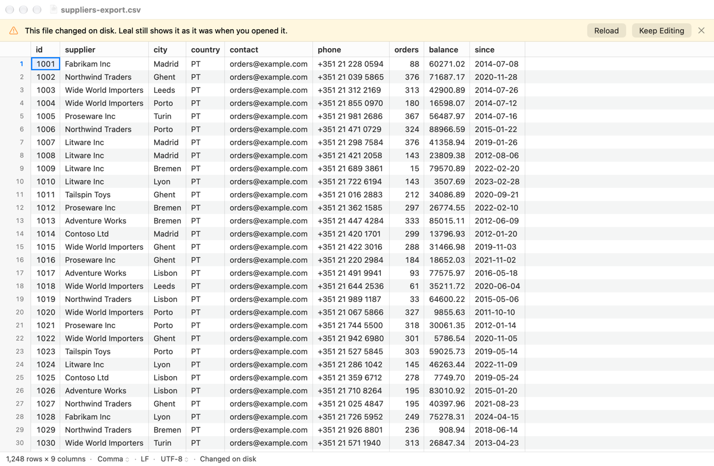
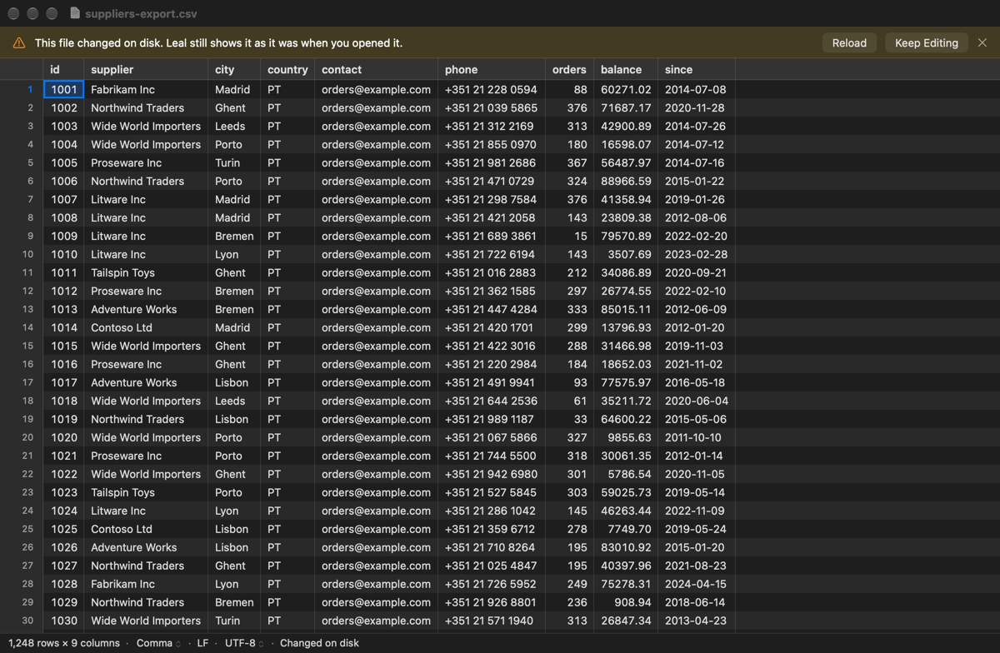
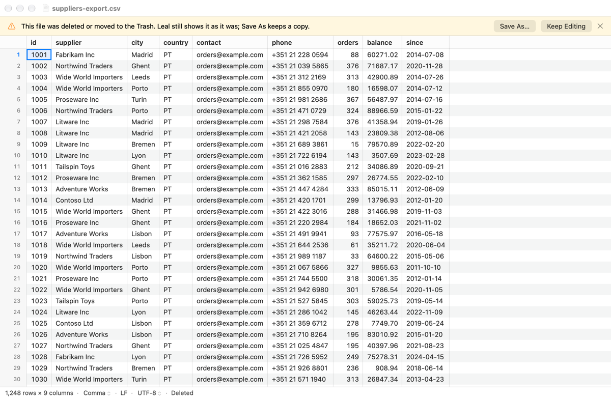

# 1.9 External changes

Leal now watches the file it opened. When another app changes it, the window
says "This file changed on disk" with **Reload** and **Keep Editing**. A
moved file is followed, a deleted one is reported, and a removable drive that
comes back is noticed: if the file is unchanged, Leal carries on copying it
and Save is allowed again. The 1.1a obligations are met: after a change while
reading from a drive that can't make a snapshot, rows read before it are
dropped and the banner offers Reload.

What Leal shows never changes by itself. It is always the snapshot taken at
open (DESIGN §3.1) until the user chooses Reload.

## What was built

| Where | What |
|---|---|
| `leal-core/src/source/original.rs` | **New.** `Original`: the user's file, watched. `OriginalState` (`Unchanged`, `Changed`, `Deleted`, `Unavailable`) and `OriginalStatus` (state, current path, `diverged`). |
| `leal-core/src/source/sys.rs` | `Kqueue` (`kqueue`, `kevent`: watch a file, a user event to stop, wait) and `path_of` (`fcntl(F_GETPATH)`), each `unsafe` block with its `SAFETY` comment. |
| `leal-core/src/source/removable.rs`, `mod.rs` | `Source::reconnect` (the drive is back) and `Source::note_original_written` (the watcher saw a write). The test hook `SimulatedFault` is now resettable, and `Source::simulate_drive_back` is a new test hook. |
| `leal-core/src/document/` | `Document` owns an `Original`. New: `original()`, `watch_original(callback)`, `check_original()` (reconnects a disconnected drive and reads the file again), and `can_save()` is false while the drive is away. After a change while reading, rows come only from the checked copy (`head_is_stale`, `rows_index`, `bytes_of`). Each `Reading` keeps its `choices`, so `restart` can read it again the same way. |
| `leal-ffi/src/document.rs` | `OriginalObserver` (a Swift callback), `OriginalState`, `OriginalStatus`, `Document.original()`, `watchOriginal(observer:)` and `checkOriginal()`. Test export `debugSimulateDriveBack()`. |
| `app/Sources/Document/OriginalRelay.swift` | **New.** Hands the watcher's reports to the main actor. |
| `app/Sources/Document/DocumentModel.swift` | Watches the file, follows moves (`onMoved`), and checks again on `NSWorkspace` mount and unmount and on app activation (`checkOriginal`, off the main thread). Also `reload()`, `restarted(_:)`, and dropping the tile cache after a change while reading. |
| `app/Sources/Window/FileBanner.swift` | **New.** Picks the file's banner (pure, tested): changed while reading, changed, deleted, or disconnected, in that order. |
| `app/Sources/Window/DocumentViewController.swift` | Shows the file's banner. Adds **Reload** (`reloadFromDisk`, keeping the active cell and scroll position) and **Keep Editing**. |
| `app/Sources/Window/StatusBarView.swift` | `BannerView` gains an optional second, plain button. |
| `app/Sources/Window/StatusText.swift` | Status notes "Changed on disk", "Deleted" and "Drive not connected", with tooltips. |
| `app/Sources/App/MainMenu.swift` | File ▸ **Reload from Disk**, which still works after Keep Editing. |
| `app/Sources/Document/CSVDocument.swift` | The `NSDocument`'s `fileURL` follows a move. `SEAM(2.5)` for Save's check. |
| `app/Sources/Bench/ScriptedRun.swift` | `-LealWaitForChange YES`, for the screenshots (`LEAL_BENCH` builds only). |
| `app/AppTests/ExternalChangesTests.swift` | **New.** The hosted tests below. |
| `.config/nextest.toml`, `justfile` | The four new disk-image tests are in the `disk-images` group. `check-no-test-exports` also looks for the new hook. |

### Watching the original (`source::original`)

`Original::new(path, identity)` runs when the document opens, just after
first paint (the "First paint" interval has already ended):

1. It opens the file **for event notifications only** (`O_EVTONLY`). This
   descriptor doesn't keep a volume from being ejected, unlike the read
   descriptor of the clone.
2. It adds the file to a kernel event queue, asking for `NOTE_WRITE`,
   `NOTE_EXTEND`, `NOTE_DELETE`, `NOTE_RENAME`, `NOTE_ATTRIB`, `NOTE_LINK`
   and `NOTE_REVOKE`.
3. It compares the file with the `FileIdentity` taken at open (device,
   inode, size, modification time). A change between opening and here is
   caught, so it counts from the start.

`watch(callback)` starts a thread (`leal-watch`) that waits on the queue.
After each batch of events it looks at the file and calls the callback if
the status changed. Dropping the `Original` fires a user event that wakes
the thread, then waits for it to stop, but for at most 50 ms (`STOP_WAIT`):
after an event the thread looks at the file and calls the callback, and a
look on a hung network volume can block for tens of seconds, while the app
drops documents on the main thread. A thread still busy then is left to
stop by itself (the phase 1 review, conc-4); it owns everything it uses,
and the document's callback holds the `Source` only weakly, so the clone
is still deleted at once. If the kernel won't make the event queue (out of
descriptors), `watch` fails with the reason (conc-6), and leal-ffi's
`Scheduler::new` raises the app's open-file limit from 256 to 10,240
(`raise_open_file_limit`), since each open document holds 3 or 4.

How each change is classified:

| What happened | How it is seen | Result |
|---|---|---|
| Written, truncated or appended in place | `NOTE_WRITE`/`NOTE_EXTEND`, or the size or time differ | `Changed` |
| Replaced (an atomic save renames a new file over it) | the watched inode's link count is 0, and a file is at the path | `Changed`, and the new file is watched |
| Renamed or moved on the same volume, nothing left at the old path | `NOTE_RENAME`; `F_GETPATH` gives the new path | pending for 2 s (`MOVE_WINDOW`), with the old path looked at every 100 ms; then path updated, still `Unchanged` (never to a `TemporaryItems` folder) |
| Renamed, with another file now at the path (a safe save: `replaceItemAt`, `RENAME_SWAP`, a backup rename then write) | `NOTE_RENAME`, or the unlink, with a regular file at the known path (or at the path before the move) | `Changed`, and the file at the path is watched |
| Moved into a Trash folder (`.Trash`, `.Trashes`) | as a move | `Deleted`; moved back out, `Unchanged` |
| Deleted | link count 0, nothing at the path | `Deleted`, and the path is looked at once a second until a file is there again (then `Changed`) |
| Attributes only (`chmod`, `xattr`, flags) | `NOTE_ATTRIB` with the same inode, size and time | nothing |
| Modification time touched | the time differs | `Changed`: Leal can't tell the contents are the same |
| Volume unmounted (eject, unplug) | `NOTE_REVOKE`, or `fstat` on the revoked descriptor fails | `Unavailable` |

`diverged` becomes true at the first change or deletion and never goes back.
That covers Keep Editing too. It is what phase 2's Save will use to ask
before writing over a changed file (`SEAM(2.5)` in `CSVDocument.canSave`).

`check()` looks at the file again without waiting for events. If nothing is
watched (the file was deleted, or its volume went away), it looks for a file
at the path. A file that is back is compared by inode, size and modification
time, **but not by device**, because a volume gets a new `st_dev` each time
it mounts.

**The kernel's path is used only when the known path stops leading to the
file.** `F_GETPATH` gives a resolved path (`/private/var/…` for `/var/…`, or
a symbolic link's target), which isn't a move.

### The modification-time limit, honestly

Comparing size and modification time can't see a same-size change that
lands within the volume's time granularity: 1 ns on APFS, 10 ms on exFAT,
1 s on HFS+ and 2 s on FAT. It also can't see a change whose time was set
back. The watcher closes most of that gap:

- **While the volume is mounted, a write event counts on its own.** A
  same-size write with its time reset is `Changed`. This is tested with
  APFS, where resetting the time stands in for coarse granularity.
- **For a file read without a snapshot** (a removable drive that can't
  clone, which 1.1a reads with `pread` while copying), the write event also
  marks the source as changed while reading
  (`Source::note_original_written`). Nothing more is read from it and Save
  is refused, even though the per-read size and time checks pass. This is
  tested on a real exFAT image.
- **While the volume is away, nothing is watched.** When it comes back, the
  comparison is all there is, so a same-size change made elsewhere within
  the granularity, or with its time set back, is missed. The test
  `a_same_size_write_that_keeps_the_time_is_caught_only_by_its_event` shows
  both sides: the watching `Original` reports `Changed`, and one that only
  looks reports `Unchanged`.

### Changed while reading (1.1a obligation)

Once `Source::changed_on_disk()` is true, `Document` no longer trusts the
first 64 KB it kept from first paint. First paint read them before the copy
began, and a change that kept the size and time could have come in between.
So from then on:

- rows come only from the index pass's copy, whose every chunk was checked
  before it was kept (`rows_index`, `bytes_of`);
- `row_count`, `progress().rows` and `column_count` are the real index's;
- the row cache is emptied once (`cache_dropped`);
- the app drops its tile cache and row flags (`refreshDriveState`), and the
  grid redraws from what the core now serves.

The banner now reads "This file changed on its drive while Leal was reading
it, so Leal shows only what it had read before the change and Save is off.
Reload reads the file as it is now." Its button is **Reload**.

### Reload and Keep Editing

- **Reload** (the banner, or File ▸ Reload from Disk) opens the file again
  through the core: a new clone, index and review. The model swaps in the
  new handle, numbered so that late reports about the old one are ignored,
  and drops every cache: tiles, row flags, diagnostics, the review and the
  sizing.
  - The user's own choices (Treat As, Reopen with Encoding, the Header row)
    are kept. If a chosen encoding no longer fits the BOM, Reload opens
    without the choices.
  - Columns the user resized keep their widths.
  - The active cell and scroll position are put back, clamped to the new
    file.
  - The old core document is released, which deletes its clone.
  - If the file can't be opened, an alert says why, using the open-error
    wording, and the window keeps what it shows.
  - Every banner may show again after a Reload, since it is a new
    snapshot.
- **Keep Editing** hides the banner for this divergence. The status bar
  keeps a "Changed on disk" note, and `diverged` stays true in the core.
  Later changes don't bring the banner back: the user chose to keep this
  version. File ▸ Reload from Disk is still there.

### Removable drives coming back (ADR-0006, 1.1a obligation)

- **Detecting the remount.** The model listens for
  `NSWorkspace.didMountNotification` and `didUnmountNotification`, and for
  `NSApplication.didBecomeActiveNotification`. Each calls
  `Document.checkOriginal()` on a detached task, because a `stat` on a
  network volume can block. Overlapping requests run one after the other,
  so a quick unmount and mount aren't lost. A job that ends with
  `DriveDisconnected` checks once too, in case the drive is already back.
- **Re-verifying the identity.** `Original::check` looks for the file at its
  path and compares inode, size and modification time (not the device).
- **Unchanged, copy incomplete (`Storage::Disconnected`):**
  `Source::reconnect` reopens the clone on the drive, if it survived the
  forced detach and is the same file (inode, size). Otherwise it reopens
  the user's file and reads it as on a drive that can't clone, checking
  after every read. The source is `Reading` again, and `Document` reads the
  file again with the same choices (`restart`): a new generation and index
  pass, which re-reads the copied part from the internal copy and carries
  on copying from `available_len()`. Save is allowed again, and the copy
  completes and is mapped as usual.
- **Unchanged, copy complete (`Storage::Copy`):** the drive being away only
  turned Save off (`OriginalState::Unavailable`, "Drive not connected").
  It comes back on.
- **Changed while away:** nothing is reopened, and the source stays
  `Disconnected`. The banner is "This file changed on disk" with **Reload**
  (and Keep Editing, after which the disconnected banner shows). Save stays
  off.
- An ordinary eject now works once a file's copy is complete, because Leal
  holds only the `O_EVTONLY` descriptor. A test checks it.

### The banners

One slot, first in the stack, shows the first of these that applies and
wasn't dismissed (`FileBanner.applicable`):

| Banner | Message | Buttons |
|---|---|---|
| changed while reading (1.1a) | "This file changed on its drive while Leal was reading it, so Leal shows only what it had read before the change and Save is off. Reload reads the file as it is now." | **Reload** |
| changed (1.9) | "This file changed on disk. Leal still shows it as it was when you opened it." | **Reload**, Keep Editing |
| deleted (1.9) | "This file was deleted or moved to the Trash. Leal still shows it as it was; Save As keeps a copy." | **Save As…**, Keep Editing |
| disconnected (1.7) | unchanged | **Save As…** |

They use ADR-0002's warning banner (the pale yellow of 03a) with a
prominent first button, as 06a's. Dismissals of these banners last until
Reload. Treat As and the other re-readings don't reset them, because they
are about the file, not the reading. Save As is still 1.7's "not available
yet" sheet (`SEAM(2.5)`).

## Tests

`just check-all` passes: 542 Rust tests (1 skipped) and 89 XCTests (11
new), after review and the rebase onto main. `just app-test release` (89), `just app release`, `just
check-no-bench` and `just check-no-test-exports` pass too. The leak check
was also run against the `app-test release` build, where it finds
`debugSimulateDriveBack`, as it should.

- **Rust, `source::tests::original`** (18 after review, plain temporary files; the 5
  added in review are under "Changes after review"):
  - an unchanged file stays quiet;
  - a write in place, a truncation and an append are each `Changed`;
  - a deletion is `Deleted`, then a new file at the path is `Changed`;
  - a rename is followed, and the file is still watched under its new
    name;
  - a move to the Trash is `Deleted`, and back is `Unchanged`;
  - attribute-only changes (two xattrs and `chmod`) are nothing;
  - touching the time is `Changed`;
  - an atomic save (rename over) is `Changed`, and the new file is watched;
  - the granularity limit: a same-size write with its time reset is caught
    by its event only, and a look alone misses it;
  - changes before watching starts (written, replaced, deleted) are found
    by the first look;
  - dropping stops the thread at once, and watching twice is harmless.
- **Rust, `document::tests`** (6 more, simulated):
  - a changed file is reported while the snapshot is kept and Save is
    allowed;
  - a move and a deletion are reported;
  - a simulated disconnection reconnects only once the drive is back: a
    new generation, every row, `Copy`, Save allowed;
  - a disconnected file that changed meanwhile isn't reconnected;
  - **after a change while reading, only the copy is trusted**: the change
    is at 16 KB, inside first paint's 64 KB. Afterwards the row count is
    the index's, the cache is emptied once and refilled from the copy, and
    the rows equal the file's;
  - watching stops when the document is dropped.
- **Rust, disk images** (4, `disk-images` group):
  - `a_drive_that_comes_back_is_reconnected_and_save_is_allowed`, on APFS
    and on exFAT. Force-detached before the copy: `Unavailable` and Save
    off; the index ends `Disconnected`. A check while it is away changes
    nothing. Re-attached: `Unchanged`, generation 1, Save on. The copy
    completes, every row is right, and the storage is `Copy`.
  - `a_file_changed_while_its_drive_was_away_is_reported`, on APFS and
    exFAT. Force-detached, attached elsewhere ("another Mac"), appended to,
    and attached again: `Changed` and `diverged`, still `Disconnected`, no
    restart, Save off.
  - `a_copied_file_on_an_ejected_drive_can_be_saved_once_it_is_back`: once
    the copy is complete, an ordinary detach succeeds. The watcher reports
    `Unavailable`, Save is off, and every row still reads. Re-attached,
    Save is on, with no restart.
  - `a_write_to_a_file_read_without_a_clone_is_caught_by_its_event`, on
    exFAT: a same-size write with its time reset passes the size and time
    checks. Watching then starts, and the queued write event marks the
    source as changed while reading. Save is refused, and the index ends
    `ChangedOnDisk`.
- **Mutation checks, by hand.** With the head distrust turned off,
  `after_a_change_while_reading_only_the_copy_is_trusted` fails. With the
  write event ignored, both granularity tests fail. (A first version of
  those two tests started watching before the change, so the thread could
  see the time before its reset. That version passed the mutation; it was
  rewritten to rely on the queued event alone.)
- **leal-ffi** (2): the status reaches Swift through the observer, and
  `check_original` reconnects a disconnected document, with a new
  generation in `first_screen` and new jobs.
- **Hosted XCTests, `ExternalChangesTests`** (11 after review), sandboxed, against the
  real core:
  - the banner appears with Reload and Keep Editing, the snapshot is kept,
    and Save is allowed;
  - **Reload** refreshes rows and keeps the active cell (row 120) and the
    scroll offset. It ends `Unchanged`, indexes the new 300 rows, and is
    watched again;
  - **Keep Editing** keeps the snapshot's rows and the status note. A later
    change doesn't bring the banner back, and File ▸ Reload from Disk still
    works;
  - a deleted file shows its banner, and Reload is off until a file is
    written at its path again;
  - a moved file is followed (`fileURL` too), and Reload opens it there;
  - a failed Reload keeps the document;
  - a change while reading (simulated at 16 KB): the banner offers Reload,
    no rows from first paint's 64 KB remain, and Reload gives every row and
    Save;
  - a disconnected drive: a check while it is away changes nothing. After
    `debugSimulateDriveBack` and a posted `didMountNotification`, it
    reconnects, Save is allowed, the banner goes, and the copy completes;
  - the banner choice and order, and the status notes and tooltips.

**Stress run:** the `disk-images` group (19 tests, 4 new) passed 10 rounds
out of 10, run one at a time as the group requires (44–48 s per round).
After review, 5 more rounds passed 5 out of 5.
`hdiutil info` afterwards showed nothing of Leal's attached; the only
image was Time Machine's.

## Performance

Watching is off the hot paths:

- **Opening** adds `Original::new`: one `open(O_EVTONLY)`, one `kqueue`, two
  `kevent` registrations and one `fstat`, after the "First paint" interval
  ends. It costs 8.7 µs median (12 µs p99), from 2,001 opens in a release
  build, timed with a throwaway test that isn't committed.
- **Scrolling** is unchanged. `rows_index` and `bytes_of` add one atomic
  load (`changed_on_disk`) per row read.
- **The watching thread** sleeps in `kevent` and wakes only for the file's
  events. It polls (one `stat` a second) only while the file is deleted.
- `checkOriginal` runs off the main thread: a few system calls.

The open benchmarks on this branch (`cargo bench -p leal-bench --bench open
-- open/`, the 1.2b reference file, M5 Pro) match 1.3a's numbers:

| Benchmark | This branch | 1.3a (quiet run) | Budget |
|---|---:|---:|---:|
| `open/first_paint` | 1.67 ms | 1.7 ms | — |
| `open/first_paint_under_load` | 2.15 ms | 2.1 ms | 150 ms |
| `open/first_paint_removable_under_load` | 3.2 ms | 3.0 ms | 150 ms |

## Screenshots

Offscreen renders (`just snapshot … -LealWaitForChange YES`, with the file
changed from the shell during the run). There is no mockup: ADR-0005
decision 8 has these follow ADR-0002's banner style, and Rob sees them at
the phase 1 gate.

1×, 1200 × 752 content, a synthetic `suppliers-export.csv` (invented names,
1,248 rows) made by the throwaway script that took them.

| Banner | Leal |
|---|---|
| Changed on disk, light |  |
| Changed on disk, dark |  |
| Deleted, light |  |

```sh
just snapshot suppliers-export.csv out.png -LealWaitForChange YES -LealWindowSize 1200x752 -LealAppearance light
# meanwhile, from another shell: change or delete suppliers-export.csv
```

**Reload** has the primary tint. As in 1.6's 06a shot, it looks grey in an
offscreen render of an inactive window.

## New dependencies

None. kqueue and `F_GETPATH` come from `libc`, which leal-core already uses.

## Decisions and deviations

- **A kqueue thread, not a dispatch source.** DESIGN §3.1 says "a dispatch
  source (kqueue)", and a dispatch source is GCD's wrapper around kqueue.
  The watcher is in leal-core, where the logic and its tests belong, and
  Rust has no GCD binding, so it uses kqueue directly, with one small thread
  per open document. The events and their meaning are the same.
- **Deleted files.** DESIGN §3.1 puts Reload and Keep editing on the banner
  for a deleted file too. A deleted file can't be reloaded, so its banner
  has **Save As…** and Keep Editing. When a file appears at the path again,
  it becomes the "changed" banner with Reload.
- **A file moved to the Trash counts as deleted**, and the window keeps its
  title. Other moves are followed, and the title changes.
- **Changed while the drive was away: no resume.** The plan says to resume
  or allow Save if the identity is unchanged, and to show the changed banner
  if it changed. With a surviving APFS clone the snapshot could be completed
  anyway. I kept one rule for every volume (no resume after a change),
  because without a clone there is nothing safe to resume from. Reload
  reads the new version.
- **The original being changed doesn't turn Save off.** Only a change while
  reading (a mixed snapshot) or a drive that is away does. DESIGN §3.1 has
  Save ask before overwriting a file changed elsewhere (phase 2, from
  `diverged`).
- **"Drive not connected" is a status note, not a banner**, for a file whose
  copy was complete before its drive was ejected. Nothing is missing, and
  ejecting is usually what the user meant to do. Save is off until the
  drive is back.
- **File ▸ Reload from Disk** is new and isn't in the mockups. Without it
  there is no way back to Reload after Keep Editing. It has no shortcut.
- **Simulated drives stay away.** The 1.7 test hook used to look
  disconnected while its file was really still there, so any check would
  have "reconnected" it at once. A simulated disconnection now refuses to
  reconnect until `simulate_drive_back` (FFI `debugSimulateDriveBack`).
  `check-no-test-exports` looks for both spellings.
- **Banner keys.** The file's banners are remembered under `drive-…` and
  `file-…`. Only Reload clears them.

## What a reviewer should check

- `Inner::follow` and `look_again` (`original.rs`): the order of "revoked,
  unlinked, renamed, compared", and that no path calls the callback while
  the lock is held.
- `Removable::reconnect`: the lock order (`streaming`, then `external`, as
  in `stream`), and that a reconnected source is read with checks after
  every read when it isn't the clone.
- `Document::check_original` and `restart`: a reconnect starts a new reading
  under `reinterpreting`, and the FFI watches the new jobs and updates its
  first screen's generation.
- `DocumentModel.reload`: the handle number guards (progress, watcher
  reports, job tasks) against reports about the old handle.
- The sandbox: the watcher opens the user's file with `O_EVTONLY`. That
  works in the hosted (sandboxed) tests. A file moved somewhere the sandbox
  doesn't cover is still watched through the open descriptor, but Reload
  there would fail with "permission denied", worded as an open error.

## Notes for Rob

- **What you'll see:** edit an open CSV in another app and save. Leal shows
  "This file changed on disk" with **Reload** and **Keep Editing**. Reload
  keeps your place. Keep Editing leaves a "Changed on disk" note in the
  status bar, and File ▸ Reload from Disk is always there.
- **Rename or move the file in Finder or Terminal:** the window's title
  follows. **Delete it or move it to the Trash:** a banner says so, and
  Leal keeps showing it.
- **USB drives:** unplug one mid-copy and plug it back in. Leal carries on
  where it was, and Save is allowed again. If the file was changed on
  another computer meanwhile, Leal says so and offers Reload.
- **The one limit** is the modification-time granularity, while a drive is
  away: see "The modification-time limit, honestly".
- Worth trying by hand with a real USB stick at the gate: unplug and replug
  with a large file open, and eject a drive whose file has finished
  copying. The tests use disk images, which the kernel treats the same way.

## Changes after review

The review passed the rest: the `unsafe` code, callbacks outside the lock,
coalescing (2,000 appends gave one callback), attributes, the rename-over
re-arm, Reload, the remount behaviour and 500 open/close cycles with no
leak. Rob's answers: Keep Editing stays as it is, a remount at another path
and network shares are acceptable for v1, and PLAN 2.5 now says Save
re-checks the identity immediately before writing.

1. **A safe save was reported as a move, then a deletion (must-fix).**
   `FileManager.replaceItemAt` (what NSDocument apps use), `renamex_np`
   with `RENAME_SWAP` followed by an unlink, and an Emacs-style backup
   (rename to `file~`, write a new file, delete `file~`) each renamed the
   watched file away while a new file took its path. The watcher followed
   the rename into the staging folder or to `file~`, then reported
   `Deleted` there, and the model moved `url` and `NSDocument.fileURL`
   with it. Now:
   - On a rename, if a regular file is at the known path, the watched file
     was **replaced**: `Changed`, and the file at the path is watched.
     `F_GETPATH` is followed only when nothing is at the old path.
   - A move into a `TemporaryItems` or `.TemporaryItems` folder is never
     followed.
   - A move with nothing at the old path became a followed move at once.
     The second review replaced that with the pending window (below).
   - Swift never adopts a path with a `TemporaryItems` component as the
     document's URL, whatever the core says.
   - Tests:
     - `a_swap_save_is_a_replacement` (`RENAME_SWAP` + unlink, through a
       test-only `sys::swap`);
     - `a_save_through_a_temporary_folder_is_a_replacement`;
     - `a_backup_rename_then_write_is_a_replacement`;
     - `a_backup_deleted_before_the_new_file_comes_is_a_replacement`.

     Each checks that no status ever names another path or says
     `Deleted`. With the "file at the path" rule turned off, the first two
     fail; on the old code all four ended at the wrong path.
   - The hosted test `testASafeSaveByAnotherAppIsAChangeNotAMove` saves
     over the document with `FileManager.replaceItemAt`, through
     `FileManager`'s own replacement folder. The result is `Changed`, the
     document stays at its URL, and Reload gives the new rows.
2. **The main thread could wait behind file-system calls (should-fix).**
   `status()` took the lock a look at the file holds across `open`,
   `fstat`, `stat` and `F_GETPATH`. The main thread calls it through
   `Document::can_save` (status bar refresh, menu validation), so a hung
   network volume could have frozen the UI. Now the status is published
   after each look into a second lock (`Shared::published`), held only to
   copy it. The lock order is always `inner`, then `published`.
   `status()` takes only `published`, so "makes no system calls, and never
   waits" is true now. Test: `status_never_waits_for_a_look_in_progress`
   holds the look's lock and reads the status at once.
3. **One watching thread per document (optional, not done).** 50 open
   documents use 53 threads. Each sleeps in `kevent` with the default
   stack. One shared thread would need one kqueue for every document, with
   each registration tagged with a unique token in `udata`, not
   identified by its descriptor. A closed descriptor's number can be
   reused at once by another document's file, so a stale event would
   otherwise reach the wrong document. The cost: a look blocked on one
   hung network file would hold up every document's notifications. That
   isn't a small, safe change, so it is left for later, if thread count
   ever matters (1.10's idle-memory budget is the place to measure it).

### Second review

The re-check passed every safe save but one, and found that the old path
was remembered for ever:

1. **A save that keeps its backup (must-fix).** Emacs's default renames
   the file to `file~`, keeps it, and writes a new file at the path. No
   event reaches the renamed file after that, so Leal followed it to
   `file~`, reported `Unchanged`, and never saw the change. The window
   would have taken `file~` as its file too.
2. **The previous path never expired (should-fix).** After a real move, an
   unrelated file at the old path, then the moved file deleted, became a
   "replacement" by the unrelated file.

Both are now one rule, the **pending move** (`Inner::pending`,
`MOVE_WINDOW` = 2 s, `PENDING_POLL` = 100 ms):

- A rename with nothing at the old path isn't followed straight away. The
  status keeps the old path, and the watching thread looks at that path
  every 100 ms for the window, as every `check()` does.
- If a regular file appears there within the window, the move was a save's
  backup step: `Changed`, and the file at the path is watched. The path the
  file was renamed to is never reported, so the document can't adopt it.
- If the moved file is unlinked within the window, the old path decides
  (replaced, or deleted at the old path). The deleted-file poll then finds
  a new file written there later. This covers backup-then-delete in both
  orders.
- Once the move has stood for 2 s, it is followed and the old path is
  forgotten. A file that appears there afterwards is unrelated.
- A real move shows in the title about 2 s late. Safe saves take
  milliseconds, so the window leaves room for a slow disk.
- The window is timed by a clock the tests can stop (`Clock`, after
  `schedule::input`'s), so both sides are tested with no sleeps:
  - `a_file_at_the_old_path_within_the_window_is_a_replacement` (at
    1 ms short of 2 s);
  - `a_move_that_stands_for_the_window_is_followed_and_the_old_path_forgotten`
    (still pending at 1 ms short, followed at 2 s; then an unrelated file
    at the old path and the moved file deleted is `Deleted` at the moved
    path).
- `a_save_that_keeps_its_backup_is_a_replacement` runs the Emacs save
  against the real watching thread. No status ever names `file~` or says
  `Deleted`, and the backup is still there afterwards.
- With the window set to zero (the old behaviour), all three fail.

After this round: `just check` passes (545 Rust tests, 1 skipped).
`just app-test` gives 87 passed and 2 crashed. The two that crash,
`DiagnosticsTests.testThePopoverListsTheCoreReportsKindsAndCounts` and
`DocumentTests.testUTF16FilesOpenReadOnlyWithABanner`, crash on main too
(per the reviewer), and the 1.9 tests all pass. Both open a UTF-16 file. The
crash report's exception backtrace is in AppKit,
`-[NSTitlebarAccessoryViewController _auxiliaryViewFrameChanged:]`: it
throws when Auto Layout resizes the read-only lock glyph's `NSImageView`
(the title-bar accessory from 1.6). Neither macOS nor the app's code changed
since the same tests passed here earlier in the day, so the trigger looks
environmental (display or window-server state). The disk-image group passed
3 rounds out of 3. `just check-no-bench` and `just check-no-test-exports`
pass.

### Integration with 1.8

Rebased onto main with 1.8 (find, go to row, copy, inspector):

- **Reload** re-runs an open find from the restored cell, so its matches
  are the new file's (`testReloadRunsAnOpenFindAgain`). It also refreshes
  the inspector with the restored cell's value as it is now
  (`testReloadRefreshesTheInspector`). A restart after a drive comes back,
  or rows dropped after a change while reading (`DocumentChange.rows`),
  does the same.
- **A promised copy** keeps the cells it was made from: `CopyPromise` holds
  its own core job, with its reading and clone. 1.8's test that reopened
  the file through `NSDocumentController` now uses the real Reload, with
  the file changed on disk first
  (`testACopyStillPastesItsCellsAfterTheFileIsReloaded`). The paste is
  still exactly the copied cells.
- **Stale answers after Reload.** A reloaded document starts again at
  generation 0, so a background answer can't be checked by generation
  alone. The inspector's value, a kind's Previous/Next and the refined
  sizing now check `DocumentModel.readingID` (the Reload count and the
  generation).
- The popover and UTF-16 app tests that crashed here before pass now, with
  1.8's title-bar accessory fix: `just app-test` and `just app-test
  release` each passed 120 out of 120.

## Open questions (for Rob, at the phase 1 gate)

- ~~After Keep Editing, should later changes bring the banner back?~~
  Decided: no, as built.
- ~~A volume mounted at another path isn't found.~~ Decided: acceptable for
  v1, as documented. (A second drive with the same name becomes
  `/Volumes/Name 1`, and the file is looked for only at its old path; the
  sandbox would refuse access at the new path anyway.)
- ~~Network shares' watchers see only this Mac's changes.~~ Decided:
  acceptable; PLAN 2.5's Save re-checks the identity right before writing.
- **The banners' wording and the second button**, which have no mockup
  (ADR-0005 decision 8): screenshots above.

## Rust notes

- **A thread that waits on the kernel** (`Shared::run` in `original.rs`).
  `kevent` blocks the thread until something happens to a registered file,
  or the timeout passes. The thread does nothing else, so it costs no CPU
  while it waits. To stop it, `Drop for Original` *triggers* a user event
  (`EVFILT_USER`) on the same queue. `kevent` returns it, the loop sees
  `STOP` and returns. `Drop` waits for that on a `Condvar` with a
  timeout (`wait_timeout_while`), set by a guard the thread drops as it
  ends (`Stopped`), and only then `join()`s; otherwise dropping the
  `JoinHandle` *detaches* the thread, which runs on until it returns.
  The document's callback holds a `Weak<Source>`: a pointer that doesn't
  keep the source alive, `upgrade()`d to an `Arc` only for the moment
  it is used.
- **`Arc<Shared>` between the thread and the owner.** The watching thread
  and the `Original` both need the state, so it lives in an `Arc`: shared
  ownership, freed when the last holder lets go. The thread's closure gets
  its own clone (`Arc::clone(&self.shared)`, moved in with `move ||`).
- **A `Mutex` around the state, and the callback outside it** (`run`). The
  thread locks `inner`, looks at the file, takes the new status, and lets go
  of the lock before calling the callback. The block `{ let mut inner =
  self.lock(); … }` ends the lock where the braces close. Calling out with
  the lock held could deadlock if the callback asked for the status.
- **`Option::take`** (`self.watched.take()` in `evaluate`). It moves the
  value out of an `Option` and leaves `None` behind. `follow` then owns the
  `Watched` and either puts it back or drops it (closing the descriptor,
  which also removes it from the queue).
- **`OwnedFd` and `FromRawFd`** (`Kqueue` in `sys.rs`). `kqueue()` returns
  a plain number, a raw descriptor. `OwnedFd::from_raw_fd` wraps it in a
  type that closes it when dropped. It is `unsafe` because Rust can't know
  that nobody else owns that number. Here nobody does: `kqueue` just made
  it.
- **`Vec::with_capacity` and `set_len`** (`Kqueue::wait`). `kevent` writes
  up to 16 events into memory we give it. The vector reserves room for 16
  without initialising it. After `kevent` says it wrote `count`,
  `set_len(count)` tells the vector those are now real values. Saying so
  before they are written would be undefined behaviour, so it is an
  `unsafe` block with its own `SAFETY` comment.
- **`&raw const change`** (`Kqueue::change`). It gives a raw pointer to a
  local value without making a reference first, which is what a C function
  taking `const struct kevent *` wants.
- **`pub(crate)` on a struct field** (`OriginalStatus::written`). The field
  is visible inside leal-core (the document needs it) but not to other
  crates. A struct with a field they can't see also can't be built outside
  the crate, which is fine: only the core makes statuses.
- **`let … else` and `if … && let …` chains** (`Removable::reconnect`).
  The `if` chain tries the clone (`if external.folder.is_some() && let
  Ok(clone) = File::open(…) && let Ok(now) = clone.metadata() && …`) and
  binds `clone` and `now` only if every part holds. It falls through to the
  next `else if` otherwise. This is the Rust 2024 edition form of nested
  `if let`s.
- **`#[cfg(test)] pub(crate) mod tests`** (`source/mod.rs`). The source
  tests' `DiskImage` helper is now visible to the document tests in the same
  crate. It is still compiled only for tests.
