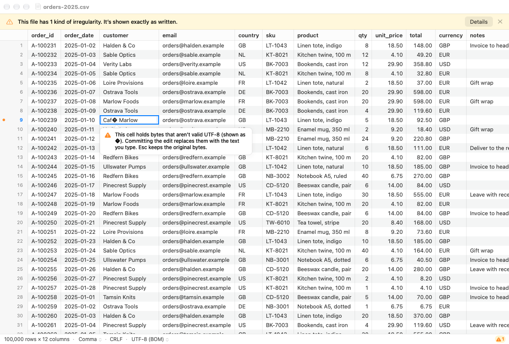
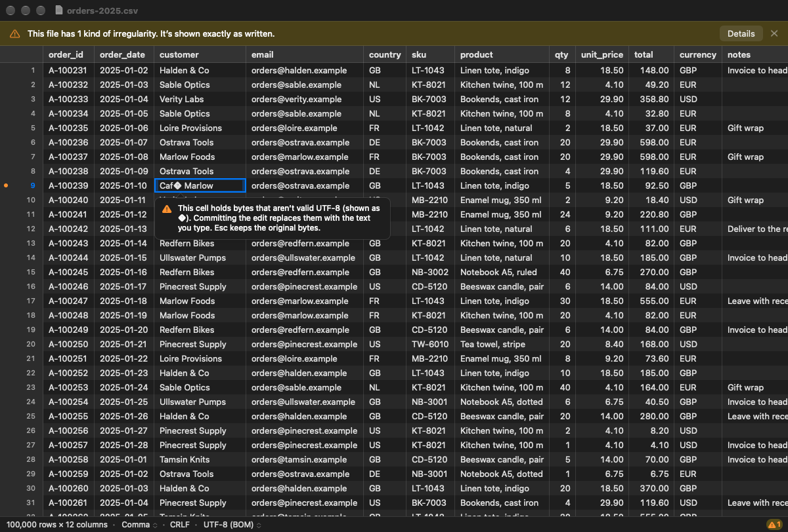
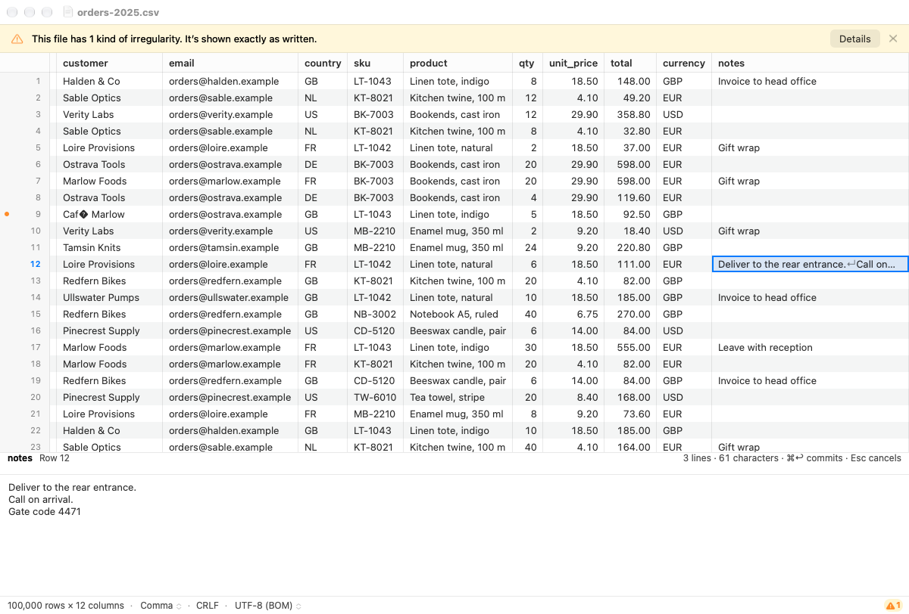
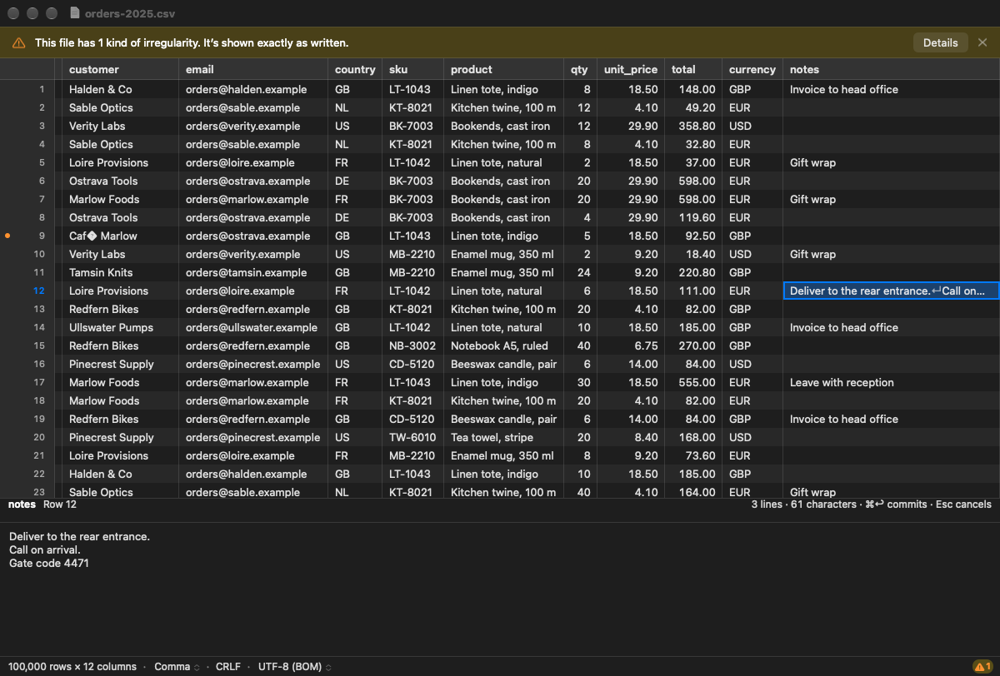

# 2.5.1 In-cell editing and the inspector

Cells can be edited in the app. Return, a double-click or typing opens an
`NSTextField` over the active cell, in the grid's overlay above the strips
(ADR-0001, ADR-0011, docs/tasks/2.0b.md "For 2.5"). The cell inspector edits
too (mockup 05a), and so does a header-row title ("Rename Column…"). Each
commit calls the core's `setCell` (task 2.1) directly. Undo, the journal and
dirty state are 2.5.2; Save, Save As and Revert are 2.5.3.

## What was built

| Where | What |
|---|---|
| `Window/CellEditor.swift` (new) | `CellEditorField` (the `NSTextField`, accent border, text laid out where the grid draws it), `EditCallout` (the bubble of mockup 05b), `CellEditController` (opening, committing, cancelling, the callout) and `EditText` (the words). |
| `Document/DocumentEditing.swift` (new) | `EditPlace` (a grid cell or a header-row cell), `EditOutcome`, and the model's edit calls: `editRefusal` (`canEdit`), `fullValue` (main thread or `fullValueInBackground`), `isShownWhole`, `hasInvalidBytes`, `unencodable` and `setCell`. `commandApplied` is the one place a command is registered: `SEAM(2.5.2)`, `onCommand`. |
| `Document/DocumentModel.swift` | `valuesChanged(by:)`, which brings everything up to date after an edit (and later an undo or redo): `cellsChanged`, the row-flag blocks, the header titles (`.header`), widening (`.widths`), and measuring the sample again. New `DocumentChange.header` and `.widths`. |
| `Document/FindModel.swift` | `valuesChanged(rows:)`: drops those rows' highlights, checks the current match again, and waits for `catchingUp` to clear (on `catchUpJob()`, polling otherwise), then retries a `Pending` Next or Previous and reads every highlight again. |
| `Window/DocumentViewController.swift` | Wiring; `editActiveCell`, `headerMenu`/`rename(column:)`; the inspector's editing (`InspectorEdit`, `commitInspector`, `cancelInspector`, the text view delegate); the editor closes, committing nothing, on `.content`, `.rows`, `.reloaded` and `.failed`. UTF-16 banner wording. |
| `Window/CellInspector.swift` | `show(…, editable:)`, the "⌘↩ commits · Esc cancels" hint (05a), `showWarning`, `showWhole`, Esc (`onCancel`). |
| `Grid/GridView.swift`, `GridChrome.swift`, `GridContainerView.swift` | Return (`insertNewline`), double-click and typing (`typesText`) start an edit. The header view hosts its editor (following the sideways scroll and the column's width) and has a context menu. `onScroll`. |
| `Document/CSVDocument.swift`, `Window/StatusText.swift` | `canSave` is false for UTF-16. The status bar says "Save As UTF-8 only", not "Read-only". |
| `Resources/Info.plist` | `CFBundleTypeRole` is `Editor` for CSV and TSV. |
| `App/Signposts.swift`, `Bench/ScriptedRun.swift` | The "Cell edit to screen" signpost; `-LealBenchEdit n`, `-LealEdit YES`, `-LealInspectorFocus YES`. |
| `leal-bench` (`leal-perf`, `perf.rs`) | Edit runs in `just perf`, `--only-edit`, the "Cell edit to screen < 16 ms" row. |

No FFI or core changes.

## How editing behaves

- **Opening.** Return, a double-click or a key that types text (no ⌘ or ⌃,
  no control or function-key character) opens the editor on the active
  cell. Typing replaces the value; the key event goes to the field editor,
  so input methods compose from it. Return and the double-click start from
  the core's full display value (ADR-0008 decision 3), with the caret at the
  end. A value the grid shows cut short (over 128 characters) is read off
  the main thread first. The editor widens to its text, up to the visible
  edge, and grows to 8 lines for a multiline value.
- **Keys.** Return commits and stays on the cell. Tab and Shift-Tab commit
  and move along the row. Esc cancels. ⌥↩ and ⌥⇥ put a line break or a tab
  in the value. Leaving the editor (a click elsewhere) commits, as a text
  field does. *Rob: whether Return should move down, as in Numbers and
  Excel, is a feel question for the on-screen check.*
- **No edit unless changed.** The editor records whether the user changed
  the text. An untouched value is never sent to the core, so a long or
  multiline value can't change on the way through `NSTextField` (line
  endings, for example). The core also returns no command for an unchanged
  value.
- **`canEdit`.** The editor opens only where `canEdit` allows. Otherwise
  the callout says why (for example, a cell after an unterminated quote, or
  a row not read yet), with a beep. The note goes at the next key, click or
  selection change.
- **Invalid bytes (05b).** If the cell's full value has a U+FFFD and the
  core says the cell has invalid bytes (`cellValue(…).invalid`), the
  callout says committing replaces them and Esc keeps them.
- **The encoding.** As the user types (for values up to 10,000 UTF-16
  units), `unencodable(value:)` is checked. A character the encoding can't
  hold is named in the callout, which points to Save As UTF-8 (for example,
  Windows-1258 and precomposed Vietnamese). Return then commits it anyway:
  edits are allowed, and Save will refuse them (DESIGN §3.7). For a value
  too long to check while typing, the first Return checks and names the
  character, and the second commits. The inspector does the same, with the
  warning in its size label.
- **Hatched cells** are edited like any other cell (ADR-0005 decision 2).
  Setting one back to "" makes it missing again (tested).
- **The header row.** The column header's context menu has "Rename
  Column…" (only while the file has a header row). It opens the same editor
  over the title, from `fullValue(row: 0, …)`, not the title's ↵ text. A
  hatched header cell ("Column 3") can be renamed too. After the commit the
  titles are read again (`.header`). Find still doesn't search row 0
  (tested). I went with the context menu, not a double-click on the title:
  phase 3's sort will use clicks on the header.
- **The inspector (05a).** It edits a cell's value where `canEdit` allows
  and the value exists (a missing cell is edited in the grid). Return puts
  in a line break, ⌘↩ commits, and Esc puts the value back. Moving to
  another cell, hiding the pane or leaving the text commits. A value cut at
  64,000 characters is read in full on the first attempt to change it
  ("Reading the whole value to edit it…"), and only then can it be edited.
- **UTF-16** documents can be edited, and Save is off (ADR-0013 decision 1;
  `CSVDocument.canSave`). The banner now says "This file is UTF-16, which
  Leal can’t save. You can edit it, then save a UTF-8 copy." The lock
  glyph stays, with a new tooltip.

## What an edit brings up to date

`DocumentModel.valuesChanged(by:)` takes the command's logical rows:

- **Grid rows:** `cellsChanged(rows:)`, which drops the tiles and redraws
  the strips and gutter. The row-flag blocks are dropped too, so the
  diagnostics marks and hatching are read again (an edited cell's
  diagnostics are its new value's; tested: an invalid byte's marker goes).
- **Header row:** the titles are read again, and the column count is
  updated if the header grew.
- **Widths:** a value wider than its column widens it at once (up to the
  sizing maximum, and not a column the user resized). If the row is in the
  1,000-row sample, the sample's widths and number detection are measured
  again 300 ms after the last such edit, off the main thread, as after a
  reinterpret. That redraws only if something changed. A widening from an
  edit outside the sample is kept through re-measuring. Tested: text in a
  number column turns detection off.
- **Find and the inspector** hear of it through `.cells` and `.header`
  (`FindModel.valuesChanged`; `updateInspector` if the active cell's row
  changed). Copy reads the core's overlay, so nothing is needed there.

The undo seam: `commandApplied` calls `valuesChanged` and then `onCommand`.
2.5.2 sets `onCommand` to register undo and append to the journal; its
undo and redo call `valuesChanged(by:)` after `undo(command:)` and
`redo(command:)`.

## Cell edit to screen

The "Cell edit to screen" signpost runs from the commit (Return) to the
completion of the Core Animation transaction that holds the edit's drawing.
The strips are drawn at that commit. `just perf` now runs 20 edits a run in
the bench build (`-LealBenchEdit`); `just perf --only-edit` runs only those.

| Run | Result |
|---|---|
| `just perf --only-edit --runs 2`, Release, reference file, M5 Pro, screen locked, busy Mac | **4.4 ms** median (1.6–10.7, 40 edits): pass against 16 ms |
| Hosted test, Release (`just app-test release`), 10 edits on a 5,000-row file, window offscreen | 0.40 ms median, 2.3 ms max (the test's activity; it asserts < 100 ms only) |

The slowest edits are the ones that widen their column, which redraws every
strip. Recorded in `docs/perf.md`.

## Tests

`EditingTests` (14 hosted tests, all against the real core): Return from the
full value (long and multiline) and commit; untouched long and multiline
values are no edit, in the editor (Return, Tab, leaving) and the inspector
(including the 64,000-character value read in full first); Esc, Tab,
Shift-Tab and leaving; typing (and `typesText`); hatched cells; header
cells in place (full value, titles, Find skips row 0, a hatched header
cell); **an edit found, copied and stepped to** (ADR-0008 decision 2); Find
catching up with 70,000 matches and a waiting Next; marks, widening and
number detection; `canEdit` refusing a cell after an unterminated quote;
the encoding check (live, and at Return for a long value) on
Windows-1258; UTF-16 editable with Save off; the inspector editing a
multiline value (Esc, ⌘↩, moving on); edit-to-screen measured.

Changed: FindTests' inspector size labels now end with the editing hint;
DocumentTests' UTF-16 status bar says "Save As UTF-8 only". `leal-bench`:
`cell_edits_are_read_and_judged`, and the new row in the verdict lists.

Results: `just check-all` passes; `just app-test` 229 passed in Debug and
229 in Release; `just check-no-test-exports` and `just check-no-bench` pass.

## Screenshots

Offscreen renders (`just snapshot`, 1×, 1200 × 780) of a synthetic
`orders-2025.csv` (invented names, 100,000 rows, UTF-8 with BOM, CRLF; row 9
holds the byte 0xE9, row 12 a three-line note), made by a throwaway script
that isn't committed.

| Mockup | Leal |
|---|---|
| `docs/mockups/05b-in-cell-edit-invalid-bytes.png` |  |
| 05b in dark mode |  |
| `docs/mockups/05a-inspector-multiline-edit.png` |  |
| 05a in dark mode |  |

```sh
just snapshot orders-2025.csv out.png -LealWindowSize 1200x780 -LealSelect 8,2 -LealEdit YES -LealAppearance light
just snapshot orders-2025.csv out.png -LealWindowSize 1200x780 -LealSelect 11,11 -LealInspector YES -LealInspectorFocus YES -LealAppearance light
```

Differences from the mockups:

- **05b** names the byte ("1 byte … (0xE9, shown as �)"). The core gives
  the app no raw bytes, so the callout says "bytes that aren't valid UTF-8
  (shown as �)". Naming them needs a small core API, which can come later.
- **05a** shows the edited-cell triangles and "— Edited" in the title.
  Both need dirty state (2.5.2), and the triangles need a per-cell "edited"
  flag from the core's `cells`, which doesn't exist yet. Neither is drawn
  here.
- In the offscreen render the inspector's caret doesn't show.

## Deviations and notes for Rob

- **Edits can be lost without warning until 2.5.2 and 2.5.3.** Nothing marks
  the document dirty yet. Closing the window, Reload and Revert discard
  edits without asking. Treat As and Reopen with Encoding are refused by
  the core while there are edits (logged, nothing happens) until 2.5.3
  disables them with the reason. ⌘S fails as before (Save is 2.5.3).
- No "Clear cells" (Delete) or paste: those are 2.6.
- The on-screen feel needs Rob's check: Return staying on the cell, the
  editor's width growth, the callout's place, IME (marked text and the
  candidate window, from the field's own frame), and typing to start an edit.

## Rust notes

The only Rust in this task is in `leal-bench`, the measuring tool.

- `edit_run` (`crates/leal-bench/src/bin/leal-perf.rs`) returns
  `Result<Vec<f64>, String>`. The `?` after `.ok_or(…)` turns a missing
  timeline (`None`) into an early `Err` with that message.
- `PerfRun::parse` reads `editsMs` with `.as_array().map(…).unwrap_or_default()`.
  A JSON file saved before this task has no such key, so it reads as an
  empty list, and the row says "untested", never 0 ms.
- `edit.map_or("—".to_owned(), |s| …)` (`perf.rs`) gives a default for
  `None` and otherwise calls the closure on the value inside the `Some`.
