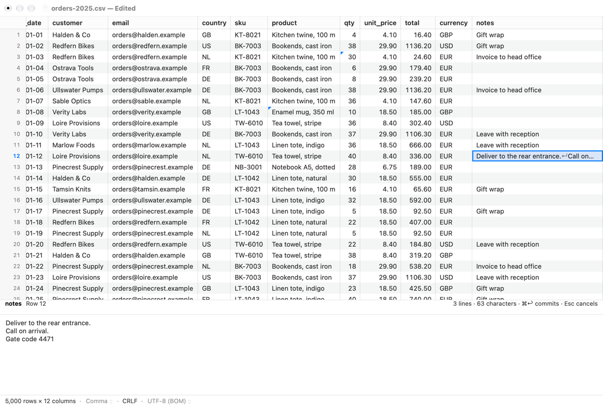
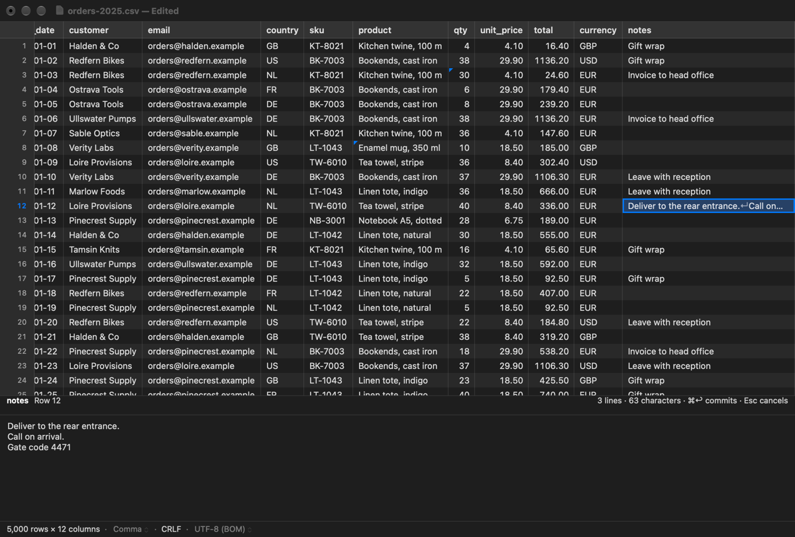

# 2.5.2 Undo, the journal and dirty state

Every command the core applies (a cell edit, a batch, a row or column
insert or delete) is undoable through the window's undo manager, with Edit
menu names ("Undo Typing", "Undo Delete Rows"). The document keeps an
append-only journal of every command, undos and redos included, with the
reading's choices, and **Recover changes** replays it into a fresh copy of
the file after a failure (ADR-0008 decision 5). The window title says
"— Edited" and edited cells carry mockup 05a's corner triangle while some
cell reads differently from the file. Treat As and Reopen with Encoding are
off while there are edits, and Reload and Close ask before throwing edits
away (ADR-0008 decision 4). Built on 2.5.1's `commandApplied(_:as:)` seam.
Save, Save As and Revert are 2.5.3.

## What was built

| Where | What |
|---|---|
| `leal-core` `Document::cells` | `RowCells.edited`: the window's columns whose cell is `ViewCell::Edited`. Rows with no edits take the old path and return an empty list. |
| `leal-ffi` | `RowCells.edited: [UInt32]`; `inverseCommand(command:)`, the command an undo applies (for the journal). |
| `Document/EditHistory.swift` (new) | `ReadingChoices`, `JournalEntry`, `DocumentUndoManager` (explicit groups, commit-before-undo hook, availability) and `EditHistory` (undo registration and action names, the journal, change-count tokens, `rebuild` after a replay). |
| `Document/DocumentEditing.swift` | `undo(_:)`, `redo(_:)` (through the core, then `commandApplied`), `editVersion`, `choices`. `commandApplied` reads the dirty state first and sends structural commands to `structureChanged`. |
| `Document/DocumentModel.swift` | `hasUnsavedEdits` (cached from the core), `canChangeSplit`, `onReadingChanged` (`.sameSplit`, `.newSplit`, `.replaced`), `structureChanged`/`moveColumns`, `recover(_:choices:)`, `isEdited(row:column:)`, `DocumentChange.structure`, status `unsavedEdits`. |
| `Document/CSVDocument.swift` | The history's owner: `commandApplied` (journal, undo registration, dirty state, token), `applyStep`, `stepEnded`, `updateDirtyState`, `readingChanged`, `confirmDiscardingEdits`, `canClose`, the failure alert's **Recover Changes**, `recoverChanges()`. `hasUndoManager` is off. |
| `Window/DocumentViewController.swift` | `DocumentWindowController` is the window's delegate (`windowWillReturnUndoManager`) and adds "— Edited" to the title. Treat As and Reopen with Encoding are off with edits; Reload asks; `.structure`; stale long-value reads stop on `.cells`. |
| `Window/HistoryText.swift` (new) | The words. |
| `Grid/*` | `TileRow.edited`, `CellTileCache.isEdited`, `GridDataSource.isEdited`, `CellPainter.drawEditedMark`. |
| `Window/StatusBarView.swift`, `StatusText.swift`, `CellEditor.swift` | The status bar's delimiter and encoding buttons off with edits; `saveOrRevertFirst`; `CellEditController.valuesChanged(rows:)`. |
| `Bench/ScriptedRun.swift` | `-LealSetCells row,column=value+…` for snapshots. |

## How it works

**Undo.** `CSVDocument.history.undoManager` is the window's undo manager,
through the window delegate's `windowWillReturnUndoManager`, so AppKit's
Edit ▸ Undo, its title and ⌘Z work as usual. Text fields being edited keep
their own (an `NSTextField`'s field editor has a private one, checked), so
typing in the find bar or the cell editor never lands in it.
`NSDocument`'s own undo manager is off (`hasUndoManager = false`), so it
doesn't count changes behind the core's back (below).

- Each command goes through the model's `commandApplied(_:as:)` (2.5.1's
  seam), which calls `valuesChanged` (or `structureChanged`) and then
  `onCommand`, which `CSVDocument` answers: append to the journal, register
  the step that takes it back (after an edit or redo its undo, after an
  undo its redo), update the change count, note a token.
- Undo and redo call the core's `undo(command:)`/`redo(command:)` and come
  back through `commandApplied` with `.undo`/`.redo`, so the grid, Find,
  the inspector, widths and number detection catch up as after an edit.
- `groupsByEvent` is off: each command is one group of its own, so two
  edits in one event are still two steps, and a batch (one core command)
  is one step.
- **An open edit is committed first.** `DocumentUndoManager.undo()` and
  `redo()` call `commitEditing()` before the step: ⌘Z with typed text in
  the inspector commits it and undoes it at once, and ⇧⌘Z brings it back
  (tested with the cell editor through the manager).
- Names: one cell is "Typing", a batch "Edit Cells", and rows and columns
  "Insert Row(s)", "Delete Row(s)", "Insert Column", "Delete Column".
- **A refused step** (the core says the cells no longer hold what the
  command left, or a row can't be read) clears the undo history, leaves the
  edits as they are, beeps and says so in a sheet. Undo is off while the
  document has failed, while it recovers, and during Save As UTF-8.
- **Structural commands** (made by the core today; the app makes them from
  2.5a): `structureChanged` drops every tile and row flag, reads the row
  and column counts, moves the widths, sample widths, number flags and
  user-sized columns at a column insert or delete, re-reads the titles, and
  measures the sample again. The window redraws, keeps the active cell in
  range, and Find starts again (`.structure`).
- **A long value being read** for the cell editor or the inspector stops
  when an undo or redo changes its row (`.cells`).

**The journal** (`EditHistory.journal`): `(command, direction, version)`
per command applied, in order, and the reading's choices (delimiter,
encoding, header row), kept up to date by the Header row toggle. An undo is
replayed as `inverseCommand(command:)`. It is reset with the undo history
by a Reload, a Revert, a Save As UTF-8's copy and a new split.

**Recover changes.** The failure alert gains **Recover Changes** (first)
when the document had unsaved edits; Reopen and Close stay. The model opens
the file afresh off the main thread with the user's choices, and reads it
with the journal's delimiter and encoding if detection now says otherwise
(Treat As before the edits), waits for the index job (rows not reached
would be `NotReadYet`; an index stopped by a read error leaves its rows to
be named), replays the journal, and adopts the new core document, clearing
the failure: the window carries on with the edits. The journal becomes the
commands that applied, as edits in the new lineage, and the undo history
the steps still done (simulated from the journal's edits, undos and redos;
no redo history). If the file changed since it was opened (the watcher's
last state, the read-time change, or the modification date) or a command
was refused, a sheet says how many were put back, names those that weren't
("• Row 1, column 2: the cell changed", at most 8, then "and N more"), and
offers **Save As…** (`NSDocument.saveAs`, SEAM(2.5.3)) or Not Now. If the
file can't be opened, it says why and the failure alert comes back.

**Dirty state.** The document is edited while the core's `hasUnsavedEdits`
is true, as DESIGN §3.6 says ("an edit set back by hand leaves it clean").
The change count is `NSDocument`'s, moved only by `updateDirtyState()`
after each command: `.changeDone` while the core is dirty, `.changeCleared`
when it is clean. No cell counting. After each command the document notes
`changeCountToken(for: .saveOperation)` with `editVersion()`;
`history.token(atVersion:)` returns the token for a save's
`snapshotVersion` and `savedThrough(version:)` drops the journal entries
the save wrote (both SEAM(2.5.3), PLAN 2.5.2's token bullet). The title is
"orders.csv — Edited": AppKit only adds that for documents that autosave
in place, which Leal's don't (checked: otherwise only the close button's
dot shows), so `DocumentWindowController.windowTitle(forDocumentDisplayName:)`
adds it and `setDocumentEdited` refreshes it.

**Edited-cell marks.** The core's `cells` names each row's edited columns
in the window it reads, so the tiles carry them at no extra call, and the
grid draws a 6-point accent-coloured triangle in the cell's top leading
corner (05a). An inserted row's own values and a column insert's aren't
marked: only values that read differently from the file's cells.

**Re-reading with edits** (ADR-0008 decision 4). Treat As and Reopen with
Encoding (menus, status bar buttons, the suggestion banners' buttons) are
off with edits, saying "Save or revert your changes first."; the Header
row toggle stays and keeps the history. A new split clears the undo
history (docs/tasks/2.1.md). Reload asks "Reload “a.csv” and discard your
changes?" (Reload, Cancel) through `CSVDocument.showSheet`. Close commits
an open edit (`canClose`), then `NSDocument` asks Save, Don't Save, Cancel
as usual; a refused open edit stops the close. Every check commits first.

## Tests

`UndoTests` (13 hosted tests, real core): cell undo/redo through
`window.undoManager` with "Undo Typing"/"Redo Typing" and a dropped redo
history; a three-cell batch as one step; row delete and insert, column
delete and insert, undone and redone (counts, titles, widths, the rows'
own bytes back); ⌘Z with typed text in the cell editor; a refused undo
clearing the history with its sheet; the change count (edit, set back by
hand, undo, redo, title, tokens, the journal's directions); the edited
marks; Treat As and Reopen off with the reason (menu items and status
bar), the Header row keeping the history, a new split clearing it; Reload
asking, Cancel, Reload; Close committing an open edit and asking; Recover
changes after `debugPanic` (cells, an undo, a redo, rows, a column, the
rebuilt undo history, a second failure recovered from the rebuilt
journal); Recover changes after the file changed (one refused, named, Save
As offered); no Recover Changes without unsaved edits.

Rust: `a_window_of_cells_names_the_edited_ones` (core) and
`an_undo_replays_as_the_inverse_and_cells_name_the_edits` (FFI).

Results: `just check-all` passes (911 Rust tests; `app-test` Debug 257
passed); `just app-test release` 257 passed; `just check-no-test-exports`
and `just check-no-bench` pass. No hot path changed beyond `cells` naming
edited columns on edited rows only (unedited rows take the old path); an
edit makes three more cheap core calls (`hasUnsavedEdits`, `editVersion`,
a token), and EditingTests' edit-to-screen check still passes.

## Screenshots

Offscreen renders (`just snapshot`, 1×, 1200 × 780) of a synthetic
`orders-2025.csv` (invented names, 5,000 rows, UTF-8 with BOM, CRLF; row 12
holds a three-line note), made by a throwaway script that isn't committed.
Two cells are edited (row 3's qty, row 8's product): each has its
triangle, the title says "— Edited", the close button has its dot, and the
status bar's delimiter and encoding menus are off.

| Mockup | Leal |
|---|---|
| `docs/mockups/05a-inspector-multiline-edit.png` |  |
| 05a in dark mode |  |

```sh
just snapshot orders-2025.csv out.png -LealWindowSize 1200x780 -LealSelect 11,11 -LealInspector YES -LealSetCells 2,7=30+7,6=Enamel_mug,_350_ml -LealAppearance light
```

Scripted runs (`just snapshot`, `just perf`'s edits) now let their edits
go before quitting (`ScriptedRun.quit`), as an edited document would
otherwise ask to save and never quit.

## Deviations and notes for Rob

- **The dirty state is the core's, not the undo stack's.** NSDocument's
  usual count would say "Edited" after an edit set back by hand or an undo
  past a save; DESIGN §3.6 says that is clean, so the change count is moved
  from `hasUnsavedEdits` after each command (by `.changeDone` and
  `.changeCleared`), with tokens still noted for 2.5.3's save.
- **A refused undo or redo clears the undo history** (the edits stay).
  Putting the step back would clear the redo history anyway (any new
  registration does), and every refusal but `saving` means the cells
  changed under the history. Undo is off while Save As UTF-8 runs; 2.5.3
  can refine this for cell undos during a save (ADR-0014 decision 1).
- **After Recover changes there is no redo history**, and the journal is
  the applied commands as edits, so a second failure replays the recovered
  state.
- "— Edited" is drawn in the title's own colour; 05a has it lighter.
  AppKit has no public way to colour part of a title.
- Close's Save button, and Recover changes' Save As…, fail until 2.5.3
  (`data(ofType:)` throws).
- On-screen checks for Rob: ⌘Z/⇧⌘Z and the Edit menu's titles; the
  triangle's size and place; "— Edited" in the title and tab.

## Rust notes

- `edited_cells` (`crates/leal-core/src/document/mod.rs`) returns a tuple
  `(Vec<Cell>, Vec<usize>)`. The closure given to `filter_map` pushes into
  `edited`, a `Vec` declared outside it: the closure borrows `edited`
  mutably while it runs, and the borrow ends when `collect()` has run, so
  `edited` can be returned afterwards.
- `matches!(cell, ViewCell::Edited(_))` is a macro that is `true` when the
  value fits the pattern; `_` ignores the value inside.
- `inverse_command` (`crates/leal-ffi/src/document/editing.rs`) takes the
  `EditCommand` by value, turns it into the core's `Command` (`From`),
  takes its inverse with `into_inverse` (which consumes it, so no copy of
  the values is made) and converts back with `.into()`.
