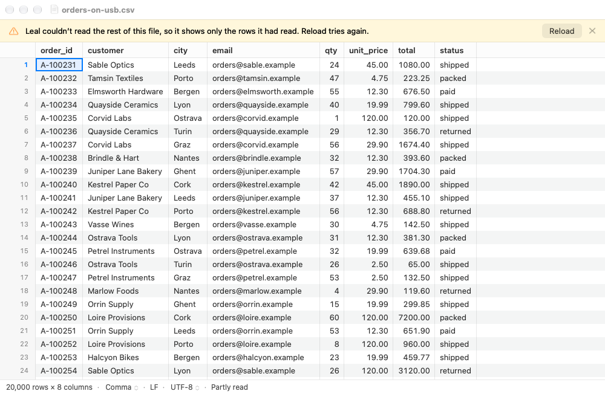
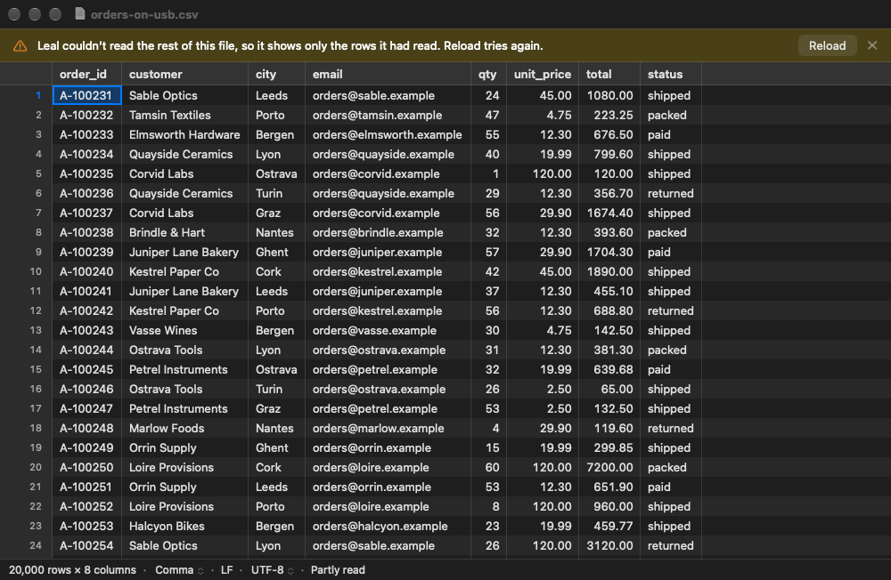
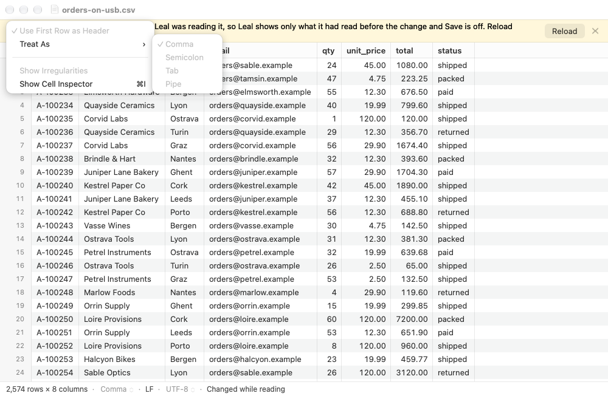
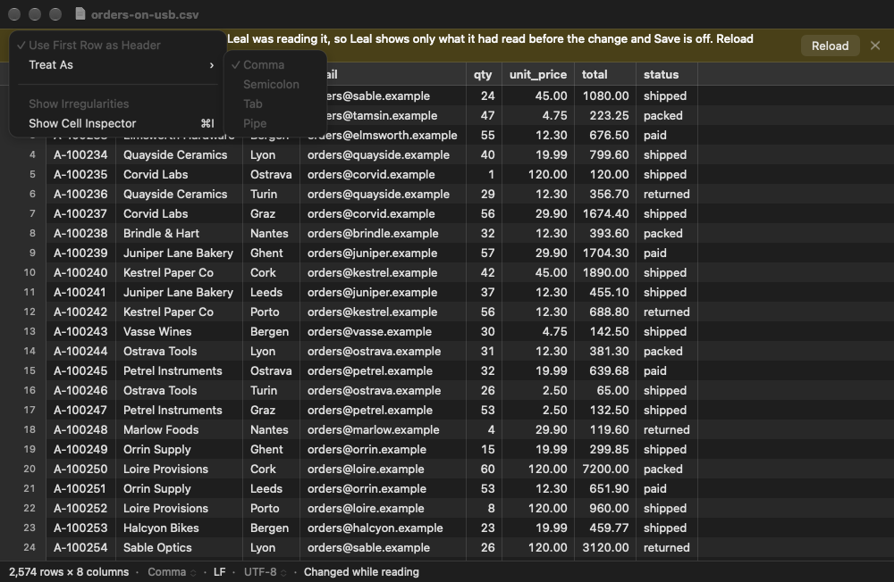
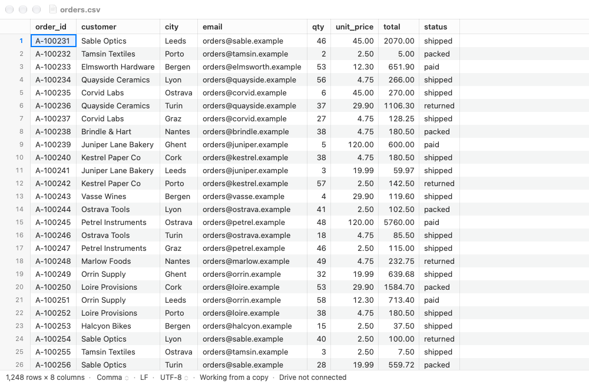
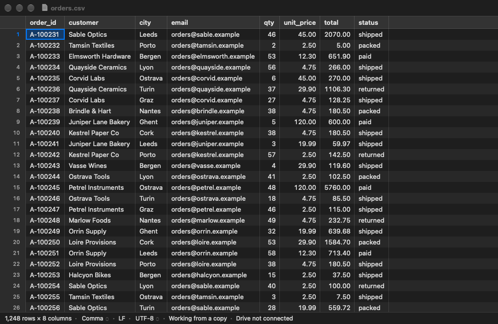
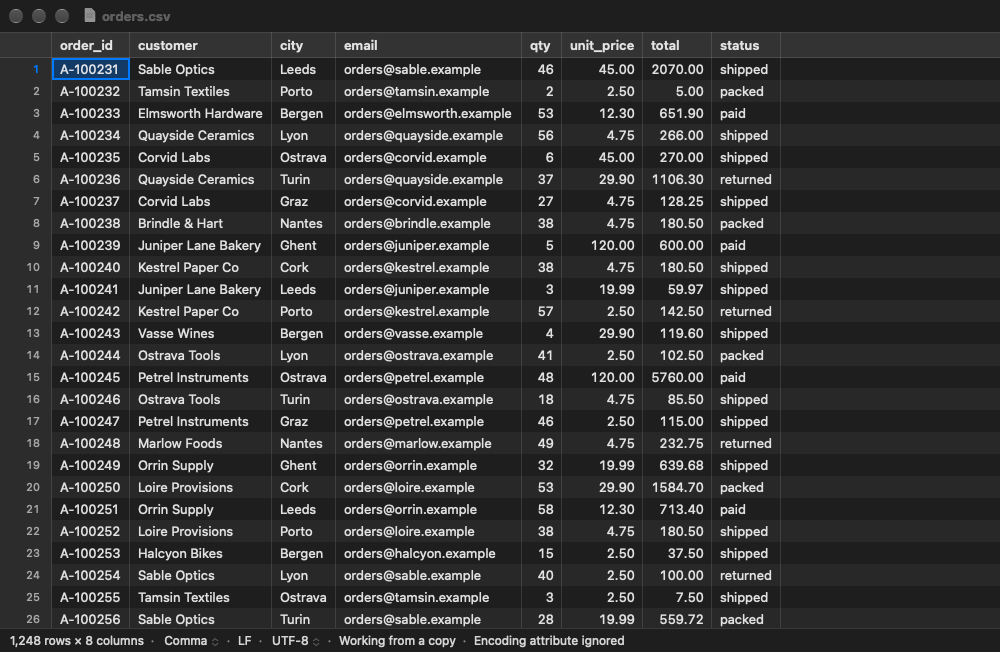
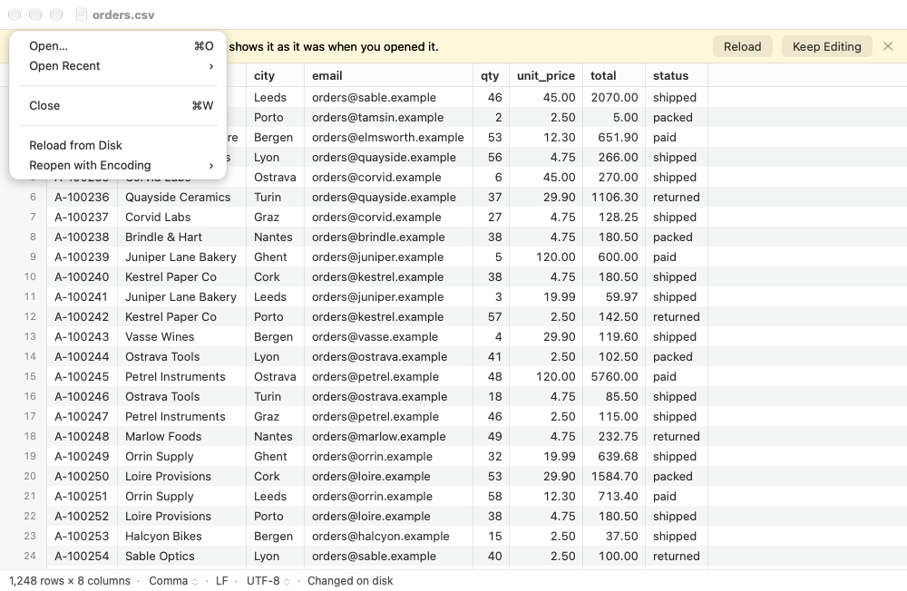
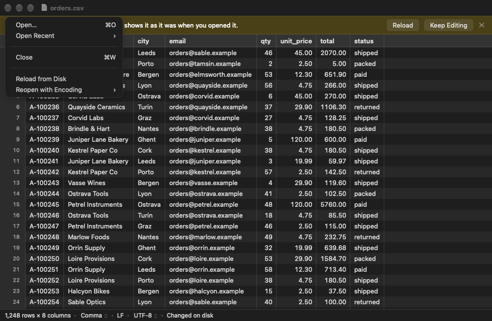

# Phase 1 gate: screenshots of the UI with no mockup

ADR-0005 decision 8 skipped a mockup round for the interpretation controls
and the banners, on the condition that Rob sees screenshots at the phase 1
gate. 1.7 and 1.9 deferred them to the gate (phase 1 review, cons-11). These
are the states that had none.

## How they were made

They are offscreen renders of the running Debug app, taken with
`just snapshot`, at 1× and a 1000 × 620 content size, in light and dark. No
input was sent to the system. The files are synthetic: invented company
names, `.example` e-mail addresses, and nothing from a real file.

- **Menus and the sheet are drawn by the scripted run.** A menu or a sheet
  is a window of its own, and those don't draw offscreen. So, as for 1.7's
  details popover, the run draws their content on a plain panel where they
  would be. The menu panel draws the real `NSMenu`'s items (title, check
  mark, greyed header) in the menu font. The sheet is the real Go to Row
  `NSAlert`, laid out and drawn into the window under the title bar. On
  screen they have the system's menu and sheet chrome.
- **The drive banners use the core's test hooks**
  (`-LealSimulateFault`). The file is opened as if it were on a removable
  drive that vanishes, or whose file changes, part-way through the copy. The
  hosted `RemovableDriveTests` show the same banner on a real disk image
  (cons-12).
- **The changed and deleted banners** come from a copy of the file that
  the script changes (rewrites, as another app's save) or deletes six
  seconds after Leal opens it.
- A button's primary tint looks grey in an offscreen render of an inactive
  window, as in 1.6's 06a shot.

New options for the scripted run (`ScriptedRun`, `LEAL_BENCH` builds only):
`-LealMenu treatAs|reopen`, `-LealMainMenu File` (or `View,View/Treat_As`),
`-LealGoToRow YES`, `-LealFindWrap YES`, `-LealWaitForReview YES` and, in
Debug, `-LealSimulateFault disconnect:<byte>|change:<byte>|none` and
`-LealSimulateReadError YES`. `-LealWaitForChange YES` also waits for a
disconnected drive. For example:

```sh
just snapshot orders.csv out.png -LealWindowSize 1000x620 -LealAppearance dark -LealMenu treatAs
just snapshot orders-on-usb.csv out.png -LealSimulateFault disconnect:300000 -LealSnapshotEarly YES -LealWaitForChange YES
```

## The status bar's menus (ADR-0005 decision 8)

| | Light | Dark |
|---|---|---|
| **Treat As**, from the delimiter |  |  |
| **Reopen with Encoding**, from the encoding (the encodings the file's BOM allows) |  |  |

## The suggestions (DESIGN §3.2, ADR-0005 decision 4)

The review found what the first 64 KB couldn't show. Each file also has an
irregularity, so the diagnostics banner shows above the suggestion: rows
read with commas are ragged, and the late Windows-1252 byte isn't valid
UTF-8.

| | Light | Dark |
|---|---|---|
| Delimiter: "This file looks semicolon-separated." **Switch** |  |  |
| Encoding: "This file looks like Windows-1252." **Reopen as Windows-1252** |  |  |

## Removable drives (ADR-0006, 1.1a)

| | Light | Dark |
|---|---|---|
| Drive disconnected part-way: **Save As…**, "Drive disconnected" in the status bar |  |  |
| Changed while reading: **Reload**, "Changed while reading" |  |  |

Since the review's follow-up, neither shows "Indexing…" with a stopped
progress bar any more. The counts are the rows read, and no skeleton
rows follow them. These shots were retaken after that change.

| | Light | Dark |
|---|---|---|
| A read error stopped the index (app-8): "Leal couldn’t read the rest of this file…", **Reload**, "Partly read" in the status bar |  |  |
| After a change while reading, reading the file another way is off until Reload. The status bar's delimiter and encoding menus are greyed, and so are View ▸ Use First Row as Header and Treat As's items. Their tooltip (not shown) says "The file changed while Leal was reading it. Reload it first." |  |  |
| "Drive not connected": a real disk image, ejected after Leal had copied the file. There is no banner, only the note; Save is off until the drive is back |  |  |

The "Partly read" state comes from the scripted run, which ends the index
with a read error just after first paint, the way the hosted test does.
The core has no hook to make a real read fail. Its count is the whole
file's, because the real index went on in the background of the shot.

## The file changed or deleted elsewhere (task 1.9)

These replace 1.9's shots, which had no dark deleted banner.

| | Light | Dark |
|---|---|---|
| Changed on disk: **Reload**, **Keep Editing** |  |  |
| Deleted: **Save As…**, **Keep Editing** |  |  |

## Status bar notes and File ▸ Reload from Disk

| | Light | Dark |
|---|---|---|
| Notes: "Working from a copy" (a file opened from a removable drive) and "Encoding attribute ignored" (an unsupported `com.apple.TextEncoding`). Their tooltips (not shown) say why |  |  |
| File ▸ **Reload from Disk**, after another app changed the file |  |  |

The other notes have no layout of their own: "Read into memory", "Reading
from the drive" (shown only until the copy is done), "Remembered settings
ignored" and "Changed on disk" (above). The status bar tests (`StatusText`)
cover their words.

## Find and Go to Row (task 1.8)

| | Light | Dark |
|---|---|---|
| **Go to Row** (⌘L) |  |  |
| Find's "wrapped" sign, after ⇧⌘G went back past the first match to the last |  |  |

The Go to Row sheet shows the generic icon: Leal has no app icon yet.
